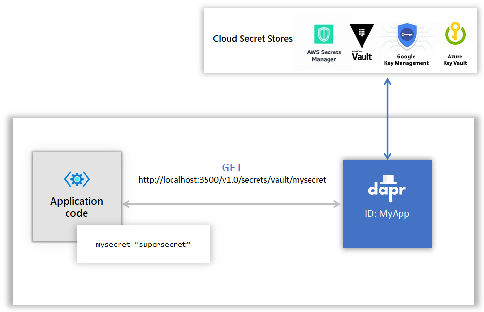

# Challenge 7 - Dapr Secrets Management

[< Previous Challenge](./Challenge-06.md) - **[Home](../README.md)** - [Next Challenge >](./Challenge-08.md)

## Introduction

In this challenge, you're going to add the Dapr **secrets management** building block.

## Description

Almost all non-trivial applications need to _securely_ store secret data like API keys, database passwords, and more. As a best practice, secrets should never be checked into the version control system. But at the same time, they need to be accessible to code running in production. This is generally a challenging requirement, but critical to get right.

Dapr provides a solution to this problem: The Dapr secrets building block. It includes an API and a secrets store.

Here's how it works:

- Dapr exposes a **secret store** - a place to securely store secret data.
- Dapr provides an API that enables applications to retrieve secrets from the store.

Popular secret stores include `Kubernetes`, `Hashicorp Vault`, and `Azure Key Vault`.

The following diagram depicts an application requesting the secret called "mysecret" from a secret store called "vault" from a configured cloud secret store:



Note the blue-colored Dapr secrets building block that sits between the application and secret stores.

_For this challenge you'll use a file-based local secret store component. Local stores are meant for development or testing purposes. Never use them in production!_

Another way of using secrets, is to reference them from Dapr configuration files. You will use both approaches in this challenge.

To learn more about the secrets building block, read the [introduction to this building block](https://docs.dapr.io/developing-applications/building-blocks/secrets/) in the Dapr documentation. Also, checkout the [secrets chapter](https://docs.microsoft.com/dotnet/architecture/dapr-for-net-developers/secrets) in the [Dapr for .NET Developers](https://docs.microsoft.com/dotnet/architecture/dapr-for-net-developers/) guidance eBook.

Update the services to use a Dapr secrets buildling block.

- Create a local JSON file & add the following credentials:
  - SMTP credentials (from the _email_ Dapr component configured in [Challenge-05](./Challenge-05.md)).
  - License key (from the `Resources\FineCollectionService\Controllers\CollectionController.cs` code file).
- Create a Dapr configuration file for the **local** secret store JSON file.
- Modify the **email** Dapr component configured in [Challenge-05](./Challenge-05.md) to use this new secret store instead of having the SMTP credentials hard-coded in the configuration file.
- Modify the `FineCollectionService` (`CollectionController` class) to pull the license key secret from the Dapr secret component instead of being hard-coded.
- Restart all services & run the `Simulation` application.
- Once you have the solution running locally, modify the Dapr configuration files to use an Azure Key Vault instead.

## Success Criteria

This challenge targets the operation labeled as **number 6** in the end-state setup:

**Local**


**Azure**


- Validate that the credentials used by the SMTP output binding to connect to the SMTP server are retrieved using the Dapr secrets management building block.
- Validate the `FineCollectionService` retrieves the license key for the `FineCalculator` component it uses from the Dapr secrets management building block.

## Tips

- Use a flat file to store secrets when working locally.
- Use scopes to restrict which service needs to read the secrets
- Use [Azure Key Vault](https://docs.microsoft.com/en-us/azure/key-vault/general/) when deploying to Azure.
- Create a Azure AD service principal for the Dapr sidecar to use to access the Key Vault.

  ```shell
  az ad sp create-for-rbac --name dapr-trafficcontrol
  az ad sp list --display-name dapr-trafficcontrol
  az keyvault set-policy --name kv-daprEventify-ussc-dev --object-id <your-service-principal-id> --secret-permissions get list
  ```

## Learning Resources

- [Dapr Building Blocks - Secrets](https://docs.dapr.io/developing-applications/building-blocks/secrets/)
- [Dapr for .NET developers - Secrets](https://docs.microsoft.com/dotnet/architecture/dapr-for-net-developers/secrets)
- [Dapr for .NET developers](https://docs.microsoft.com/dotnet/architecture/dapr-for-net-developers/)
