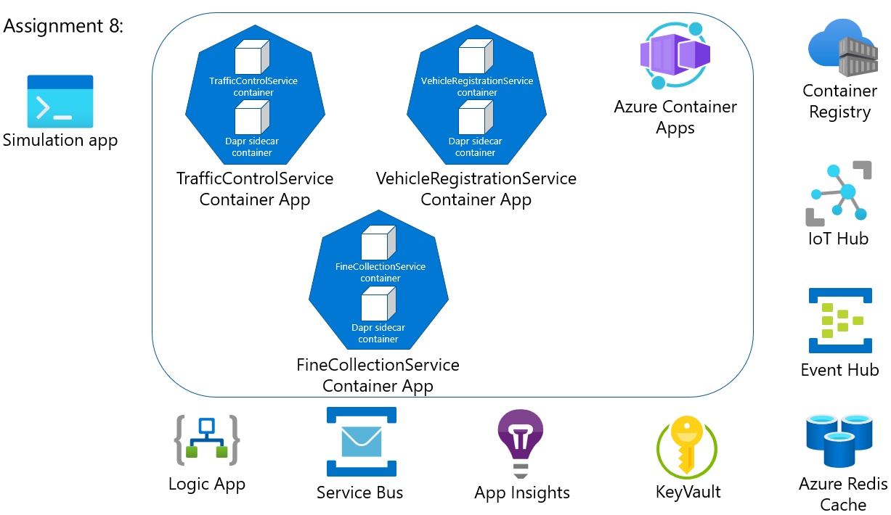

# Challenge 8 - Path B: Dapr-enabled Services running in Azure Container Apps (ACA)

[< Previous Challenge](./Challenge-07.md) - **[Home](../README.md)**

## Introduction

In this challenge, you're going to deploy the Dapr-enabled services you have written locally to an [Azure Container Apps](https://learn.microsoft.com/en-us/azure/container-apps/overview) service.

- Update all the host names & port numbers to use the Dapr defaults since it will be running in ACA.
- Build Docker images of all 3 services & upload to the Azure Container Registry.
- Deploy your service images to your ACA service.
- Run your **Simulation** service locally.

## Success Criteria

To complete this challenge, you must reach the following goals:

- Validate that all 3 services are compiled into Docker images & stored in an Azure Container Registry.
- Validate that you have successfully deployed all 3 services (`VehicleRegistrationService`, `TrafficControlService` & `FineCollectionService`) to an ACA service.
- Validate that the local **Simulation** service runs & connects to your ACA-hosted services and that all the previous functionality still works (input messages, output messages, speeding violation emails, etc).

## Tips

- Change the host name for each service (in the `Program.cs` file) from `http://localhost` to `http://*` as this will allow the Kestrel server to bind to 0.0.0.0 instead of 127.0.0.1. This is needed to ensure the health probes work in Kubernetes.
  - [Debugging K8S Connection Refused](https://miuv.blog/2021/12/08/debugging-k8s-connection-refused)
- Dapr on ACA (at this time) doesn't support declarative pub/sub subscriptions, so you will need to modify the `FineCollectionService.` to subscribe to the `collectfine` topic programmatically using the Dapr SDK.
  - You will have to modify both the `FineCollectionService/Startup.cs` & the `FineCollectionService/Controllers/CollectionController.cs` files.
    - [ASP.NET Core Controller example](https://github.com/dapr/dotnet-sdk/tree/master/examples/AspNetCore/ControllerSample)
  - [Dapr .NET SDK - Programmatic subscriptions](https://docs.dapr.io/developing-applications/building-blocks/pubsub/subscription-methods/#programmatic-subscriptions)
- Use [ACR Tasks](https://docs.microsoft.com/en-us/azure/container-registry/container-registry-tasks-overview) to simplify creation & deployment of the images to the registry.

## Learning Resources

- [Dapr integration with Azure Container Apps](https://learn.microsoft.com/en-us/azure/container-apps/dapr-overview?tabs=bicep1%2Cbicep)

Thanks for participating in these hands-on challenges! Hopefully you've learned about Dapr and how to use it. Obviously, these challenges barely scratch the surface of what is possible with Dapr. We have not touched upon subjects like: hardening production environments, actors, integration with Azure Functions and Azure API Management just to name a few. So if you're interested in learning more, I suggest you read the [Dapr documentation](https://docs.dapr.io).
