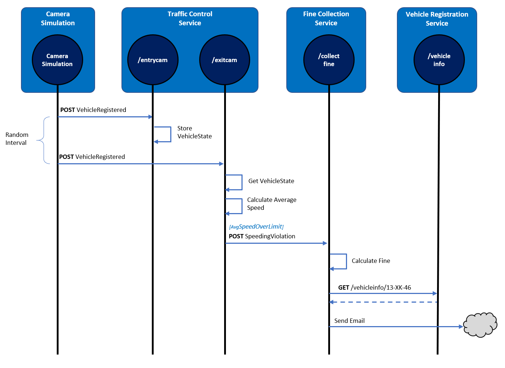
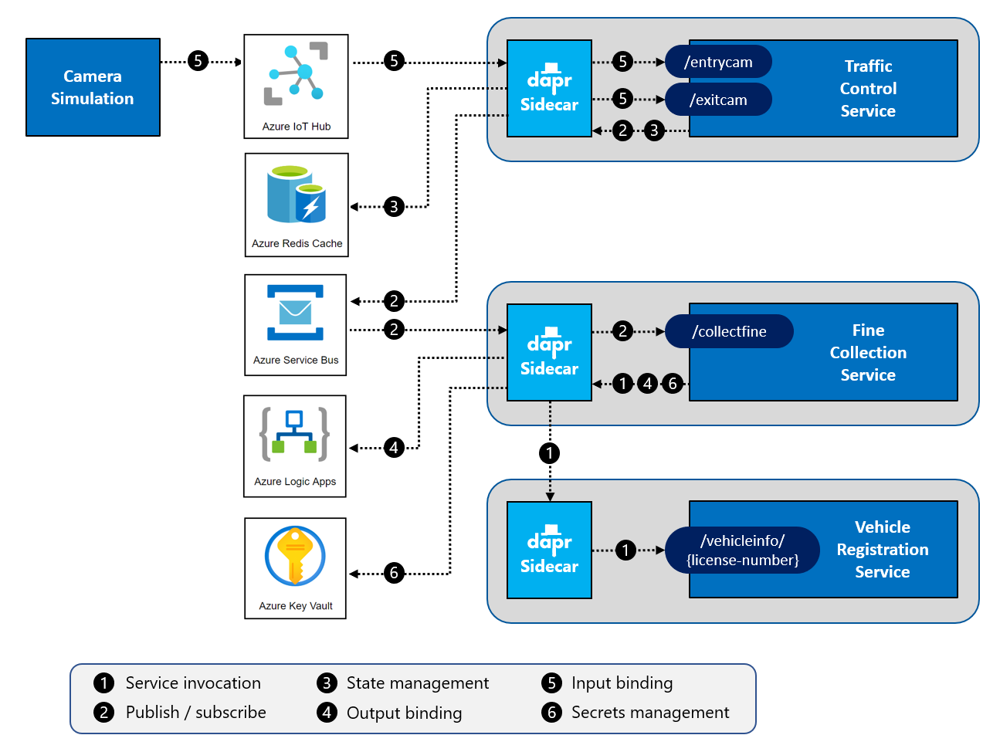
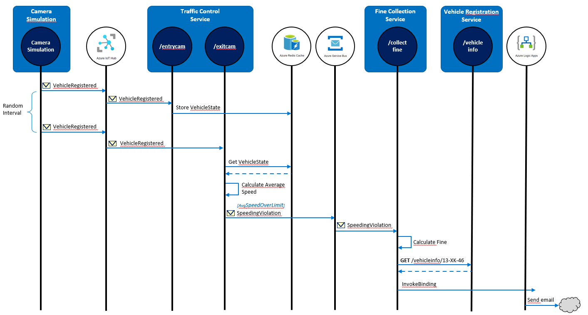

# TrafficControl Application & Services Description

- [Challenge 0: Install local tools and Azure prerequisites](../Challenge-00.md)
- [Challenge 2 - Dapr Service Invocation](../Challenge-02.md)
- [Challenge 3 - Dapr Pub/Sub Messaging](../Challenge-03.md)

## Architecture

The traffic-control application architecture consists of four microservices:

- The **Camera Simulation** is a .NET Core console application that will simulate passing cars.
- The **Traffic Control Service** is an ASP.NET Core WebAPI application that offers entry and exit endpoints: `/entrycam` and `/exitcam`.
- The **Fine Collection Service** is an ASP.NET Core WebAPI application that offers 1 endpoint: `/collectfine` for collecting fines.
- The **Vehicle Registration Service** is an ASP.NET Core WebAPI application that offers 1 endpoint: `/getvehicleinfo/{license-number}` for retrieving vehicle and owner information of a vehicle.

These services compose together to simulate a traffic control scenario.

The following sequence diagram describes how the application works:

1. The Camera `Simulation` generates a random license plate number and sends a _VehicleRegistered_ message (containing this license plate number, a random entry-lane (1-3) and the timestamp) to the `/entrycam` endpoint of the `TrafficControlService`.
1. The `TrafficControlService` stores the _VehicleState_ (license plate number and entry-timestamp).
1. After a random interval, the Camera `Simulation` sends a follow-up _VehicleRegistered_ message to the `/exitcam` endpoint of the `TrafficControlService`. It contains the license plate number generated in step 1, a random exit-lane (1-3), and the exit timestamp.
1. The `TrafficControlService` retrieves the previously-stored _VehicleState_.
1. The `TrafficControlService` calculates the average speed of the vehicle using the entry and exit timestamp. It also stores the _VehicleState_ with the exit timestamp for audit purposes, which is left out of the sequence diagram for clarity.
1. If the average speed is above the speed-limit, the `TrafficControlService` calls the `/collectfine` endpoint of the `FineCollectionService`. The request payload will be a _SpeedingViolation_ containing the license plate number of the vehicle, the identifier of the road, the speeding-violation in KMh, and the timestamp of the violation.
1. The `FineCollectionService` calculates the fine for the speeding-violation.
1. The `FineCollectionService` calls the `/vehicleinfo/{license-number}` endpoint of the `VehicleRegistrationService` with the license plate number of the speeding vehicle to retrieve vehicle and owner information.
1. The `FineCollectionService` sends a fine notice to the owner of the vehicle by email.

All actions described in the previous sequence are logged to the console during execution so you can follow the flow.

Your coach will provide you with a `Resources.zip` package file that contains the starting projects for the WhatTheHack. It contains a version of the services that use plain HTTP communication and store state in memory. With each challenge, you'll add a Dapr building block to enhance this application architecture.

_It's important to understand that all calls between services are direct, synchronous HTTP calls using the HttpClient library in .NET Core. While sometimes necessary, this type of synchronous communication [isn't considered a best practice](https://docs.microsoft.com/dotnet/architecture/cloud-native/service-to-service-communication#requestresponse-messaging) for distributed microservice applications. When possible, you should consider decoupling microservices using asynchronous messaging. However, decoupling communication can dramatically increase the architectural and operational complexity of an application. You'll soon see how Dapr reduces the inherent complexity of distributed microservice applications._

## End-state with Dapr applied

As you complete the challenges, you'll evolve the application architecture to work with Dapr and consume Azure-based backing services:

- Azure IoT Hub
- Azure Redis Cache
- Azure Service Bus
- Azure Logic Apps
- Azure Key Vault

The following diagram shows the end-state of the application:

1. To retrieve driver information using synchronous request/response communication between the `FineCollectionService` and `VehicleRegistrationService`, you'll implement the Dapr **service invocation** building block.
1. To send speeding violations to the `FineCollectionService`, you'll implement the Dapr **publish and subscribe** building block (asynchronous communication) with the Dapr Azure Service Bus component.
1. To store vehicle state, you'll implement the Dapr **state management** building block with the Dapr Azure Redis Cache component.
1. To send fine notices to the owner of a speeding vehicle by email, you'll implement the HTTP **output binding** building block with the Dapr Azure Logic App component.
1. To send vehicle info to the `TrafficControlService`, you'll use the Dapr **input binding** for MQTT using Dapr Azure IoT Hub component as the MQTT broker.
1. To retrieve a license key for the fine calculator component and credentials for connecting to the SMTP server, you'll implement the Dapr **secrets management** building block with Dapr Azure Key Vault component.

The following sequence diagram shows how the solution will work after implementing Dapr:

_It's helpful to refer back to the preceding sequence diagram as you progress through the challenges._

## Prevent port collisions

For most of the challenges, you'll run the microservices in the solution on your local machine. To prevent port collisions, all services will listen on a different HTTP port. When running with Dapr, you need additional ports for HTTP and gRPC communication between the sidecar services. By default, these ports are `3500` and `50001`. However, you'll use different port numbers for each service to prevent collisions. Please closely follow the instructions so that your microservices use the following ports for their Dapr sidecars:

| Service                    | Application Port | Dapr sidecar HTTP port | Dapr sidecar gRPC port |
| -------------------------- | ---------------- | ---------------------- | ---------------------- |
| TrafficControlService      | 6000             | 3600                   | 60000                  |
| FineCollectionService      | 6001             | 3601                   | 60001                  |
| VehicleRegistrationService | 6002             | 3602                   | 60002                  |

Use the ports specified in the preceding table _whether_ using the DIY or step-by-step approach.

You'll specify the ports from the command-line when starting a service with the Dapr CLI using the following command-line arguments:

- `--app-port`
- `--dapr-http-port`
- `--dapr-grpc-port`
