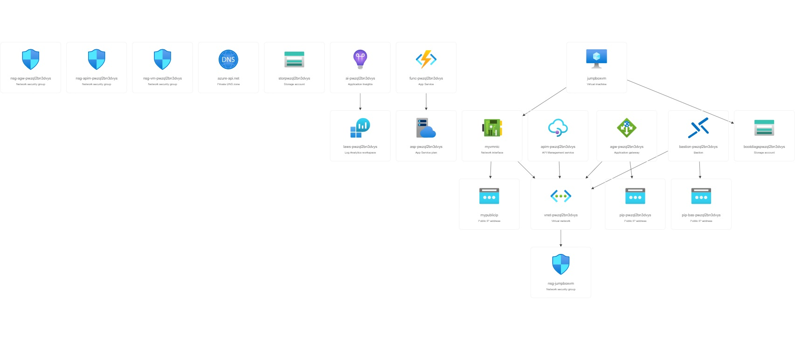

# Challenge 01 - Provision your Integration Environment - Coach's Guide

[<Previous Solution](./Solution-00.md) - **[Home](./README.md)** - [Next Solution>](./Solution-02.md)

## Introduction

The students should be able to create an AIS environment consisting of APIM and Function Apps.  This prepares them for the second challenge where they will be asked to create a CI/CD pipeline that will call these IaC for automated deployment.


## Description
Students has to do one of the following AIS environments, click on the link below to jump straight to relevant scenario: 
- [Scenario 01: Deploy a VNET-secured AIS environment](#scenario-01-deploy-a-vnet-secured-ais-environment)
- [Scenario 02: Deploy an identity-secured AIS environment](#scenario-02-deploy-an-identity-secured-ais-environment)

### Scenario 01: Deploy a VNET-secured AIS environment
- Scenario 01: Students can deploy the Bicep templates of the VNET-integrated AIS which can be found at [Student/Resources/Challenge-01/Scenario-01](../Student/Resources/Challenge-01/Scenario-01).  This is the shortcut method - the templates are ready to deployed and all they need to do is plug-in the parameter values.  
  This would create the following:
  1. APIM 
  1. Application Gateway
  1. Application Insights (workspace-based)
  1. Log Analytics workspace
  1. Function App in Elastic Premium plan
  1. 2 Public IPs
  1. 3 Network Security Groups
  1. Private DNS zone (azure-api.net)
  1. Jumpbox VM
  1. Bastion
  1. Virtual Network with 3-4 subnets

  Eventually, the environment would look like the one below:
  

  - Create a resource group and run the following Azure CLI command to deploy the Bicep templates as follows:
    ```
    az deployment group create --template-file main.bicep --parameters [enter parameter values you need to overwrite]
    ```
  - Ensure that the students have [published the APIM Developer portal](https://docs.microsoft.com/en-us/azure/api-management/api-management-howto-developer-portal-customize#publish) because they will need to use this in Challenge 04.  The students should log-in to the jumpbox VM to do this.
    - First, they need to [set the DNS entries for the APIM service endpoints in the hosts file](https://docs.microsoft.com/en-us/azure/api-management/api-management-using-with-internal-vnet?tabs=stv2#dns-configuration#:~:text=To%20access%20these%20API%20Management%20,%20(Windows)%20or%20%2Fetc%2Fhosts%20(Linux%2C%20macOS)).  Map the endpoints to the assigned private virtual IP address (usually 10.0.1.5), as follows:
    
    - Then, open a browser and go the Azure portal (still in the jumpbox VM).  In the menu list, go to Developer portal - Portal overview and click the Developer Portal button which will open a browser to create the Developer portal instance in Edit mode. 
    
    - Go back to browser tab where the APIM Portal overview is opened, then click publish.
    
    - Once done, enable CORS.
    
    - Open a new browser window (in incognito/private browsing mode) and then [view the portal](https://docs.microsoft.com/en-us/azure/api-management/api-management-howto-developer-portal-customize#visit-the-published-portal) 
    
    - Click API and test call Echo API GET operation (don't forget to add the subscription key!)
    

### Scenario 02: Deploy an identity-secured AIS environment 
- Scenario 02: Students they can deploy the Bicep templates of the publicly-exposed AIS which can be found at [Student/Resources/Challenge-01/Scenario-02](../Student/Resources/Challenge-01/Scenario-02).  There might be some parameter or variable values that are missing, so the students need to fill these out.
  This would create the following:
  1. APIM 
  1. Application Insights (workspace-based)
  1. Function App in Consumption plan

  
  The students should have the following files:
  - main.bicep - The main Bicep file.  In there, you will reference the modules, define parameter values, and then pass those values as input to the modules.

  - The rest of the deployments are organized into [Bicep modules](https://docs.microsoft.com/en-us/azure/azure-resource-manager/bicep/modules) contained in the "module" folder, namely:

    - appInsights.bicep - Defines the Application Insights resource and should be the very first resource that need to be created. Make sure to define an [output parameter](https://docs.microsoft.com/en-us/azure/azure-resource-manager/bicep/outputs?tabs=azure-powershell) for the instrumentation key, which will then need to be passed as input into the Function App and APIM modules. 

        ```
        resource laWorkspace 'Microsoft.OperationalInsights/workspaces@2021-06-01' = {
          name: '${appInsightsName}ws'
          location: location
        }

        resource appInsights 'Microsoft.Insights/components@2020-02-02' = {
          name: appInsightsName
          location: location
          kind: 'web'
          properties: {
            Application_Type: 'web'
            WorkspaceResourceId: laWorkspace.id
          }
          tags: resourceTags
        }

        output appInsightsInstrumentationKey string = appInsights.properties.InstrumentationKey
        output appInsightsResourceId string = appInsights.id
        ```

        See [Microsoft.Insights components](https://docs.microsoft.com/en-us/azure/templates/microsoft.insights/components?tabs=bicep) for reference


      - apim.bicep  - This contains the definition for creating the API management resource.  At a minimum, the module should have the following properties:

        ```
        resource apiManagementService 'Microsoft.ApiManagement/service@2021-08-01' = {
          name: apiManagementServiceName
          location: location
          sku: {
            name: sku
            capacity: skuCount
          }
          properties: {
            publisherEmail: publisherEmail
            publisherName: publisherName
          }
          tags: resourceTags
        }

        resource apiManagementServiceLoggers 'Microsoft.ApiManagement/service/loggers@2021-08-01' = {
          parent: apiManagementService
          name: 'apimlogger' 
          properties: {
            resourceId: appInsightsResourceId 
            loggerType: 'applicationInsights'
            credentials: {
              instrumentationKey: appInsightsInstrumentationKey
            }
            isBuffered: true 
            
          }
        }


        ```

        See [Microsoft.ApiManagement service](https://docs.microsoft.com/en-us/azure/templates/microsoft.apimanagement/service?tabs=bicep) for reference

      - function.bicep - This contains the definition for creating the Function App resource.  At a minimum, the module should have the following properties:

        ```
        resource storageAccount 'Microsoft.Storage/storageAccounts@2021-06-01' = {
          name: storageAccountName
          location: location
          tags: resourceTags
          sku: {
            name: 'Standard_LRS'
          }
          kind: 'StorageV2'
          properties: {
            supportsHttpsTrafficOnly: true
            encryption: {
              services: {
                file: {
                  keyType: 'Account'
                  enabled: true
                }
                blob: {
                  keyType: 'Account'
                  enabled: true
                }
              }
              keySource: 'Microsoft.Storage'
            }
            accessTier: 'Hot'
          }
        }

        resource plan 'Microsoft.Web/serverFarms@2021-02-01' = {
          name: appServicePlanName
          location: location
          kind: functionKind
          tags: resourceTags
          sku: {
            name: functionSku
            tier: functionTier
          }
          properties: {}
        }

        resource functionApp 'Microsoft.Web/sites@2021-02-01' = {
          name: functionAppName
          location: location
          kind: 'functionapp'
          tags: resourceTags
          properties: {
            serverFarmId: plan.id
            siteConfig: {
              appSettings: [
                {
                  name: 'AzureWebJobsStorage'
                  value: 'DefaultEndpointsProtocol=https;AccountName=${storageAccount.name};EndpointSuffix=${environment().suffixes.storage};AccountKey=${listKeys(storageAccount.id, storageAccount.apiVersion).keys[0].value}'
                }
                {
                  name: 'WEBSITE_CONTENTAZUREFILECONNECTIONSTRING'
                  value: 'DefaultEndpointsProtocol=https;AccountName=${storageAccount.name};EndpointSuffix=${environment().suffixes.storage};AccountKey=${listKeys(storageAccount.id, storageAccount.apiVersion).keys[0].value}'
                }
                {
                  name: 'APPINSIGHTS_INSTRUMENTATIONKEY'
                  value: appInsightsInstrumentationKey
                }
                {
                  name: 'APPLICATIONINSIGHTS_CONNECTION_STRING'
                  value: 'InstrumentationKey=${appInsightsInstrumentationKey}'
                }
                {
                  name: 'FUNCTIONS_WORKER_RUNTIME'
                  value: functionRuntime
                }
                {
                  name: 'FUNCTIONS_EXTENSION_VERSION'
                  value: '~3'
                }
              ]
            }
            httpsOnly: true
          }
          identity: {
            type: 'SystemAssigned'
          }  
        }

        output functionAppName string = functionApp.name
        ```

        See [Microsoft.Web sites/functions](https://docs.microsoft.com/en-us/azure/templates/microsoft.web/sites/functions?tabs=bicep) for reference

  


  - They can also refer to the [MS Learn Bicep tutorial](https://docs.microsoft.com/en-us/learn/modules/build-first-bicep-template/8-exercise-refactor-template-modules?pivots=cli) to guide them on how to author the files above.


  - You should run the following Azure CLI command to deploy the Bicep templates as follows:

    ```
    az deployment group create --template-file main.bicep --parameters [enter parameter values you need to overwrite]
    ```
  - Ensure that the students have [published the APIM Developer portal](https://docs.microsoft.com/en-us/azure/api-management/api-management-howto-developer-portal-customize#publish) because they will need to use this in Challenge 04.

    - In the Azure portal, find the menu list, then go to Developer portal - Portal overview and click the Developer Portal button which will open a browser to create the Developer portal instance in Edit mode. 
    
    - Go back to browser tab where the APIM Portal overview is opened, then click publish.
    
    - Once done, enable CORS.
    
    - Open a new browser window (in incognito/private browsing mode) and then [view the portal](https://docs.microsoft.com/en-us/azure/api-management/api-management-howto-developer-portal-customize#visit-the-published-portal) 
    
    - Click API and test call Echo API GET operation (don't forget to add the subscription key!)
    

[Back to Top](#challenge-01---provision-your-integration-environment---coachs-guide)