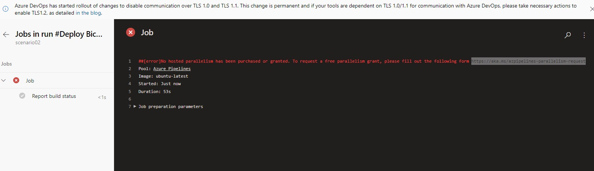

# Challenge 02 - Deploy your Integration Environment - Coach's Guide

[<Previous Solution](./Solution-01.md) - **[Home](./README.md)** - [Next Solution>](./Solution-03.md)

## Introduction

The students should be able to create upload the Bicep files to a repo and create a CI/CD pipeline that deploys the environment.

## Description
- Students can choose to use either GitHub Actions (recommended) or Azure DevOps Pipelines for this exercise.
- If using GitHub actions, a sample workflow can be found at [Student/Resources/Challenge-02](../Student/Resources/Challenge-02)
    - Students can follow the steps on how to configure the workflow from [Quickstart: Deploy Bicep files by using GitHub Actions](https://docs.microsoft.com/en-us/azure/azure-resource-manager/bicep/deploy-github-actions?tabs=CLI)
- If using ADO Pipelines, they can follow the steps from [Quickstart: Integrate Bicep with Azure Pipelines](https://docs.microsoft.com/en-us/azure/azure-resource-manager/bicep/add-template-to-azure-pipelines?tabs=CLI)
    - It is ideal that they are using an ADO organization that has [parallel jobs configured](https://docs.microsoft.com/en-us/azure/devops/pipelines/licensing/concurrent-jobs?view=azure-devops&tabs=ms-hosted).  Otherwise, you will need to request free parallel jobs which will take 2-3 days to complete or set-up paid jobs for a cost.

    If neither has been done beforehand, they will see the following error after running the pipeline:

    

[Back to Top](#challenge-02---deploy-your-integration-environment---coachs-guide)
