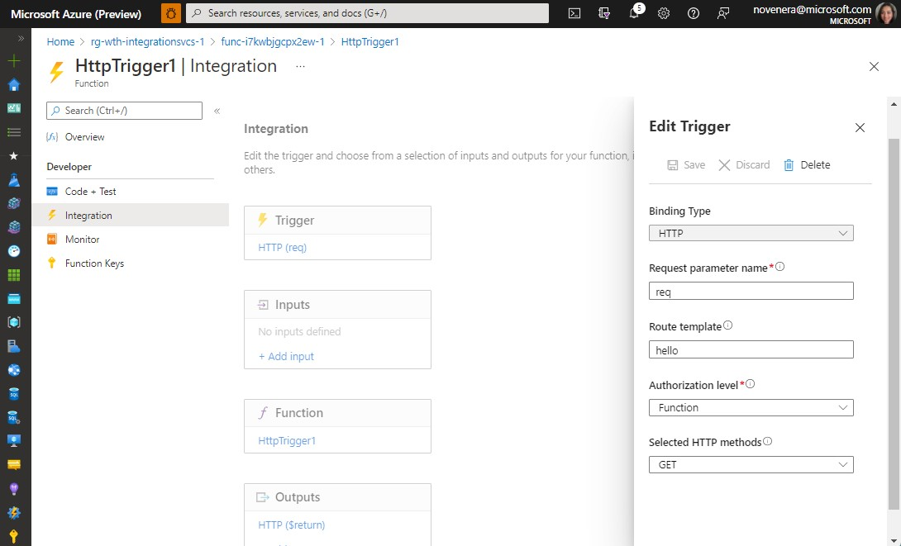
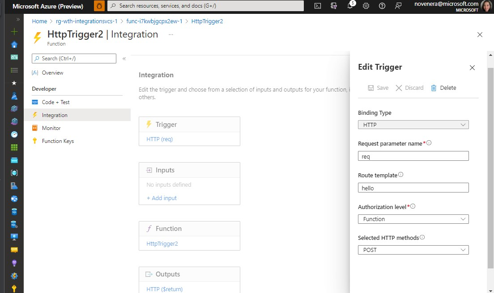
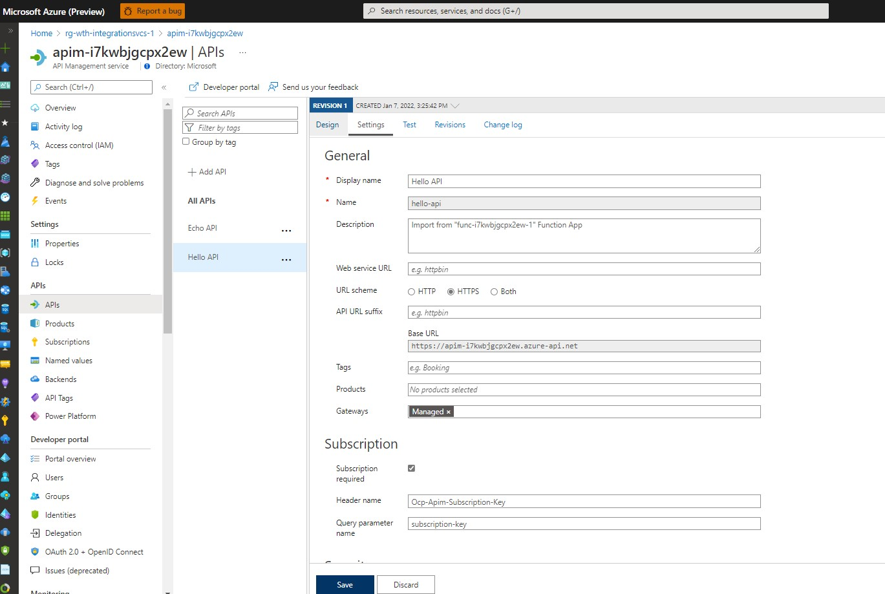
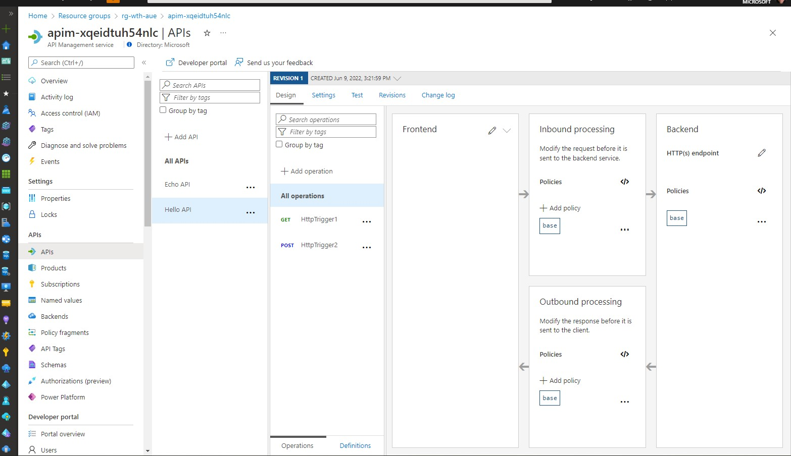
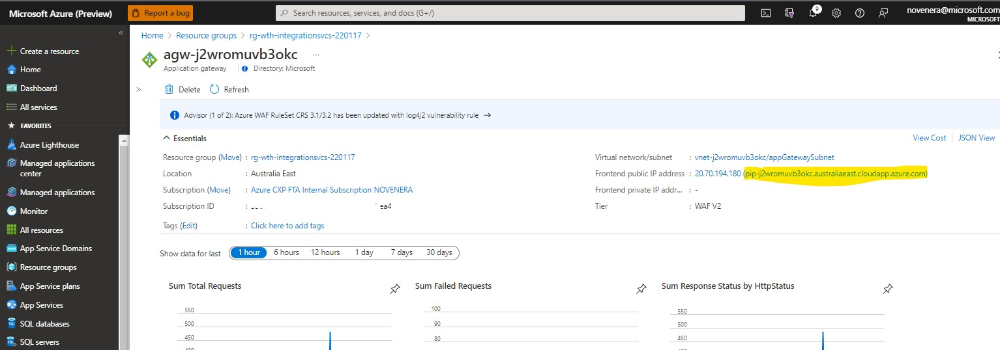
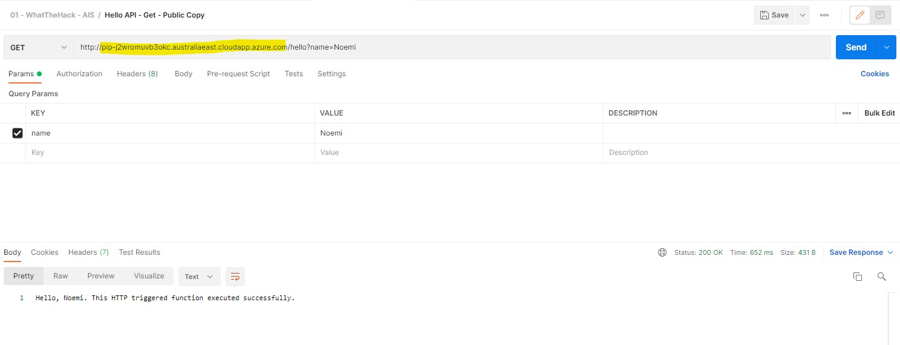
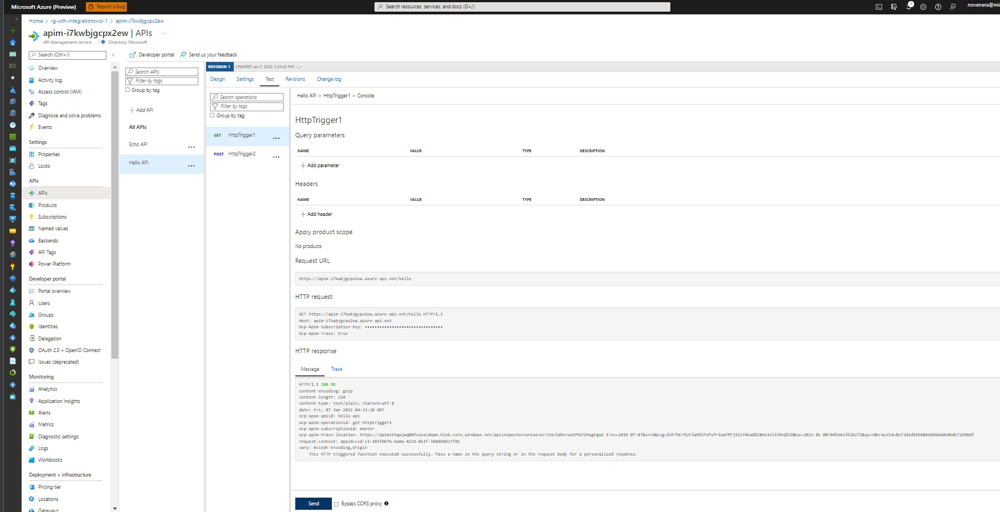
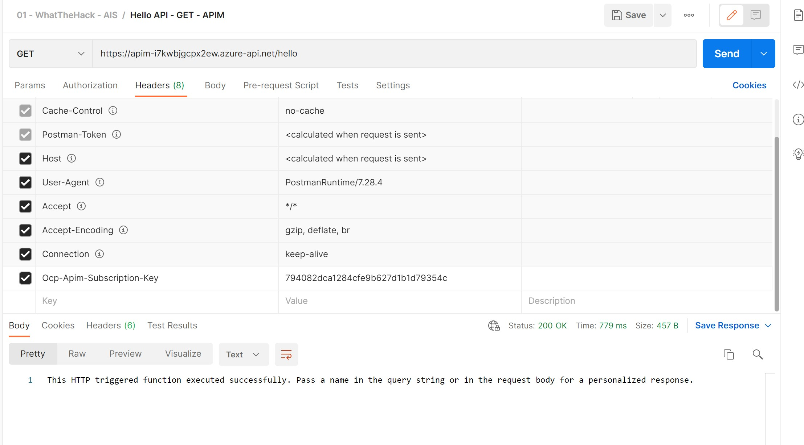
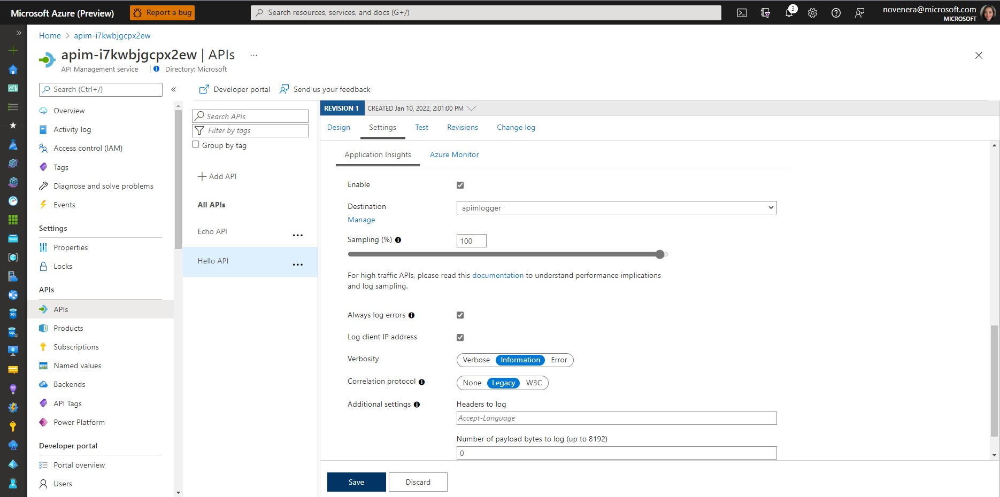
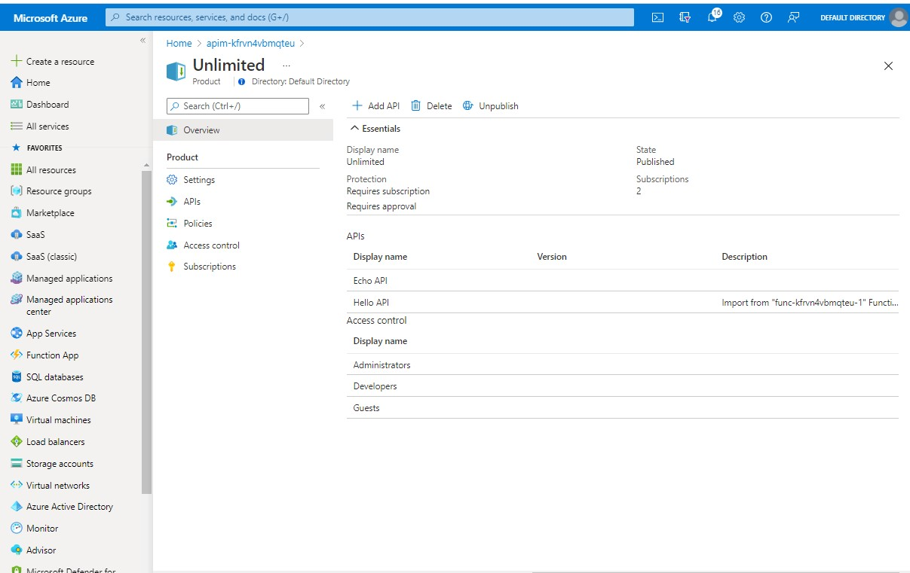

# Challenge 03 - Create Backend API - Coach's Guide

[<Previous Solution](./Solution-02.md) - **[Home](./README.md)** - [Next Solution>](./Solution-04.md)

## Introduction

The students should be able to create upload the Bicep files to a repo and create a CI/CD pipeline that deploys the environment.


## Description
- Students can add the functions via the Azure Portal by following the steps in this [document](https://docs.microsoft.com/en-us/azure/azure-functions/functions-create-serverless-api)
    - The first function should have a HTTP Trigger that takes a name parameter and returns a simple message via a GET call. 
        

    - The second function should also have a HTTP Trigger that sends name as a JSON payload and returns a simple message via a POST call. 
        

- Then, import the functions in API Management and name it Hello API, as per the steps [here](https://docs.microsoft.com/en-us/azure/api-management/import-function-app-as-api).  The settings would be similar to the one below:
  
  

- To test API calls, students are free to use whatever tool they prefer, e.g. Powershell [Invoke-RestMethod](https://docs.microsoft.com/en-us/powershell/module/microsoft.powershell.utility/invoke-restmethod?view=powershell-7.2), Azure Portal ([APIM Test tab](https://docs.microsoft.com/en-us/azure/api-management/import-function-app-as-api#test-in-azure-portal)), or [Postman](https://www.postman.com/).
    - For Scenario 1 
        - You will not be able to test from the APIM portal since it is in internal mode and already publicly inaccessible.  You have to use HTTP proxy tool like Postman and send calls to the Application Gateway public endpoint.
          
          Here's the GET and POST calls to the APIM endpoint:
          
        Make sure that you add the APIM subscription key (```Ocp-Apim-Subscription-Key```) in the request header if using subscription key to call the API. (which is enabled by default)
    - For Scenario 2
        - If testing the API in the Azure Portal, you just need to go to the Test tab and click Send.
            
        - If using Postman, here's the GET and POST calls to the APIM endpoint:
            
        Make sure that you add the APIM subscription key (```Ocp-Apim-Subscription-Key```) in the request header if using subscription key to call the API. (which is enabled by default)

- Enable Application Insights for Hello API, keep the default values (e.g. sampling to the default value of 100%)
    

- Ensure that the students [added Hello API to the Unlimited product](https://docs.microsoft.com/en-us/azure/api-management/api-management-howto-add-products?tabs=azure-portal#add-apis-to-a-product).
    
  Browse to the Dev portal in a separate incognito/private browser and test Hello API GET operation. 

[Back to Top](#challenge-03---create-backend-api---coachs-guide)
