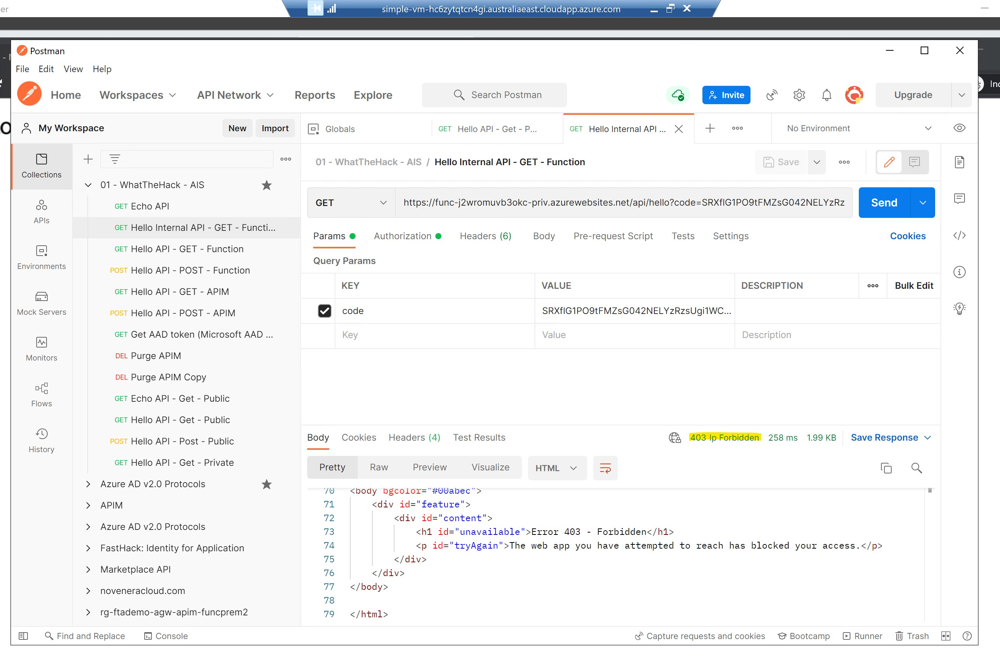
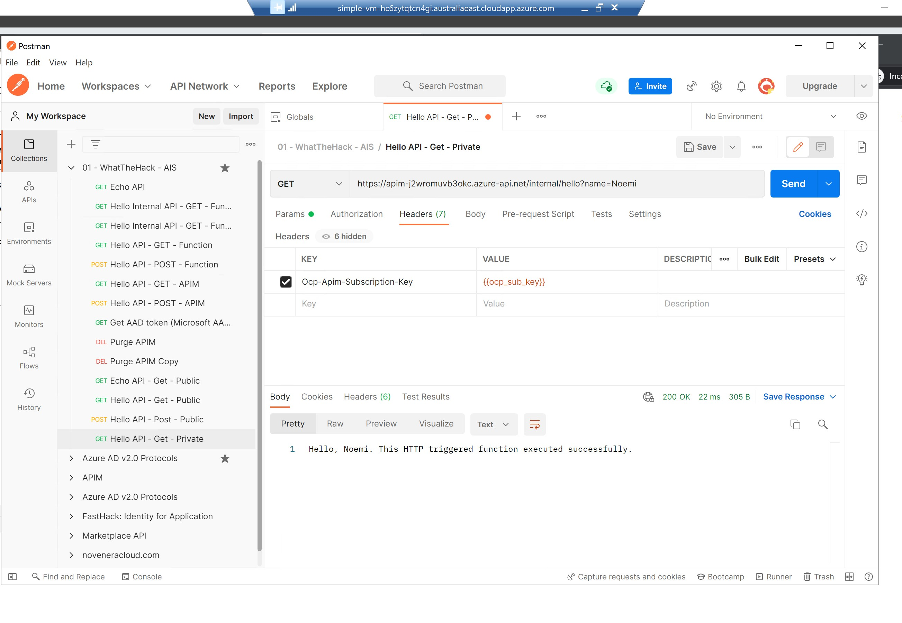

# Challenge 04 - Securing Backends APIs - Coach's Guide

[<Previous Solution](./Solution-03.md) - **[Home](./README.md)** 

## Introduction

The students should be able to either:
- Scenario 01: Configure secured backend APIs in a private network
- Scenario 02: Configure OAuth2 authorization when calling Hello API


## Description
For Scenario 01:
- After creating a new Function App that will be imported to the APIM as Hello Internal API, secure the function app in one of the following ways:
  - Define APIM IP subnet range in the function apps [IP restriction list](https://docs.microsoft.com/en-us/azure/azure-functions/functions-networking-options#inbound-access-restrictions)
    
    It enables the service endpoint for Microsoft.Web on the APIM subnet, make sure its has been provisioned and enabled.
    
    
    Try calling the function from Postman, you should get HTTP 403
    
    Import to APIM
    
    Then call from Postman in your jumpbox VM, pointing to the APIM endpoint (e.g.).  You should get HTTP 200.
    

  - Configure a [Private endpoint](https://docs.microsoft.com/en-us/azure/azure-functions/functions-create-vnet)
    
    This creates a virtual NIC with a private IP assigned to it, as well as private DNS record to be mapped to that IP. 
    
    Try calling the function endpoint from Postman in your jumpbox VM, you should get HTTP 200
    
    Import to APIM
    
    Then call from Postman in your jumpbox VM, pointing to the APIM endpoint (e.g.).  You should get HTTP 200.
    

- To allow routes to external Hello API only, you should configure URL redirection mechanism in Application Gateway.  Follow the instructions on how to do this in the portal [here](https://docs.microsoft.com/en-us/azure/application-gateway/rewrite-url-portal).
    - First, let us modify the path to external Hello API by going to APIM -> APIs then select Settings.  Add external to  the API URL suffix so that the new backend route would now be https://api.{{unique_id}}.azure-api.net/external/hello.  Click Save to apply changes.
      
    - In the portal, go the Application Gateway and under Settings, select Rewrites, then click Rewrite set.
      
    - Name your new rewrite set then select the default routing rule created earlier.  Click Next.
            
    - Click Add rewrite rule and name it: First, add condition as follows, then click Ok when done.
          
    - Then, add action and configure like below.  Click OK then Create when done.
       
    - Open Postman and test your changes. Try calling http://pip-{{unique_id}}.australiaeast.cloudapp.azure.com/external, it should now return HTTP 200.
       
       
       
    - Try calling http://pip-{{unique_id}}.australiaeast.cloudapp.azure.com/, it should now return HTTP 404.
       

- To secure external Hello API to only accept requests routed from Application Gateway, you need to add [```ip-filter``` policy](https://docs.microsoft.com/en-us/azure/api-management/api-management-access-restriction-policies#RestrictCallerIPs).
  - Add the policy to Hello API, configuring the AGW subnet range.  Click Save to apply changes.
    
  - Log-in to the jumpbox VM.  Open Postman (highly recommended to install if the students have not done yet), then call external Hello API using th APIM endpoint, you should get HTTP 403 like below.
    
  - Try calling external Hello API using the AGW endpoint, it should still succeed.
    

- To test the public and private API calls:
  - Test the public API by calling the AGW endpoint from Postman
  - Test the private API by calling the APIM endpoint from Postman installed in your jumpbox VM. 

For Scenario 02:
- First, the student should follow the steps [Protect a web API backend in Azure API Management using OAuth 2.0 authorization with Azure Active Directory](https://docs.microsoft.com/en-us/azure/api-management/api-management-howto-protect-backend-with-aad).    
    - In Step [1. Register an application in Azure AD to represent the API](https://docs.microsoft.com/en-us/azure/api-management/api-management-howto-protect-backend-with-aad#1-register-an-application-in-azure-ad-to-represent-the-api), the backend-app AAD registration should look like below:
        
        
        
        
    - In Steps [2. Register another application in Azure AD to represent a client application](https://docs.microsoft.com/en-us/azure/api-management/api-management-howto-protect-backend-with-aad#2-register-another-application-in-azure-ad-to-represent-a-client-application) to [3. Grant permissions in Azure AD](https://docs.microsoft.com/en-us/azure/api-management/api-management-howto-protect-backend-with-aad#3-grant-permissions-in-azure-ad), the client app registration would look like below:
        
        
        
             
    - In Step [4. Enable OAuth 2.0 user authorization in the Developer Console](https://docs.microsoft.com/en-us/azure/api-management/api-management-howto-protect-backend-with-aad#4-enable-oauth-20-user-authorization-in-the-developer-console), the OAuth2 settings in the Developer portal should look something like below:
        
        
    - In Step [5. Successfully call the API from the developer portal](https://docs.microsoft.com/en-us/azure/api-management/api-management-howto-protect-backend-with-aad#5-successfully-call-the-api-from-the-developer-portal), you should be able to successfully call Hello API from the APIM Developer Portal. 
               
      You may get the following CORS error after clicking Send.
        
      To fix this, just add the APIM CORS policy scoped for all APIs, as follows:
        
      After saving the policy, re-try calling the API again and it should succeed this time.
        
    - In Step [6. Configure a JWT validation policy to pre-authorize requests](https://docs.microsoft.com/en-us/azure/api-management/api-management-howto-protect-backend-with-aad#6-configure-a-jwt-validation-policy-to-pre-authorize-requests), configure the validate-jwt policy scoped to Hello API.
        
      To test, call Hello API from the Dev Portal again.  Try returning a failure by modifying the Authorization header value.
        

    <!-- - Click the scope link.  Student does not have to do anything here since the settings have already been pre-filled.  Though, they have the liberty to change any of these (e.g. Consent to Admins only), as long as the scope has been enabled.  
         -->

- If using Postman as your client application, you need to [specifying the Authorization details using OAuth2](https://learning.postman.com/docs/sending-requests/authorization/#oauth-20) which will ask you to log in and consent before sending the generated Access Token.  Ensure that you specify Authorization Code as the grant type.
    - Token Name: The name you want to use for the token.
    - Grant Type: A dropdown list of options. Choose Authorization code.
    - Callback URL: The client application callback URL redirected to after auth, and that should be registered with the API provider. If not provided, Postman will use a default empty URL and attempt to extract the code or access token from it. If this does not work for your API, you can use the following URL: https://oauth.pstmn.io/v1/browser-callback, but you need to add this to the list of Redirect URLs for your client-app AAD registration.
        - Authorize using browser: You can enter your credentials in your web browser, instead of the pop-up that appears in Postman by default when you use the Authorization code or Implicit grant type. Checking this box will set the Callback URL to return to Postman. If you opt to authorize using the browser, make sure pop-ups are disabled for the callback URL, otherwise it won't work.
    - Auth URL: The endpoint for the API provider authorization server, to retrieve the auth code. (e.g. https://login.microsoftonline.com/organizations/oauth2/v2.0/authorize for multi-tenant AAD account authentication)
    - Access Token URL: The provider's authentication server, to exchange an authorization code for an access token. (e.g. https://login.microsoftonline.com/organizations/oauth2/v2.0/token for multi-tenant AAD account authentication)
    - Client ID: The ID for your client application registered with the API provider. (e.g. the Application ID of the client app AAD registration created [earlier](https://docs.microsoft.com/en-us/azure/api-management/api-management-howto-protect-backend-with-aad#2-register-another-application-in-azure-ad-to-represent-a-client-application#:~:text=On%20the%20app%20Overview%20page%2C%20find%20the%20Application%20(client)%20ID%20value%20and%20record%20it%20for%20later.))
    - Client Secret: The client secret given to you by the API provider. (e.g. the Client secret of the client app AAD registration created [earlier](https://docs.microsoft.com/en-us/azure/api-management/api-management-howto-protect-backend-with-aad#2-register-another-application-in-azure-ad-to-represent-a-client-application##:~:text=Create%20a%20client%20secret%20for%20this%20application%20to%20use%20in%20a%20subsequent%20step.))
    - Scope: The scope of access you are requesting, which may include multiple space-separated values. (e.g. This is the [backend app scope](https://docs.microsoft.com/en-us/azure/api-management/api-management-howto-protect-backend-with-aad#2-register-another-application-in-azure-ad-to-represent-a-client-application###:~:text=Use%20the%20back-end%20app%20scope%20you%20created%20in%20the%20Default%20scope%20field) granted to the client app)
    - State: An opaque value to prevent cross-site request forgery. 
    - Client Authentication: A dropdown list: send a Basic Auth request in the header, or client credentials in the request body. After upgrading to a new  version, change the value in this dropdown menu to avoid problems with client authentication.

    
    

- Click Get New Access Token which will pop-up another browser window prompting you to log-in.  Once successful, you will be redirected back with the generated access token.  Click Use Token to add that to the request header.
    
  
- Then, click Send to execute GET request to Hello API.
    

 
- Lastly, configure your Function App to use AAD login. Use the [existing backend app AAD registration](https://docs.microsoft.com/en-us/azure/app-service/configure-authentication-provider-aad?toc=/azure/azure-functions/toc.json#-option-2-use-an-existing-registration-created-separately) created earlier.
    

  For the issuer URL, usually this would be the AAD Tenant where you created the backend app registration.  However, to be sure, I suggest that you check the issuer claim of the Access Token by decoding it using [jwt.io](https://jwt.io/).
    
    

- Test API call again.

- Enable [Managed Identities in APIM](https://docs.microsoft.com/en-us/azure/api-management/api-management-howto-use-managed-service-identity) and then authenticate to backend using that identity using [authentication-managed-identity](https://docs.microsoft.com/en-us/azure/api-management/api-management-howto-use-managed-service-identity#authenticate-to-the-back-end-by-using-a-user-assigned-identity) policy.
    - Create a new API by importing the same function app
      
    - Add the [authentication-managed-identity](https://docs.microsoft.com/en-us/azure/api-management/api-management-authentication-policies#ManagedIdentity)   policy which uses the managed identity to obtain an access token from AAD, then will set the token in the Authorization header using the Bearer scheme.  In the resource property, specify the client id of the backend app.
      
    - Test API call.
    
[Back to Top](#challenge-04---securing-backends-apis---coachs-guide)
