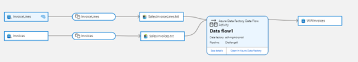

# Challenge 6: Data lineage

[< Previous Challenge](./Challenge5.md) - [Home](../README.md) - [Next Challenge >](./Challenge7.md)

## Description

Data engineers in Fabrikam are working on a new ETL process which will transform data gathered from multiple sources and will be consumed later by Power BI report. Engineers want to represent this process visually, so it is available for further analysis like troubleshooting, tracing root cause in data pipelines or impact analysis.

## Introduction

With multiple data sources in your environment, it may become challenging to understand lifecycle of the whole data transformation process. As these sources may be dependend on each other, changing one data set can impact whole process. So far you have scanned your data sources and you can see individual metadata about these datasets. Time to see dependency and flow of data in your environement. It can be extremly helpful for "what if" analysis, tracing root cause or just to understand the lifecycle of the data. 

In this challenge, you will create data movement pipeline within Azure Data Factory and see data flow in Microsoft Purview Lineage. 

## Success Criteria
- Register Azure Data Factory in Microsoft Purview Studio.
- Create a pipeline in which you will copy data from SQL Database to Azure Data Lake storage (tables: InvoiceLines and Invoices)
- Create Dataflow which will join copied data sets (InvoiceLines and Invoices on ADLS) and save result in Azure SQL Database 
- Understand limitations of Linage feature
- Confirm that you can see data lineage between assets.

Expected lineage view: 

## Learning Resources
- https://docs.microsoft.com/en-us/azure/purview/catalog-lineage-user-guide
- https://docs.microsoft.com/en-us/azure/purview/concept-best-practices-lineage-azure-data-factory
