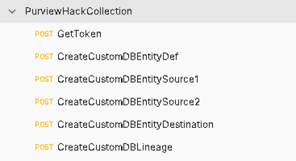
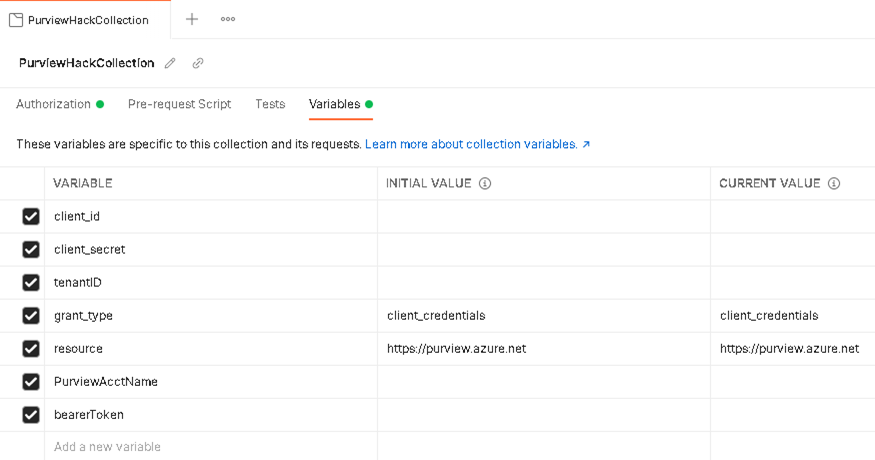

# Challenge 8: Enhancing Microsoft Purview with Atlas API - Coach Guide

[< Previous Solution](./Solution7.md) - [Home](./README.md)

## Introduction

Duration: 45 – 60 minutes. 

Pre-requisites: Pre-create a Service Principal which can be provided to the attendees. The attendees will need to provide Data Curator, Data Source Admin, and Collection Admin permissions to the Service Principal on their respective Microsoft Purview deployments. 
Install Postman locally on the computer (https://www.postman.com/downloads/)

Attendees can follow the steps from the document linked below in order to provide permissions and get the token by sending a POST:
https://docs.microsoft.com/en-us/azure/purview/tutorial-using-rest-apis#set-up-authentication-using-service-principal

We recommend using Postman to demonstrate the use of APIs. Use the attached postman workspace for demonstration of the solution: 

https://stpurviewfasthack.blob.core.windows.net/purviewfasthack/PurviewHackCollection-APIChallenge  

The solution package demonstrates how to connect to Microsoft Purview and get a token. The rest of the API requests create a type definition for CustomDB and then create the entities (Customer, Orders and Reporting). The last request then creates the lineage showing data from Customer, Orders being transformed into the Reporting table.
Before submitting the requests, you will need to modify the collection variables to suit your environment. You should update the bearer token once you submit the first GetToken request.

