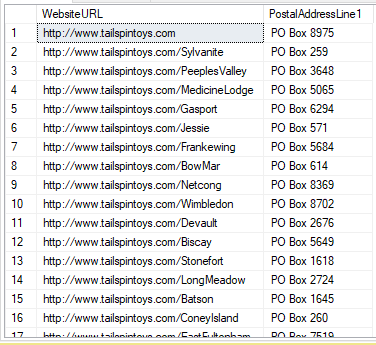

# Challenge 4: Create Custom Classifications

[< Previous Challenge](./Challenge3.md) - [Home](../README.md) - [Next Challenge >](./Challenge5.md)

## Introduction
Users have started using the data catalog and have been happy with the out of the box classifications provided by Microsoft Purview. Some assets scanned from ADLS have data that are specific for Fabrikam's business. These assets remain unclassified as the out of the box classifiers are unable to classify them. The users have requested these assets and attributes that are specific to Fabrikam's needs to be classified based on their requirements.

## Description
In this challenge you will setup a custom classification and will ensure that future scans of the data lake will use the custom classifications that have been defined and perform a scan. Once the scan is completed ensure that the assets and attributes reported earlier are now successfully classified according to the classification rules that you have defined. Create a custom classification rule to classify WebsiteURL and PostalAddressLine1 columns in the Sales.Customers table in the WideWorldImporters database that was scanned in the previous challenge.

## Success Criteria
- Successfully ran a full scan using the custom classification rules.
- The custom classification rules are successfully applied on the assets.
- The new classification appears to filter the search results.

## Learning Resources
- [Custom classifications in Microsoft Purview](https://docs.microsoft.com/en-us/azure/purview/create-a-custom-classification-and-classification-rule)
- [Microsoft Purview classification best practices](https://docs.microsoft.com/en-us/azure/purview/concept-best-practices-classification)
