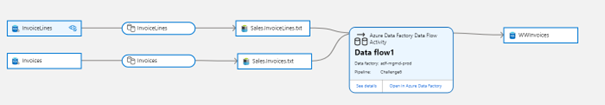

# Challenge 6: Data Lineage

[< Previous Challenge](./Challenge5.md) - [Home](../README.md) - [Next Challenge >](./Challenge7.md)

## Introduction
Data engineers in Fabrikam are working on a new ETL process which will transform data gathered from multiple sources and will be consumed later by a Power BI report. Engineers want to represent this process visually, so it is available for further analysis like troubleshooting, tracing root cause in data pipelines or impact analysis.

## Description
With multiple data sources in your environment, it may become challenging to understand the lifecycle of the whole data transformation process. As these sources may be dependent on each other, changing one data set can impact the whole process. So far, you have scanned your data sources and you can view individual metadata about these datasets. Time to see the dependency and flow of data in your environment. It can be extremely helpful for "what if" analysis, tracing root cause or just to understand the lifecycle of the data. 

In this challenge, you will create a data movement pipeline within Azure Data Factory (copy tables - InvoiceLines and Invoices from the SQL Database to Azure Data Lake Storage) and see data flow in Microsoft Purview Lineage. As an additional step in the pipeline, create a Dataflow which will join the copied data sets (InvoiceLines.csv and Invoices.csv on ADLS) and write the result into a single Azure SQL Database table.

## Success Criteria
- Successful pipeline run that copies data from the SQL Database to Azure Data Lake storage (tables: InvoiceLines and Invoices)
- Successful pipeline run that joins copied data sets (InvoiceLines and Invoices on ADLS) and save result into a single table in Azure SQL Database
- Explain to your coach the limitations of Lineage feature.
- Successful lineage reporting for both the pipelines in Purview.

Expected lineage view: 

## Learning Resources
- [Microsoft Purview Data Catalog lineage user guide](https://docs.microsoft.com/en-us/azure/purview/catalog-lineage-user-guide)
- [Microsoft Purview Data Lineage best practices](https://docs.microsoft.com/en-us/azure/purview/concept-best-practices-lineage-azure-data-factory)
