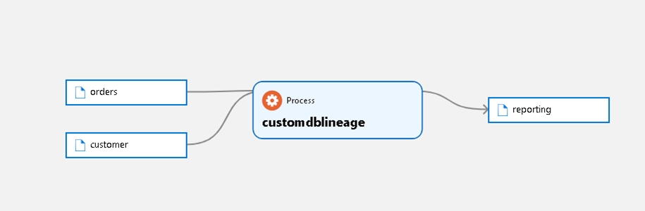

# Challenge 8: Enhancing Microsoft Purview with Atlas API

[< Previous Challenge](./Challenge7.md) - [Home](../README.md)

## Introduction
Despite the rich functionality of Microsoft Purview, there are still some features which are not available yet in the product and may be relevant in the production deployments. Also, there are some tasks you may have in the environment, which cannot be performed with the current user interface of the Governance Portal. Atlas API can help you enhance your solution with custom features like custom lineage. This will allow you to create lineage between assets, even if a data processor (like Azure Databricks) is not supported out of the box. Atlas API can be also helpful with automation of repetitive tasks like bulk loading glossary terms. 

## Description
The Fabrikam team is very happy with the current Microsoft Purview deployment. Yet, there are parts of their overall solution which are not reflected in the Data Catalog. Particularly, Fabrikam has a custom developed database called CustomDB. They would like to create entities pertaining to their CustomDB within Microsoft Purview and would like to show the lineage between these custom entities created in Purview. As part of a POC, you are requested to create a type definition for CustomDB, create 2 source entities (Customers, Orders), create a destination entity (Reporting). Once the entities have been created, create a lineage which shows data from the Customers and Orders table transform into the Reporting table (similar to the below):

## Success Criteria
- Successfully create new type definitions and entities for CustomDB.
- Show the linage between assets (Customers, Orders and Reporting tables). 

## Learning Resources
- [Microsoft Purview automation best practices](https://docs.microsoft.com/en-us/azure/purview/concept-best-practices-automation)
- [pypacheatlas](https://github.com/wjohnson/pyapacheatlas)
