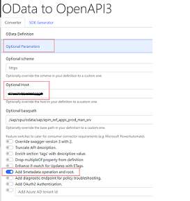

# Challenge 02 - .NET Web frontend with OpenAPI and OData via APIM - Coach's Guide 

[< Previous Solution](./Solution-01.md) - **[Home](./README.md)** - [Next Solution >](./Solution-03.md)

## Notes & Guidance

The most likely things to go wrong here are

1. Convert from OData MD to OpenAPI (https://convert.odata-openapi.net/) -> pay attention to the "Optional Parameters": Optional Host, Optional basepath - SAP OData backend host/port and service path

2. For now, authentication to SAP should be set with BASIC (can be applied with APIM authentication-basic policy) - use BPINST user credentials. 

## Description

During the exercise, participants will be able to provision a web application that will read data from SAP by invoking OData API.

## Prerequisite

Set up and activation of SAP S4H application landscape.
 
## Success Criteria
- Configure OData service in SAP S4H.
- Success deployment of APIM to invoke SAP OData API (based on BASIC authentication).
- Successful deployment of OData Reader web application that can view and edit data in the SAP Application Layer (SAP S/4HANA or SAP ECC) via RESTful OData calls, that have been secured and routed via an Azure API Management gateway.

 
## Learning Resources

- [Convert OData metadata to OpenAPI json](https://docs.microsoft.com/en-us/azure/api-management/sap-api#convert-odata-metadata-to-openapi-json)

- [API Management authentication policies](https://learn.microsoft.com/en-us/azure/api-management/api-management-authentication-policies)
