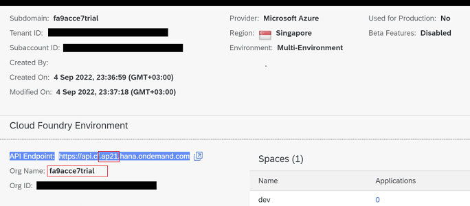
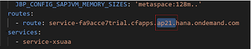
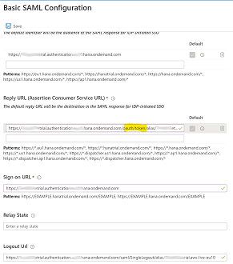
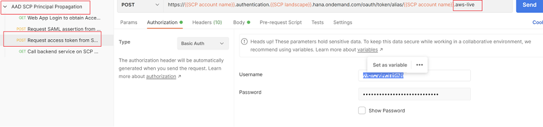

# Challenge 03 - Geode Pattern: Global Caching and replication of SAP source data

[< Previous Solution](./Solution-02.md) - **[Home](./README.md)** - [Next Solution >](./Solution-04.md)

## Notes & Guidance

The most likely things to go wrong here are

1. Complete the setup of the App Service before settting up the SAP BTP HTML5 application as service creation on SAP BTP depends on OData API existance.

2. SAP BTP Backend-
  * Deployment of the backend service - ([steps 1-7](https://blogs.sap.com/2020/07/17/principal-propagation-in-a-multi-cloud-solution-between-microsoft-azure-and-sap-cloud-platform-scp/))

    use your sap instance identifier - https://login.cf.[instance].hana.ondemand.com/ or https://api.cf.[instance].hana.ondemand.com
        Step3 – login should be done with the sap Cloud Foundry Environment created for the specific trial – for example- (orig: cf login -a https://api.cf.[instance].hana.ondemand.com)
        You can check your details in the SAP BTP Subaccount details-

    

      * In case that the student forgot his/hers password, they can use "cf login --sso" to authenticate with a temp code generated via browser access

      * In case mvn is not functioning post installation, please check PATH environment variable include the path of mvn bin folder (e.g. C:\Program Files\Maven\apache-maven-3.8.5\bin)

    * Step 6 - In addition to "your-trial-org-name" edit manifest.yml to point to the right BTP instance

      

3. App Registrations and Configuration in Azure AD - 
  * Step 29 - Make sure to edit Reply URL - replace “saml/SSO” with “oauth/token”.
    This ensures that the Recipient URL is set correctly in the generates SAML assertion by Azure AD.
    
    

  * Testing the scenario - postman reply URL should match to the REPLY URL that was set in the Enterprise app SAML configuration – the below is the right template (original is using aws.live): 

    

    https://{{SCP account name}}.authentication.{{SCP landscape}}.hana.ondemand.com/oauth/token/alias/{{SCP account name}}.azure-{{SCP landscape}}

## Description

During the exercise, participants will be able to provision a SAP Client application that will read/write data from Azure Cosmos DB by invoking Azure App Service OData API.
## Prerequisite

Setup and activation of SAP S4H application landscape.

## Success Criteria

Setup and activation of Azure App Service (OData-Shim), Azure Cosmos DB, Azure APIM and SAP Backend (SFlight)
 
## Learning Resources

- [Setup SAP Client app](https://github.com/MartinPankraz/SAPUI5-CosmosDB-umbrella)

- [Principle propagation](https://blogs.sap.com/2020/07/17/principal-propagation-in-a-multi-cloud-solution-between-microsoft-azure-and-sap-cloud-platform-scp/)

- [Configure SSO between SAP BTP and Azure AD](https://www.youtube.com/playlist?list=PLvqyDwoCkBXZ85LoFrNWv9Mj88TiDAc4g)
## Usefull Links
- [SAP BTP Cockpit](https://cockpit.hanatrial.ondemand.com/trial/)

- [SAP UI5](https://ui5.sap.com/)

- [Business application studio](https://<your-sap-trial-env>.authentication.<trial-instance>.hana.ondemand.com)
