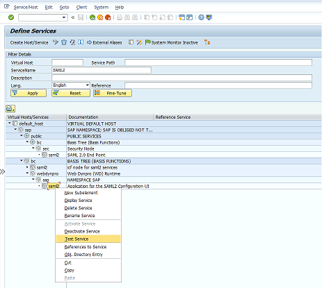
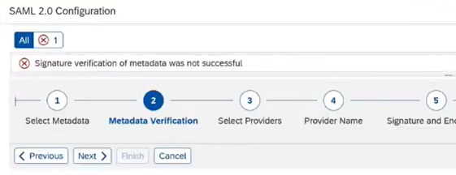

# Challenge 04 - Azure AD Identity - Azure AD and SAP principal propagation

[< Previous Solution](./Solution-03.md) - **[Home](./README.md)** - [Next Solution >](./Solution-05.md)

## Notes & Guidance

The most likely things to go wrong here are
1. Transaction code SAML2 is not launching -> go to TCODE sicf and use Service name: SAML2

    

(Web GUI doesnt support IE Browser)
Alternativley - You can also use https://vhcals4hci.dummy.nodomain:44300/sap/bc/webdynpro/sap/saml2

2. Access to SAML2 is forbidden
https://vhcals4hci.dummy.nodomain:44300/sap/bc/webdynpro/sap/saml2?sap-client=100&sap-language=EN
3. SAML 2.0 Configuration
    * TIP! ProviderName should be URI compliant (e.g. http://S4H )
    * Step 2 (Metadata Verification) - users can fail on "Signature verification of metadata was not successful" 
    
    
    
    -> Participent should Refresh the Azure AD page and download the saml MD and certificate and re-configure it in SAP.
    * Setup of user TCODE /nsu01 -> set up email address
    * If transaction code "SOAUTH" doesn’t open -> participent should use "Wdyid" -> OAuth 2.0 Configuration
        * Enable odata service for oauth /n/iwfnd/maint_service
  
4. APIM setup - 
    * Fail on testing the OData service - "The underlying connection was closed: Could not establish trust relationship for the SSL/TLS secure channel." => resolution is to setup backend with **no SSL validation**, Please state for sudentd that live systems you should have more secure environment therefre should validate SSL and load the relevant certificates for SAP system.

## Description

During the exercise, participants will be able to authenticate with a User to the front-end, authenticate with an App between AppSvc (FE) to APIM and from APIM to SAP

## Prerequisite

Setup and activation of SAP S4H application landscape.
Azure API Management is configured and acces successfuly to your SAP OData API.
Deployment of OData Reader App Service app.
 
## Success Criteria

- Access Azure OData Reader app service and authenticate with your Azure user against Azure AD and will authenticate behind the scenes between -
    Azure App Service and Azure APIM (through AAD)
    Azure APIM and SAP GW (through XSAA)

## Learning Resources

- [SAP Principal Propagation with Azure API Management (Part1)](https://www.youtube.com/watch?v=VDUOYQ_gNv4&list=PLvqyDwoCkBXZ85LoFrNWv9Mj88TiDAc4g&index=5&t=1275s)
- [SAP Principal Propagation with Azure API Management (Part2)](https://www.youtube.com/watch?v=7dblbiHBWpc&list=PLvqyDwoCkBXZ85LoFrNWv9Mj88TiDAc4g&index=6)
- [SAP services protection with Azure APIM and SSO](https://www.youtube.com/watch?v=KFd2x06c4nM)
- [APIM Policies for SAP authentication debug](https://www.youtube.com/watch?v=VMAHSn_QgXQ&t=737s)

