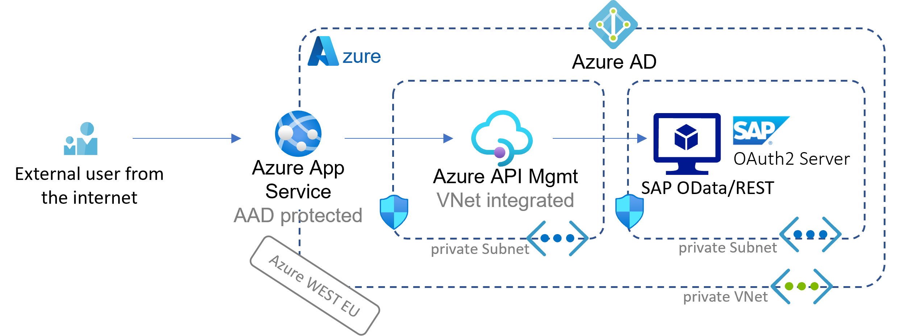

# Challenge 02 - .NET Web frontend with OpenAPI and OData via APIM

[< Previous Challenge](./Challenge-01.md) - **[Home](../README.md)** - [Next Challenge >](./Challenge-03.md)

## Introduction

Now that we have an SAP landscape deployed in Azure, it's time to connect it to the outside world. 
In this challenge, you'll configure and connect up an ASP.NET core MVC application to consume OData services from SAP using SAP's demo data set.

## Description

At this point your SAP data will no longer be an island! There are a number of steps for you to perform.

- Review the following repository and familiarise yourself with it's concepts.
	- [Azure SAP OData Reader](https://github.com/MartinPankraz/AzureSAPODataReader)

- Deploy a new Resource Group in your Azure Subscription 'SAP-WTH052'

- Deploy an empty Developer Tier Azure API Management Instance into your subscription. For this setup you can leave it as not network integrated, but production environments should be located inside a VNet. 
	- Hint: Look in the Azure Portal for "API Management" as a service in the Marketplace.  
		
- Deploy an empty Azure Web Application into your subscription. Again here you do not need to be concerned about network/vnet integration, but you would consider this model in a production-ready environment.

- Configure the API Management instance to connect to your S/4HANA or SAP ECC services as detailed here. 
	- [SAP Configuration](https://github.com/MartinPankraz/AzureSAPODataReader#azure-api-management-config)
	- Hint: for now do not enable principal Propagation. Instead, simply configure SAP Basic Auth for now. We will enable this in the APIM policy later in another challenge. But let's connect to the data first! 
	
## Success Criteria

- Run an ASP.NET MVC Core app that can view and edit data in the SAP Application Layer (SAP S/4HANA or SAP ECC) via RESTful OData calls, that have been secured and routed via an Azure API Management gateway.

## Learning Resources

- [.NET speaks OData too!](https://blogs.sap.com/2021/08/12/.net-speaks-odata-too-how-to-implement-azure-app-service-with-sap-odata-gateway)

- [Azure SAP OData Reader](https://github.com/MartinPankraz/AzureSAPODataReader)

