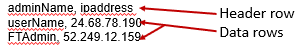

# Challenge 02 - Custom Queries & Watchlists

[< Previous Challenge](./Challenge-01.md) - **[Home](../README.md)** - [Next Challenge>](./Challenge-03.md)

## Pre-requisites 

Challenge-02 needs to be complete; this challenge is dependent on having logon events 4624 and 4625 sent to the Sentinel Log Analytics workspace   

## Introduction 

A big part of running a SEIM/SOAR solution is triaging as many of the 'false' positives as possible.  False is in quotes because we still want to keep the data, it is potentially useful, but we know that many alerts/incidents can be closed automatically as they are expected behaviors.   

## Description
In this challenge, we will create Alerts and Incidents based on tracking logins to our server and leverage Watchlists to identify safe IP addresses.  The objective is to ensure that we know everytime a user logs into the machine, or fails to log into the machine.  Select two tactics that represent what kind of attack could be underway using the Mitre.org framework.

**Alerts**   

-  Create an Alert and an Incident based on a user logon . Include the account of the user that logged on and the IP address as Entities.  

-  Write down your justification for tactics selected, severity, query scheduling, alert threshold and event grouping.  

-  Reporting - Create a workbook that tracks the number alerts generated by user activity - successful and failed logon attempts.
 

**Watchlists**   

-  Create a Watchlist containing a userName and an IPAddress. Include your home IP address.  (Hint:  Alias – validips) Example: 
      
    
 

-  Modify the Watchlist and add another row containing "AsiaAdmin" and the home/work IP address of one of your WTH colleagues.   
Example:  AsiaAdmin, 173.135.10.193

-  Set the retention date for Watchlist table to 7 days maximum. (Hint: ARM template) and validate the date has been set correctly  
  

## Success Criteria

**Alerts**

- An alert and incident are created whenever you login to one of the VM's being monitored.
- You can explain your choices around query scheduling, thresholds and groupings
- Workbook that shows the alerts/incidents for your newly created alert.
 

**Watchlists**

- The Watchlist exists   
- The user has been added  
- The teams (individuals) are able to show the retention data has been set to 7 days on that watchlist  

## Learning Resources

- [Mitre Attack framework:]( https://attack.mitre.org/)

- [Azure Sentinel Watchlists]( https://docs.microsoft.com/en-us/azure/sentinel/watchlists)

- [Creating a custom analytics rule to detect threats]( https://docs.microsoft.com/en-us/azure/sentinel/detect-threats-custom)

- [Creatinng Sentinel Workbooks]( https://techcommunity.microsoft.com/t5/microsoft-sentinel-blog/azure-sentinel-workbooks-101-with-sample-workbook/ba-p/1409216)

- [Sentinel Ninja training ](https://techcommunity.microsoft.com/t5/azure-sentinel/the-ninja-training-2021-edition-is-out/ba-p/2027400 )

 

## Tips

Look for resources that can help you with setting table retention and verifying it 

Each alert is one incident 
 

## Advanced Challenges 

**Too comfortable?  Eager to do more?  Try these additional challenges!**

- Alert on RDP Session connection only  
- Create a workbook that tracks the top five alerts by severity, the top five by volume, and the top five over the past 24 hours.  
- Create a playbook to add the 'unknown' IP address to the NSG of the relevent subnet of the resource being targeted  
