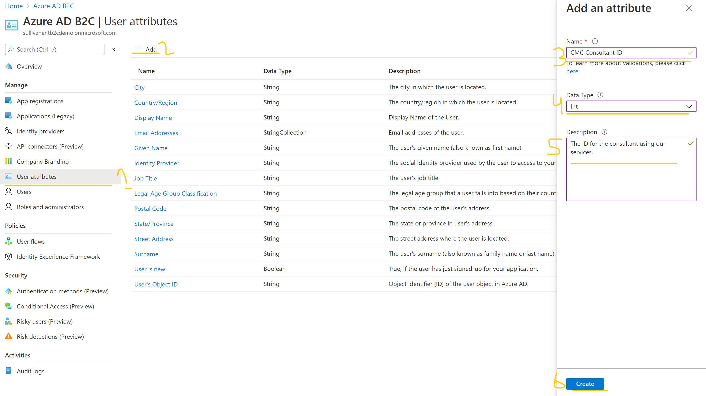
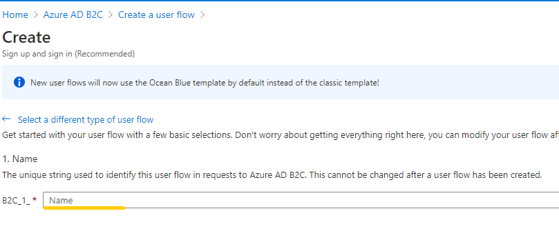
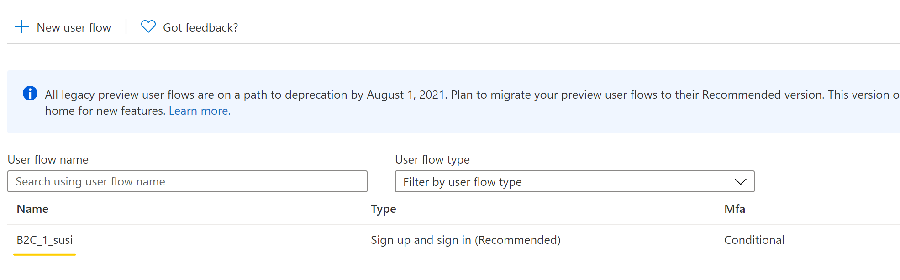

# Challenge \#2 - Sign Me Up! Sign Me In!

[< Previous Challenge](./01-provision-b2c.md) - **[Home](./README.md)** - [Next Challenge>](./03-external-idp.md)

## Prerequisites

There are no prerequisites that are new from the end of challenge 1. Must have an existing B2C tenant.

## Introduction 

This challenge will walk your attendees through a standard, simple sign up & sign in (SUSI) [user flow](https://docs.microsoft.com/en-us/azure/active-directory-b2c/add-sign-up-and-sign-in-policy?pivots=b2c-user-flow). 

## Hackflow

1. If you are coming immediately from the previous hack, once your B2C tenant completes provisioning, it will present you with the option to click to work in your new tenant. Do that. 
    - If you are not coming from the creation screen, you will need to find your tenant in the resource group you dropped it in or switch directories in the Azure portal. 
2. In your new tenant, we will first need to create a [custom attribute](https://docs.microsoft.com/en-us/azure/active-directory-b2c/user-flow-custom-attributes?pivots=b2c-user-flow#create-a-custom-attribute) for the consultant ID.  
3. Now we are ready to create our user flow. Select "User flows" and click the "New user flow" button 
4. On the Create a user flow page, select the Sign up and sign in user flow. 
5. Under Select a version, select Recommended, and then select Create.  
6. On the creation screen, name your flow. Something like "susi" is acceptable. This will make a policy called __B2C_1_susi__.  
7. Still on the creation screen, make sure you select "Email signup" as your option for local accounts. Once this is done, click the create button.  
    - You may want to have a brief discussion with your team about the MFA enforcement options and what this could mean for them in their organizations. 
8. The creation should happen quickly, and you should pop back into the user flows blade. Click the name of your user flow to edit.  
9. Under settings, select "User Attributes". Your attendees will then select the proper attributes from their challenge. 
    - First Name
    - Last Name
    - Display Name
    - Email Address
    - City
    - State
    - CMC Consultant ID
10. To customize the appearance, select "Page layouts" under Customize, and then select the templates dropdown. For this hack, the slate gray template is preferred:  
11. You'd restrict the states a user can signup with by changing the data type of State/Province from TextBox to DropDownSingleSelect and entering the valid values there.

