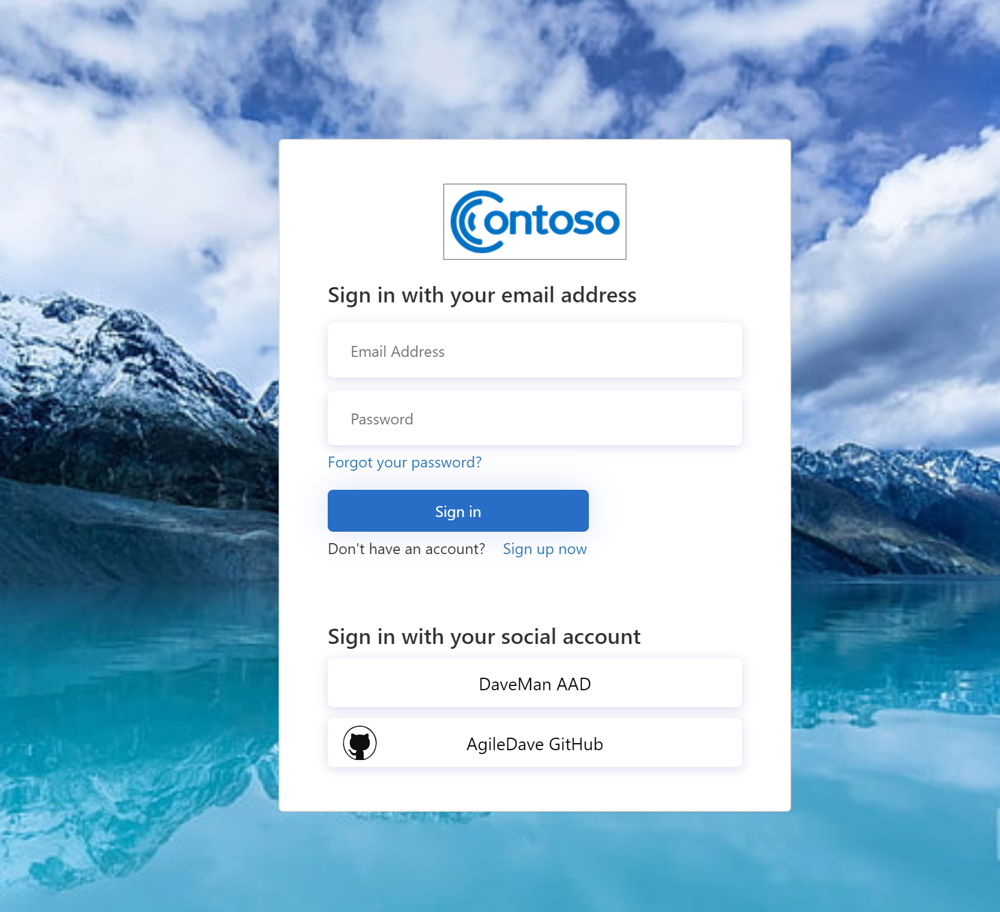

# Challenge \#4 - Logos, Colors, and Custom Text

[< Previous Challenge](./03-external-idp.md) - **[Home](./README.md)** - [Next Challenge>](./05-claims-enrichment.md)
## Introduction 
This challenge has the team complete the following:

- Create a new User Flow for Profile Edit
- Change the display of some attribute labels
- Add an additional language
- Host and modify a new SUSI template
- Wire up the SUSI and Profile Edit User Flows in a test harness web application.

## Hackflow

1. For creating a new User Flow for Profile Edit, the process will be very similar to the SUSI flow creation. Identify the attributes that will be updated and then test the new flow.
2. For modifying the display of attributes, this can all be done by selecting the User Flow to modify and then selecting **Page Layouts**.

    - You'll want to modify the **Local Account Sign Up Page** for modifying attributes on the SignUp flow.
    - You'll also want to do the same for the **Social Account Sign Up Page**
    - Repeat this if you modify the Profile Edit flow
    - The files in the [PageTemplates](../Student/Resources/PageTemplates/) directory can be uploaded in bulk using [Azure Storage Explorer](https://docs.microsoft.com/en-us/azure/virtual-machines/disks-use-storage-explorer-managed-disks) or the [Azure Storage](https://marketplace.visualstudio.com/items?itemName=ms-azuretools.vscode-azurestorage) extension in VS Code.

3. Modifying languages (and adding add'l customized languages) can be accomplished by selecting the User Flow and then selecting **Languages**

    - You'll want to **Enable Language Customization** from the menu
    - Pick an additional language of your choosing and select **Enabled**
    - Modify a couple of string values in the *Unified Sign Up or Sign In Page*
    - After you download the defaults file, find this string entry:

    ```json
        {
        "ElementType": "ErrorMessage",
        "ElementId": null,
        "StringId": "UserMessageIfInvalidPassword",
        "Override": false,
        "Value": "Your password is incorrect."
        },
    ```
    - Change the `Override` value to `true` and change the `Value` to something more vague, like `Invalid user name or password`.
    - Upload the modifed defaults page and then test your User Flow
4. To use a custom template for the SUSI User Flow, the team will provision an Azure Storage Account, create a Blob Container, and then store the HTML template in that container.
    - They should follow the docs on setting up the container for anonymous access and also set the appropriate CORS values
    - Once the HTML template has been saved, get the URL to the container and update the User Flow by selecting **Page Layouts** and for the `Unified sign up or sign in page`, select **Use custom page content** to `Yes` and then provide the URL to the HTML template in Blob Storage.
5. Under the Resources folder, there is a HarnessApp folder that contains a web application that can be run locally. Follow the README for Option 2 to run the application locally and connect it to your B2C tenant.
6. Make sure on the Harness app registration in the B2C tenant, that your Redirect URL is something like "https://localhost:44316/signin-oidc". You will need the "/signin-oidc" path in order for the Microsoft identity library to properly handle signin and signup.
7. At the end of the challenge, the student should have a signup/signin flow set of screens that look similar to:



