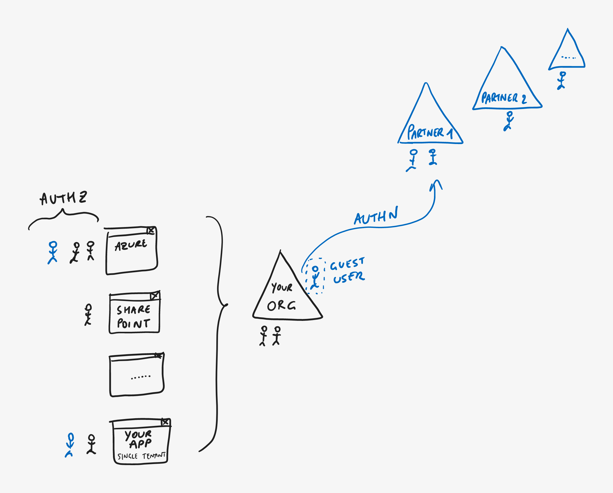

# Challenge \#4 - Invite Guest Users in Azure AD tenant

[< Previous Challenge](./02-test-sign-in.md) - **[Home](../README.md)** - [Next Challenge>](./04-integrate-app-service.md)

## Introduction

Azure Active Directory (Azure AD) B2B collaboration is a feature within External Identities that lets you invite guest users to collaborate with your organization. With B2B collaboration, you can securely share your company's applications and services with external users, while maintaining control over your own corporate data. Work safely and securely with external partners, large or small, even if they don't have Azure AD or an IT department.

## Success Criteria

1. Your new guest user is invited.
2. Invited user has received and accepted the invitation.
3. Sign in with the guest user account is successful(using [Authr](https://authr.biz/)).

## Advanced Challenges (Optional)

1. Self Service sign up would be enabled for your tenant.

## Learning Resources

- [B2B Collaboration Overview](https://learn.microsoft.com/en-us/azure/active-directory/external-identities/what-is-b2b)
- [B2B Guest User ](https://learn.microsoft.com/en-us/azure/active-directory/external-identities/user-properties)
- [Real WOrld Scenario with External Identities](https://github.com/Azure/FTALive-Sessions/blob/main/content/identity/microsoft-identity-platform/11-external-identities-scenario.md)