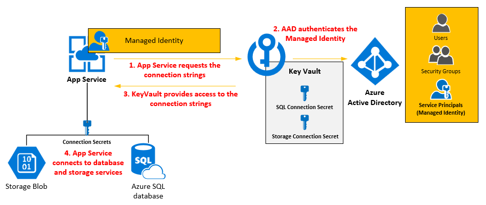

# Challenge \#5 - Deploy your app to Azure!!

[< Previous Challenge](./04-integrate-app.md) - **[Home](../README.md)**
## Introduction

Modern authentication protocols allow you to decouple from Windows and Active Directory, instead allowing any person in the organization to sign in to a web application from any device - as long as it has internet connectivity.

During this scenario, you will modernize an existing intranet web application from being hosted on Windows with IIS and connecting to SQL Server all using Windows Integrated Authentication, into a cloud based web application using OpenID Connect to sign users in and a Managed Identity to securely connect to an Azure SQL Database.

## Success Criteria

1. Your app is deployed to Azure App Service.
2. The redirect URL of Azure Active Directory App should be configured with Azure App service URL.
3. User could sign in your azure app with Azure AD credentials.

## Learning Resources

- [Deployment to Azure App Service](https://learn.microsoft.com/en-us/azure/app-service/deploy-local-git?tabs=cli)
- [Quickstart: Deploy an ASP.NET web app](https://learn.microsoft.com/en-us/azure/app-service/quickstart-dotnetcore?tabs=net60&pivots=development-environment-vs#publish-to-azure)
## Advanced Challenges (Optional)

_Too comfortable? Eager to do more? Try these additional challenges!_

1. Configure a Managed Service Identity for the Web App.
2. Create a SQL Database.
3. Configure your SQL Database to use the web app's manage service identity.