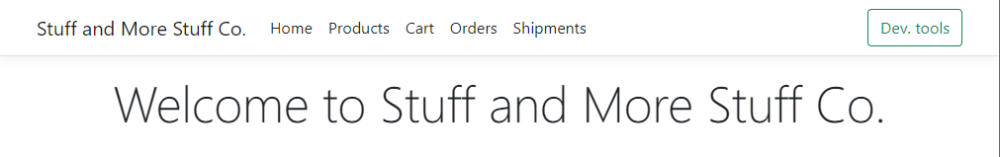
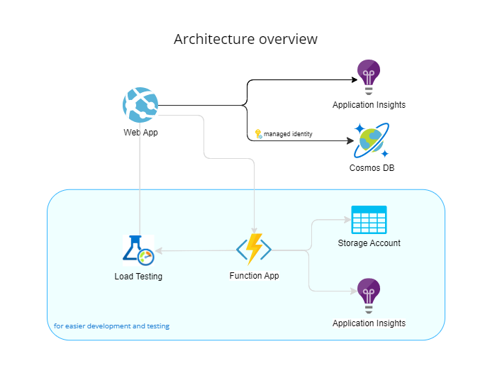

# Challenge 01 - What Is Going On?

[< Previous Challenge](./Challenge-00.md) - **[Home](../README.md)** - [Next Challenge >](./Challenge-02.md)

## Introduction

Stuff and More Stuff Co. has deployed their newly designed web application on Azure, using Azure Cosmos DB as the database backend, since they were looking for a NoSQL database to suit their requirements.  In the first few weeks, all was going quite well, until their first marketing campaign. The number of customers visiting the web application increased exponentially and a host of issues and complaints started arriving. The web application was constantly very slow, multiple error messages were being generated and the overall customer experience was severely degraded.

The web application is a multi-tenant application; for the purposes of the What The Hack, we offer a simplified version, where in the `Carts` and `Orders` pages, the application user may select the Store for which to view their data. Each user can order from any of the available stores.

The application interface itself is as below:

The `Products` page provides a per-store inventory of available products. This page statically reads a json file since practically such a page would be driven from a search backend (such as [Azure Cognitive Search](https://docs.microsoft.com/en-us/azure/search/search-what-is-azure-search)) which is not implemented in our case.

The `Cart` page provides an interface to view, for a given user/store pair, the contents of their cart.

The `Orders` page provides an interface to view, for a given user/store pair, the orders they have finalized.

The `Shipments` page provides an interface to view, for a given user/store pair, the orders that have been shipped.

Finally, clicking on the `Dev. tools` button allows a user to run a Load Test from the deployed Azure Load Testing service. The load test will simulate 1000 users making the following interactions:
- Viewing a Product
- Adding the Product to their Cart
- Viewing their Cart for the specific Shop
- Finalizing their Order
- Viewing their Orders for the specific Shop

The architecture of the solution: 

The resources in the blue box are not part of the application itself, but allow for easier development and testing experience.

## Description

In this challenge, you will have to identify how the current system has been set up and what problems does this create.

**NOTE:** You will need to run the Load Test defined in the Azure Load Testing service that is deployed in your Resource Group to gather data. The load test simulates the following user actions:
- The user views a product
- The user adds the product to the cart
- The user views the cart
- The user submits their order
- The user views their orders

As we would like to simulate real-life traffic, we should load test with a representative load (the load test runs a 1000 user test across the web app). Please scale up the Azure App Service Plan hosting the Web App to P1V3 for the duration of the test. You may then scale back down to S1.

To be able to identify the required data points to help you formulate a plan to mitigate the issues, you will need to:
- Enable Diagnostics in Cosmos DB
- Identify what is the current data model used by the application and how it is implemented in Azure Cosmos DB

## Success Criteria

To complete this challenge successfully:
- Show that the Load Test successfully ran (even with errors - this will probably happen :) )
- Show a correct set-up of Diagnostics in Azure Cosmos DB
- Show the current data model as you have identified it
- Show sample queries that where executed along with their associated RU cost
- Show your findings and identify potential ways that could alleviate the various problems found.
- Should you not change anything in the application, identify the scale factor (in RU/s) the database would need to operate correctly.

## Learning Resources

- [Data modeling in Azure Cosmos DB](https://docs.microsoft.com/en-us/azure/cosmos-db/sql/modeling-data)
- [How to model and partition data on Azure Cosmos DB using a real-world example](https://docs.microsoft.com/en-us/azure/cosmos-db/sql/how-to-model-partition-example)
- [Partitioning and horizontal scaling in Azure Cosmos DB](https://docs.microsoft.com/en-us/azure/cosmos-db/partitioning-overview)
- [Troubleshoot issues with diagnostics queries](https://docs.microsoft.com/en-us/azure/cosmos-db/cosmosdb-monitor-logs-basic-queries)
- [Troubleshoot issues with advanced diagnostics queries for the SQL (Core) API](https://docs.microsoft.com/en-us/azure/cosmos-db/cosmos-db-advanced-queries)
- [Indexing in Azure Cosmos DB](https://docs.microsoft.com/en-us/azure/cosmos-db/index-overview)
- [Optimize request cost in Azure Cosmos DB](https://docs.microsoft.com/en-us/azure/cosmos-db/optimize-cost-reads-writes)
- [Create & Run a load test in Azure Load Testing Service](https://docs.microsoft.com/en-us/azure/load-testing/quickstart-create-and-run-load-test)
