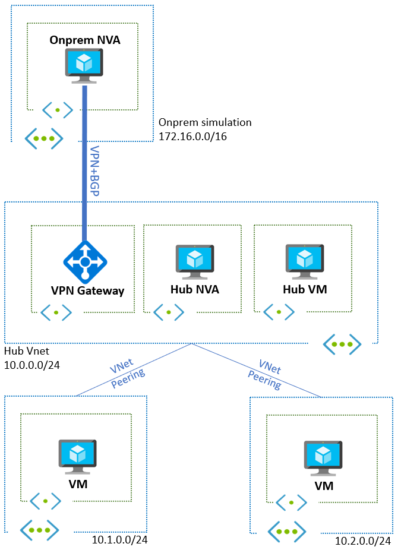

# Challenge 01 - Building a Basic Hub and Spoke Topology utilizing a central Network Virtual Appliance

[< Previous Challenge](./Challenge-00.md) - **[Home](../README.md)** - [Next Challenge >](./Challenge-02.md)

## Introduction

In this challenge you will be setting up a basic hub and spoke topology with a Central Network Virtual Appliance. You will also establish connectivity to on-prem via VPN site-to-site or Express Route Circuit if you have access to one.

In this challenge you will learn how to build a basic test bed upon which to simulate different Route Server topologies, like the ones described in the rest of the hack. 

## Description

In this challenge you will create the topology described in this diagram:

Please perform the following actions:
- Create a Hub and Spoke Topology as described above. **Do not use Azure Route Server yet.**
- Route traffic through the Central Network Virtual Appliance with the use of **User Defined Routes (UDRs)** in Azure. Configure the Central Network Virtual Appliance with **static routes** to achieve the latter. 
- Click on the link to get the configuration to deploy an [On-Premises Environment using Cisco CSR 1000v](./Resources/wthcsronprem.md)
- Click on the link to get the configuration to deploy a [Central Network Virtual Appliance using Cisco CSR 1000v](./Resources/centralnva.md)
- If you prefer or are experienced with another vendor, please feel free to deploy and provide your own configuration. However, the appliance that you choose will be used throughout this hack
> **Warning**
> 
> VNet Gateway should be deployed on Active/Active mode!

## Success Criteria

At the end of this challenge, you should:

- Have a basic Hub and Spoke Topology in Azure connecting to a simulated On-Premises Environment. 
- Verify all traffic is going through the Central Network Virtual Appliance:
  - Spoke to spoke
  - Spokes to onprem
  - Onprem to hub VM
  - Spokes to Internet
  - Spoke to hub VM

## Learning Resources

* [Virtual network peering](https://docs.microsoft.com/azure/virtual-network/virtual-network-peering-overview)
* [Hub and Spoke topology in Azure](https://docs.microsoft.com/azure/architecture/reference-architectures/hybrid-networking/hub-spoke)
* [What is VPN Gateway](https://docs.microsoft.com/azure/vpn-gateway/vpn-gateway-about-vpngateways)
* [Create a Site-to-Site connection in the Azure portal](https://docs.microsoft.com/azure/vpn-gateway/vpn-gateway-howto-site-to-site-resource-manager-portal)
* [Configure BGP for VPN Gateways](https://docs.microsoft.com/azure/vpn-gateway/bgp-howto)
* [View BGP status and metrics](https://docs.microsoft.com/azure/vpn-gateway/bgp-diagnostics)
* [Subnet calculator](https://www.davidc.net/sites/default/subnets/subnets.html)

