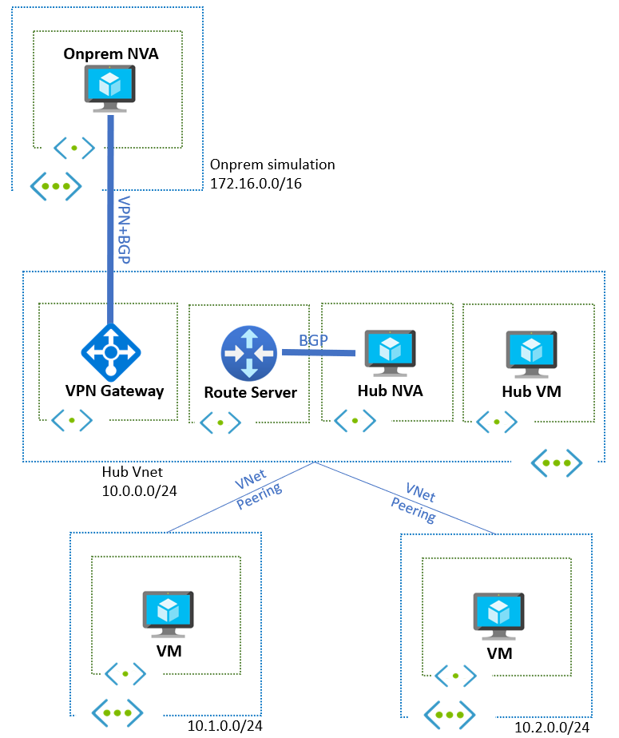

# Challenge 02 -  Introduce Azure Route Server and peer with a Network Virtual appliance

[< Previous Challenge](./Challenge-01.md) - **[Home](../README.md)** - [Next Challenge >](./Challenge-03.md)

## Introduction

In this challenge you will introduce Azure Route Server into the topology that you have built previously in order to establish dynamic routing across the Hub and Spoke topology.

This challenge simulates the insertion pattern of firewall NVAs that have no hybrid or SDWAN connectivity and rely on Azure VPN or ExpressRoute gateways for the communication to on-premises networks.

## Description

In this challenge you will insert Azure Route Server as described in this diagram:

Please perform the following actions:

- Use BGP so that spoke to spoke traffic goes through the NVA. You should limit the use of User-Defined Routes (UDRs) to a minimum.
- Click on the link to get the necessary configuration to [establish BGP relationship between the Cisco CSR 1000v Central NVA and Azure Route Server](./Resources/whatthehackcentralnvachallenge2.md).

## Success Criteria

At the end of this challenge you should: 

- Determine if inspecting all traffic through the NVA is achievable, using as few UDRs as possible.
  - Can you eliminate all UDRs to have "spoke VM -> Internet" traffic traversing the NVA?
  - Can you eliminate all UDRs to have "onprem <-> spoke VM" traffic traversing the NVA?
  - Can you eliminate all UDRs to have "onprem <-> hub VM" traffic traversing the NVA?
  - Can you eliminate all UDRs to have "spoke VM <-> hub VM" traffic traversing the NVA?
- Verify that you still have SSH connectivity to all VMs and NVAs.

## Learning Resources

- [What is Azure Route Server?](https://docs.microsoft.com/en-us/azure/route-server/overview)
- [Configure Azure Route Server](https://docs.microsoft.com/en-us/azure/route-server/quickstart-configure-route-server-portal)
- [Configure Route Server with Quagga](https://docs.microsoft.com/en-us/azure/route-server/tutorial-configure-route-server-with-quagga)
- [ARS with ExR and VPN](https://docs.microsoft.com/en-us/azure/route-server/expressroute-vpn-support)
- [Route Injections](https://docs.microsoft.com/en-us/azure/route-server/route-injection-in-spokes)
- [Troubleshooting](https://docs.microsoft.com/en-us/azure/route-server/troubleshoot-route-server)
- [Can I advertise the exact prefixes as my VNET?](https://docs.microsoft.com/en-us/azure/vpn-gateway/vpn-gateway-bgp-overview#can-i-advertise-the-exact-prefixes-as-my-virtual-network-prefixes)
- [VPN BGP Transit Routing in Azure](https://docs.microsoft.com/en-us/azure/vpn-gateway/vpn-gateway-bgp-overview#does-azure-vpn-gateway-support-bgp-transit-routing)

## Tips

- The best tip to understand the functionality of Azure Route Server is to look at the routing tables across the board. You can find a way to do it through PowerShell, CLI or Azure portal if the functionality is available.  
- Look at what routes are learned and advertised by the different Networking technologies utilized on this exercise. The articles above have some useful commands for this.
- Look at what gets programmed into the effective routes on the NICs.

