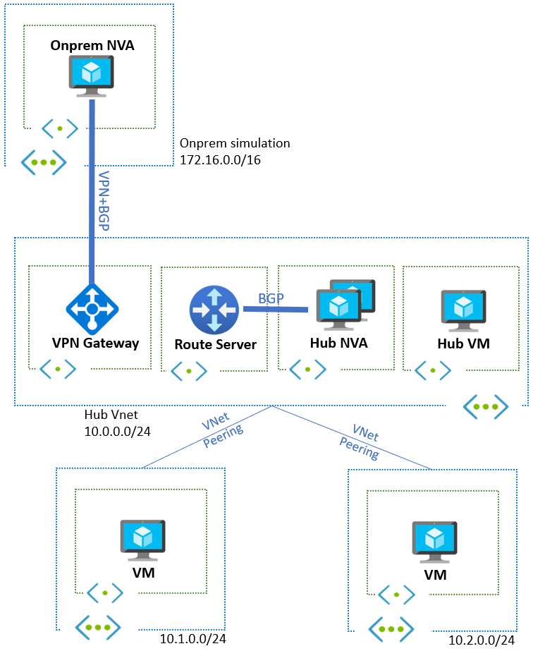

# Challenge 03 -  Introduce a High Availability with Central Network Virtual Appliances

[< Previous Challenge](./Challenge-02.md) - **[Home](../README.md)**

## Introduction
  
It is recommended that organizations avoid single points of failure by deploying their infrastructure in a resilient manner, and Network Virtual Appliances are no exception. In this challenge you will be confronted with multiple ways of achieving NVA high availability through Azure Route Server and BGP.

## Description

Your Network Organization has decided to deploy High Availability on your current topology as depicted in the picture below. 

  
- Using the configurations from the past challenges, please add a secondary NVA that will fulfill that requirement.
- You can get some config examples to manipulate routes in the CSR in [establish BGP relationship between the Cisco CSR 1000v Central NVA and Azure Route Server](./Resources/whatthehackcentralnvachallenge2.md).

## Success Criteria

At the end of this challenge you should: 

- Demonstrate three different failover scenarios:
  - Active/active without any additional components, traffic symmetry not required
  - Active/active with traffic symmetry. You may deploy an additional component (Azure Load Balancer)
  - Active/standby by configuring the routes from the first hub NVA as more preferred than the ones from the second
- Discuss which pattern would be more apropriate for SDWAN (typically stateless) and firewall appliances (typically stateful)

## Learning Resources

- [Deploy highly available NVAs](https://docs.microsoft.com/en-us/azure/architecture/reference-architectures/dmz/nva-ha#azure-route-server)
