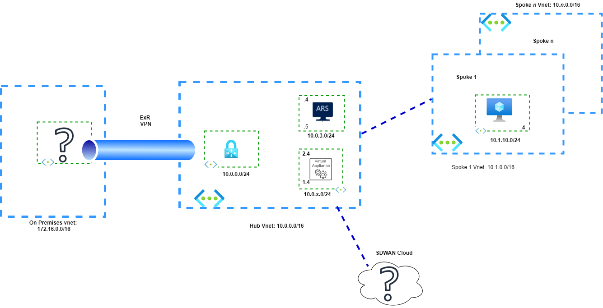

# Challenge 03 -  Connect Network Virtual Appliance to an SDWAN environment

[< Previous Challenge](./Challenge-02.md) - **[Home](../README.md)** - [Next Challenge >](./Challenge-04.md)

## Introduction
  
Now that we have a solid understanding of the functionality of Azure Route Server, you will integrate a simulated SDWAN environment to this solution.

While the topology in the previous challenge focused on insertion patterns for firewall NVAs, this challenge will show how to integrate an NVA that provides on-premises connectivity, such as SDWAN NVAs and how that integration works together with an Azure Virtual Network Gateway. Designs that involve SDWAN NVAs and Azure VMware Solution or Skytap (which are connected to VNets via ExpressRoute gateways) are an example requiring this interaction between the NVA, Route Server and an Azure VNG.

## Description

Your Network Organization decided that Azure is amazing and want to establish communications with two different SDWAN Data Centers in separate geographic locations. They are advertising the exact same prefixes from both locations via BGP and they want to reach their On-Premises Data Center. 
  

  
Please deploy the following scenario:

- Establish two simulated SDWAN branches on different locations.You have two options for deployment: 
  - Create two SDWAN Data Centers using the same address space and advertise it to the Central NVA.
  - Create two SDWAN Data Centers using different address spaces and advertise an additional identical address space from each.
  
- Plan for additional prefixes for BGP advertisements.
- You may use the following [BGP topology](./Resources/bgplayout.md) as an aid.
- Click on the link to go to the configuration template to simulate your [SDWAN topology using Cisco CSR 1000v](./Resources/sdwancsr.md)

> **Warning**
> 
> Consider the BGP Topology and SDWAN deployment carefully and make sure your VNet address space does not overlap with the Virtual Tunnel Interfaces on the configuration inside the boxes.

## Success Criteria

At the end of this challenge you should: 

- Verify connectivity between On Premises and the SDWAN branches.
- Verify connectivity between Hubs, Spokes and SDWAN branches. 
- The SDWAN Data Center closest to Azure should be preferred.
- Ensure no asymmetric routing is found.

