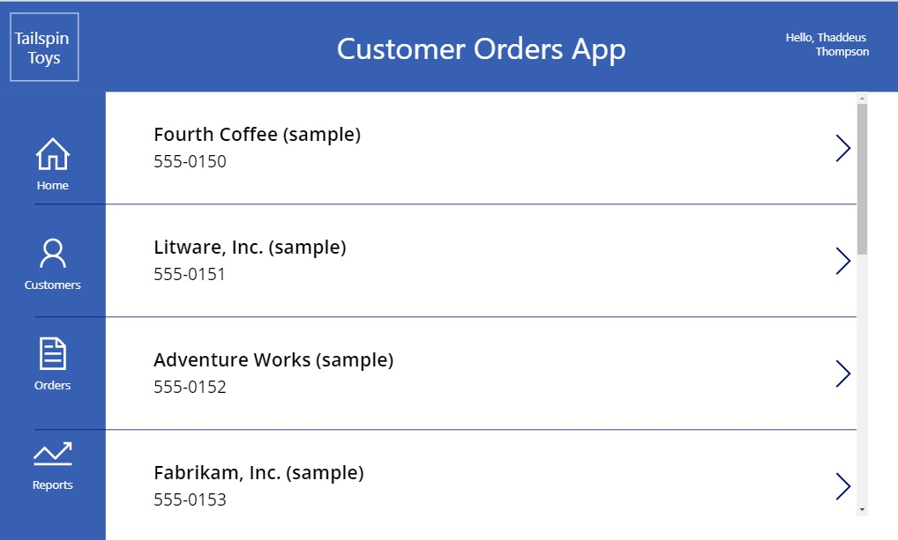

# Challenge 05 - Build a Power App

[< Previous Challenge](./Challenge-04.md) - **[Home](../README.md)** - [Next Challenge >](./Challenge-06.md)

## Introduction

Now that you have managed to processes of handling inbound emails, extracting and storing order data leveraging AI Builder, and creating an approval process, in this challenge you will create a Power App to view and manage the order data.

## Description

In this challenge, you will create a Power App to support Order and Customer Management

To get you started, we have provided your team with a starter canvas app which includes two custom components, a navigation bar, and a title bar. You can find the starter app Zip file, `TailspinToysBaseApp.zip`, in the `/BasePowerApp/` folder of the student `Resources.zip` file provided by your coach.  You can import this starter app into your Dataverse environment.

Since the components are generalized, you will want to customize them to include proper icons and labels. 

Once you have imported the starter Power App, your team will continue to design and build the app which will allow users to see Customers, Orders, and order details.

Rename the canvas app to include your team number and specify the development environment. (e.g., Tailspin Toys – Squad 2 – Dev).

Now that your base app is imported, implement the following design requirements:
- A working navigation component that allows the user to switch between app screens.  
    - **HINT:** You will need to add and configure the navigation component from the starter app to the screens that you and your team creates
- Four app screens that show the following:
    * A screen and a label that shows the Customer records view
    * A screen and a label that shows the Order records view for a selected customer
    * A screen and a label that allows for viewing of a selected Order and detail lines
    * A screen that will be used to view analytics (report visualizations will be created in a future challenge)
    * It is your choice as to which fields are displayed on the screens
    * Include a search box for locating a customer on the customer screen
    * Include a search box for locating an order on the Orders screen
    * Appropriate buttons for navigation, editing/viewing, etc.
    * Connect the above components so that the custom properties in the provided navigation system directs the user to the correct page.

Below is an example of how the app might start to look: 
    

## Success Criteria

To complete this challenge successfully, you should be able to:
- Demonstrate a working app to your coach that uses data from the Dataverse tables and fulfills the above requirements as well as in the solution in your team's development environment.

## Learning Resources

* [Importing a solution](https://learn.microsoft.com/en-us/power-apps/maker/data-platform/import-update-export-solutions)
* [Create a solution](https://docs.microsoft.com/en-us/powerapps/maker/common-data-service/create-solution)
* [Solution concepts](https://docs.microsoft.com/en-us/power-platform/alm/solution-concepts-alm)
* [Get Started with Power Apps](https://docs.microsoft.com/learn/modules/get-started-with-powerapps)
* [Import Power Apps Solutions](https://docs.microsoft.com/en-us/powerapps/maker/common-data-service/import-update-export-solutions)
* [Controls and properties in Power Apps](https://docs.microsoft.com/en-us/powerapps/maker/canvas-apps/reference-properties)
* [Create responsive layouts in canvas apps](https://docs.microsoft.com/en-us/powerapps/maker/canvas-apps/create-responsive-layout)
* [Add a screen to a canvas app and navigate between screens](https://docs.microsoft.com/en-us/powerapps/maker/canvas-apps/add-screen-context-variables)
* [Understand canvas app variables in Power Apps](https://docs.microsoft.com/powerapps/maker/canvas-apps/add-screen-context-variables)
* [Add a data connection to a canvas app in Power Apps](https://docs.microsoft.com/en-us/powerapps/maker/canvas-apps/add-data-connection)
* [App in a Day](https://aka.ms/appinaday)
* [EditForm, NewForm, SubmitForm, ResetForm, and ViewForm functions in Power Apps](https://docs.microsoft.com/en-us/powerapps/maker/canvas-apps/functions/function-form)
* [Filter, Search, and Lookup functions in Power Apps](https://docs.microsoft.com/en-us/powerapps/maker/canvas-apps/functions/function-filter-lookup)
