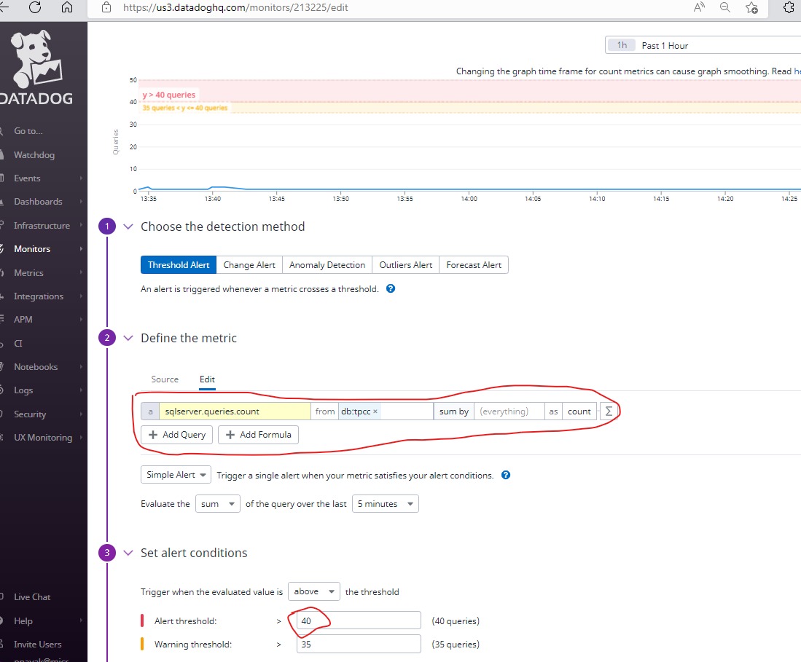
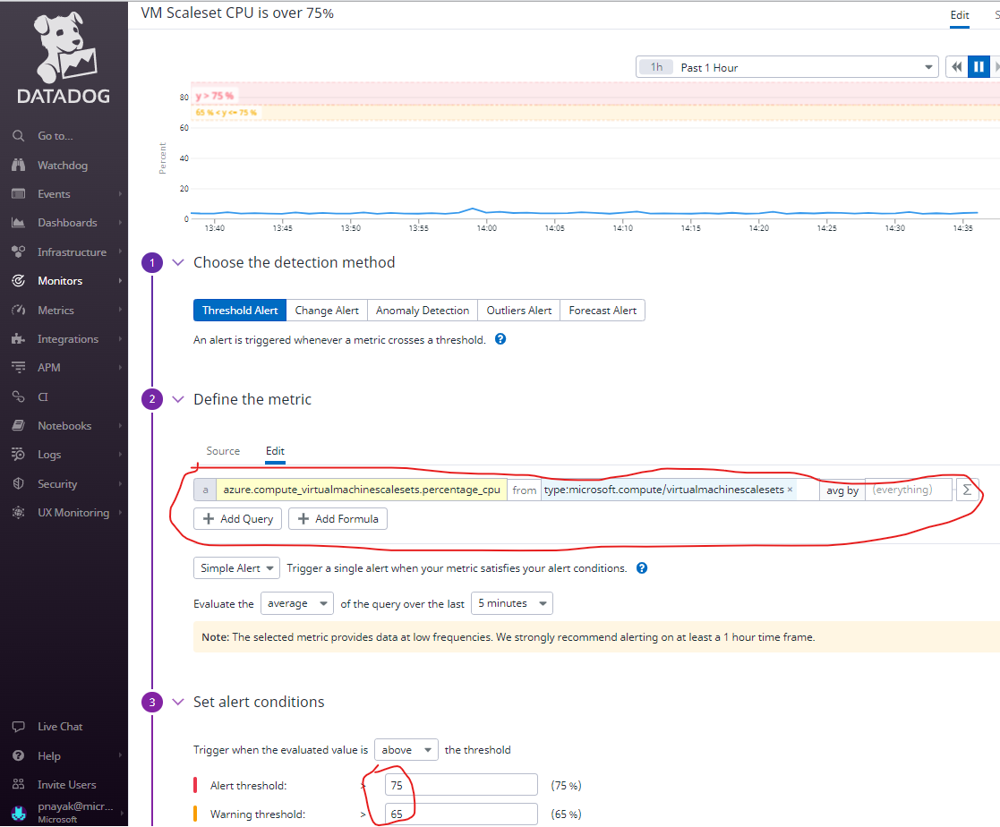

# Challenge 02 - Monitoring Basics and Dashboards - Coach's Guide 

[< Previous Solution](./Solution-01.md) - **[Home](./README.md)** - [Next Solution >](./Solution-03.md)

## Notes & Guidance

 Here's the screenshot for setting up SQL Queries count monitor in Datadog.

 Here's the screenshot for setting up VMSS CPU metrics monitor in Datadog.
