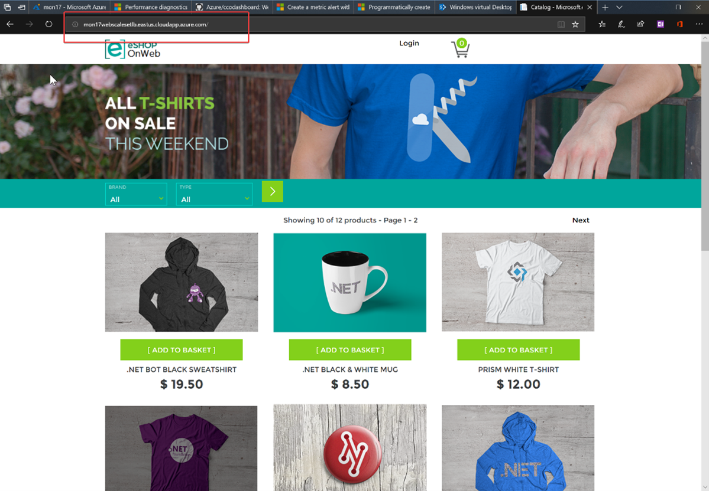
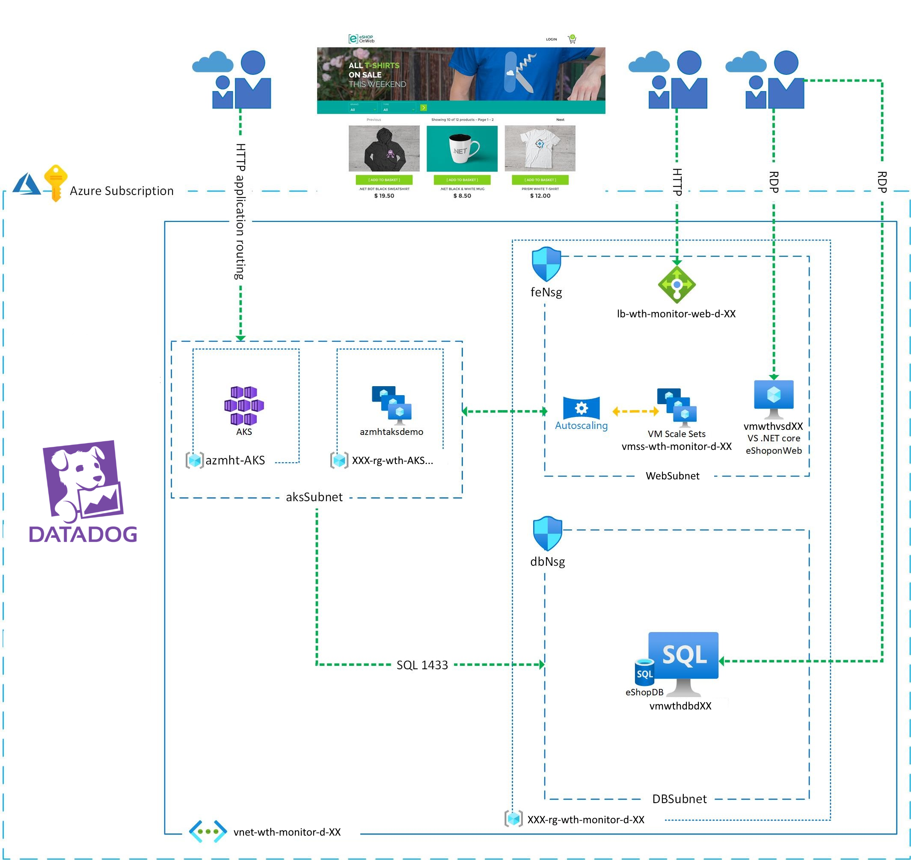

# Challenge 00 - Prerequisites - Ready, Set, GO! DASH Conference

**[Home](../README.md)** - [Next Challenge >](./Challenge-01.md)

## Introduction

Thank you for joining us at the DASH conference in NYC on October 18th, 2022! You will be participating in a special edition of this hack where you will be provided with an Azure lab environment to participate. 

The content of this hack will be available if you wish to attempt the hack in your own Azure subscription at a later time on the [What The Hack website](https://aka.ms/wth).

You have been contracted to monitor and manage an online shopping website in Azure for a start-up company called "eShopOnWeb".  The eShopOnWeb solution in Azure has an Azure environment that consists of (2) Azure resource groups that include a VNet, subnets, NSG(s), LB(s), NAT rules, scale set and a fully functional .NET Core Application (eShopOnWeb) to monitor.

The eShopOnWeb solution in Azure has been pre-deployed by our lab partner, Spektra Systems. Your job will be to use Datadog to configure the eShopOnWeb solution to be monitored so you can demonstrate to your company's leadership team that you can effectively manage it.

## Prerequisites

You will be provided with access to an Azure Subscription where the eShopOnWeb solution has been deployed.

You can complete this entire hack in a web browser using the [Azure Portal](https://portal.azure.com), [Datadog Portal](https://datadog.com), and [Azure Cloud Shell](https://shell.azure.com). The Azure Cloud Shell has most of the common Azure management tools already pre-installed.

>**Note** Datadog is commonly automated via [Terraform](https://www.terraform.io/). Some of the challenges have you use Terraform to configure Datadog features. Terraform is already included in the Azure Cloud Shell. 

## Description

### Accessing the eShopOnWeb Azure Environment

To access the Azure lab environment for this hack, you will need to do the following:

- Login to Spektra Systems' website with your email address and the password provided by your coach.
- Copy the provided username & password for the Azure environment to an easy to access location on your workstation (Notepad, OneNote, etc).
- Please be sure to copy the VM username and password as well.
- Login to the Azure portal at: [https://portal.azure.com](https://portal.azure.com)
- Login to the Azure Cloud Shell and create a new Bash environment (if it does not exist): [https://shell.azure.com](https://shell.azure.com)

>**Note** While you can access the Azure Cloud Shell from the Azure Portal, we recommend you keep the Azure Cloud Shell open "fullscreen" in its own browser tab or window by accessing [https://shell.azure.com](https://shell.azure.com). During the hack, you will want to observe things in the Azure Portal while interacting with the Azure Cloud Shell in a separate browser window side by side.

### Student Resources

Your coach will provide you with a link to a `Resources.zip` file that contains resource files you will use to complete some of the challenges for this hack.  

- Download and unpack this file in your Azure Cloud Shell environment. 

```bash
# Download the Resources.zip file from the URL provided by your coach
wget https://aka.ms/WTHDashResources -O Resources.zip
# Unpack the zip file
unzip Resources.zip
# Navigate to the "Resources" folder
cd Resources
```

The rest of the challenges will refer to the relative paths inside the `Resources.zip` file where you can find the various resources to complete the challenges.

### View Deployed Resources

- To view the eShopOnWeb website, navigate to the Public IP Address resource, **`pip-wth-monitor-web-d-eu`**, in the Azure Portal.  
- In the Overview blade, copy the DNS name to your clipboard.  
- Open a web browser, paste your DNS name in the address bar and press ENTER.  Your browser should render the eShopOnWeb site. 



### Deploy Datadog from Azure Marketplace
- Go to the Azure Marketplace and deploy Datadog into your subscription using the `Datadog Pro Pay-As-You-Go` offering.
- Create a new Datadog organization when asked to choose between linking to an existing Datadog org or creating a new one.
- Select the existing resource group `XXX-rg-wth-monitor-d-XX` to deploy the Datadog resource.
  >**Note** The "XXX" in the resource group name will vary based on the Azure region the eShopOnWeb Azure environment has been deployed to.
- Ensure that the Azure resource details show as `West US 2` and the Datadog site is `US3`.
- You do not need to enable single sign-on through Azure Active Directory for this workshop, but we recommend doing so in a production environment.
- Proceed with the deployment, and once the deployment is finished, click the link **Set Password in Datadog.**
- Choose a password that you will remember for the duration of this workshop.
- Proceed to log in to Datadog. 
  - The username/email can be found in the Azure portal, top right. 
  - Click View account to see the full email address.
  - Use the password from the previous step.
-  We recommend keeping the Datadog and Azure portal browser tabs open for the duration of this workshop.

## Success Criteria

- Verify you have access to the contents of the `Resources.zip` package in your Azure Cloud Shell environment
- Verify you can see the website deployed
- Verify the resources contained in architecture diagram below are present in your own Azure subscription.
- Verify that you have deployed Datadog into your Azure lab environment. 



## Learning Resources

- [Get Started with Azure PowerShell](https://docs.microsoft.com/en-us/powershell/azure/get-started-azureps?view=azps-6.4.0)
- [Get Started with Azure Command-Line Interface (CLI)](https://docs.microsoft.com/en-us/cli/azure/get-started-with-azure-cli)
- [Overview of Azure Cloud Shell](https://docs.microsoft.com/en-us/azure/cloud-shell/overview)
