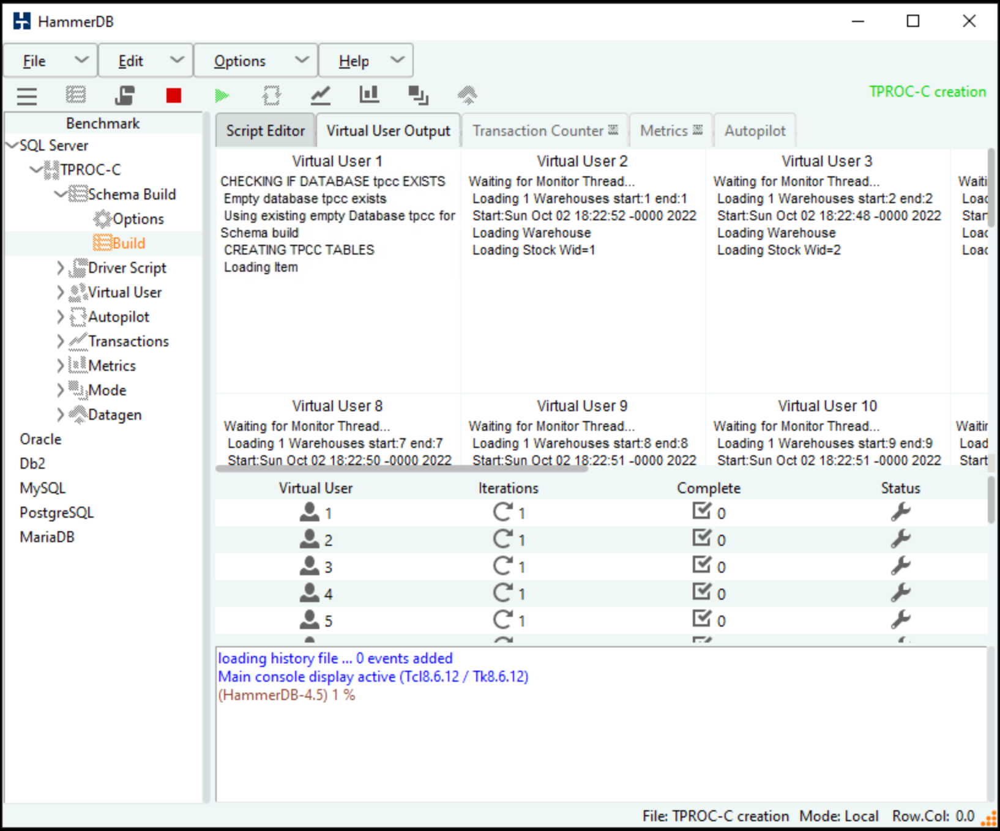

## HammerDB Configuration

[< Back to Challenge](../../Challenge-02.md)

This is a reference guide for [Challenge 02 - Monitoring Basics and Dashboards](../../Challenge-02.md) that demonstrates how to configure HammerDB to generate a load test against the eShopOnWeb database.

### Stress the Database using HammerDB 

- From the Visual Studio Server, download and install the latest version of [HammerDB](http://www.hammerdb.com/)
      

- Open HammerDB and double click on SQL Server to start configuring the transaction load. In the dialog that opens, click OK.

	   

- Drill into SQL Server \\ TPC-C \\ Schema Build and double click on **Options**
- Modify the Build Options for the following:
	- SQL Server: Name of your SQL Server
	- SQL Server ODBC Driver: SQL Server
	- Authentication: SQL Server Authentication
	- SQL Server User ID: sqladmin
	- SQL Server User Password: \<password  you  used during the deployment\>
	- SQL Server Database: tpcc
	- Number of Warehouses: 50
	- Virtual Users to Build Schema: 50  

	>**Note** Setting the last two at 50 should generate enough load to trip a threshold and run long enough for you to graph to show a spike
  
	
  
- Double click on "Build" and Click "Yes" to kick of a load test.

	
  
When the test is running it should look like the screenshot below:
>**TIP:** If you would like to run a second test you **must** first delete the database you created and recreate it. HammerDB will not run a test against a database that has data in it. When you run a test it fills the database with a bunch of sample data.

 