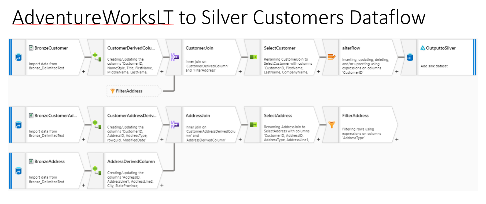
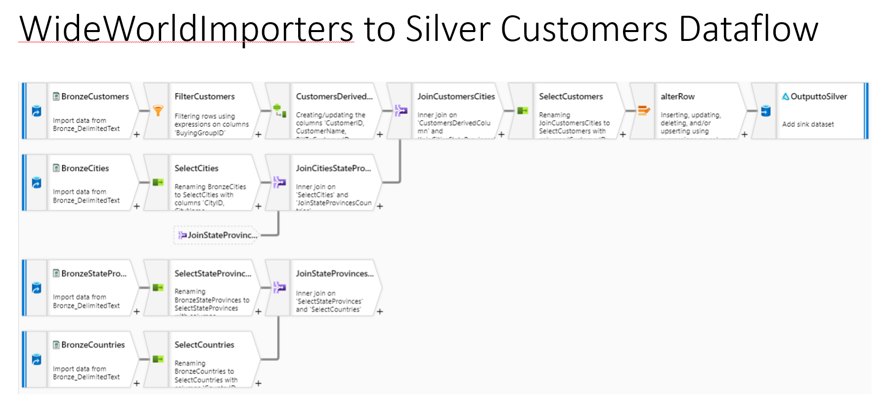

# Challenge 02 - Standardizing on Silver - Coach's Guide 

[< Previous Solution](./Solution-01.md) - **[Home](./README.md)** - [Next Solution >](./Solution-03.md)

## Notes & Guidance

Do not have the squads worry about duplicate customers/products between systems, but they should be concerned about duplicate IDs.  Make sure that they review [Azure Databricks Tutorial: Delta Lake](https://learn.microsoft.com/en-us/azure/databricks/delta/tutorial) to understand how they create Delta Tables and how to Upsert to the Delta Tables.  That will help them understand why IDs are important.

If your students are interested in using Azure Synapse Dataflows for this challenge, it would be a good idea for them to familiarize themselves with the transformation options available in the [Mapping data flow transformation overview](https://learn.microsoft.com/en-us/azure/data-factory/data-flow-transformation-overview?context=%2Fazure%2Fsynapse-analytics%2Fcontext%2Fcontext).  
Example dataflows for both data sets are also provided below as a reference:
  

  

  

If your students are more inclined towards Databricks or Synapse Spark then you can use this generic [notebook](../Coach/Solutions/Bronze%20to%20Silver%20Delta%20Lake.ipynb?raw=true) to explain the steps that they need to follow to load data into the Silver layer and play around with Delta and time travel. 

There are also good samples at GitHub...
- [Azure-Samples/Synapse Notebooks](https://github.com/Azure-Samples/Synapse/tree/main/Notebooks)
- [Databricks Notebook Gallery](https://www.databricks.com/discover/notebook-gallery)

__Bonus Challenge__:  
For the bonus challenge, we can use a GetMetadata or a similar pipeline object in Azure Synapse to check for files being present and copy over the file(s) at the end (or start) of a pipeline run.
  
