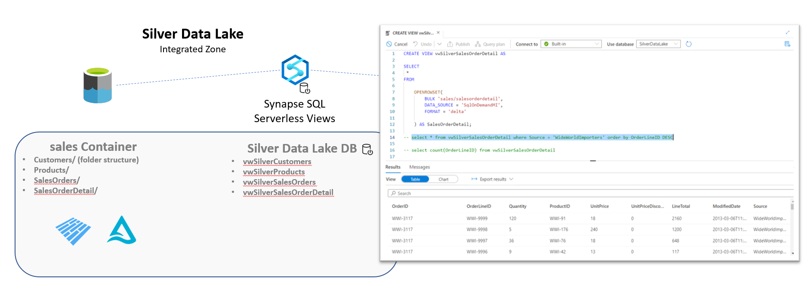

# Challenge 03 - Go for the Gold - Coach's Guide 

[< Previous Solution](./Solution-02.md) - **[Home](./README.md)** - [Next Solution >](./Solution-04.md)

## Notes & Guidance

Most of the focus in this challenge would be in setting up the Dedicated Pools, Databricks SQL or the Power BI Datamarts.   

If your squad goes the route of the dedicated pool, we have included an Azure Data Studio Notebook in the [solutions folder](./Solutions/) that showcases implementing Row Level Security utilizing a bridge table between users and the address table.  

For Column Level Security / Data Masking in Power BI Datamarts there is no way to do this dynamically.  Thus, the users will most likely have to do some sort of replace values, etc. within the Power Query editor when bringing the data into the Power BI Datamart.
  
If they are going down the Power BI Datamart route, use this [guide](https://learn.microsoft.com/en-us/power-bi/transform-model/datamarts/datamarts-get-started#create-a-datamart) for detailed steps on setting it up.  
Some connection details that could be useful are:
- To connect to Synapse Dedicated Pools: Go to the Azure portal, open the Synapse resource and use the "Dedicated SQL endpoint" URL
- To connect to Synapse Serverless Pools: Go to the Azure portal, open the Synapse resource and use the "Serverless SQL endpoint" URL
- To connect to Azure Databricks: You will need the Server Hostname as well as the HTTP Path. More details on how to get those details [here](https://learn.microsoft.com/en-us/azure/databricks/integrations/jdbc-odbc-bi#get-server-hostname-port-http-path-and-jdbc-url).
  

__Bonus Challenge__:  
  
If the students are interested in using Synapse Serverless, use this [SQL script](../Coach/Solutions/Synapse%20SQL%20Serverless%20Setup%20Guide.sql?raw=true) as a guide on the steps needed to set them up.  
These SQL Serverless views can act as the foundation to the Power BI Datamarts if the students choose that path.
  
For the bonus challenges, the possible answers to those questions are:
- Azure Synapse Database Templates  
  [What are Azure Synapse database templates?](https://learn.microsoft.com/en-us/azure/synapse-analytics/database-designer/overview-database-templates)
- Using Azure Synapse Serverless SQL Views  
  [Create and use views using serverless SQL pool in Azure Synapse Analytics](https://learn.microsoft.com/en-us/azure/synapse-analytics/sql/create-use-views)  
  Details on what that would look like are added below.
  

  
