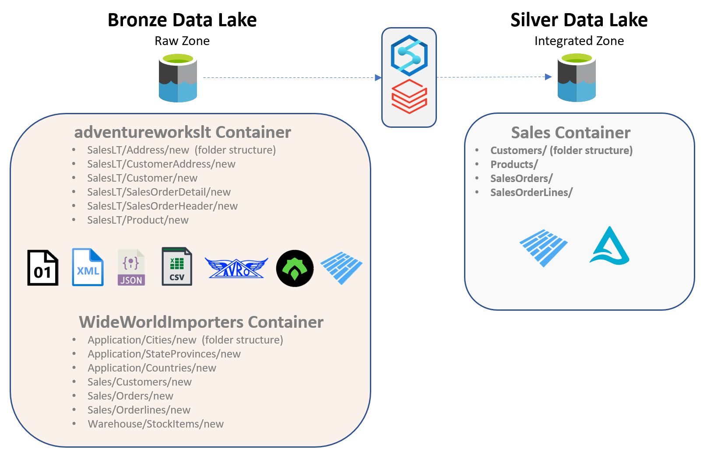

# Challenge 02 - Standardizing on Silver

[< Previous Challenge](./Challenge-01.md) - **[Home](../README.md)** - [Next Challenge >](./Challenge-03.md)

## Introduction
In this challenge we will begin to transform the data we loaded "as is" to the Bronze layer into more "standardized" and "integrated" datasets that are then loaded into the Silver layer. 
The goal of this challenge is to merge the tables and bring in only a subset of the fields.  We do not need this to be production level quality and determine every field that could be a match.  Rather we want to bring over just enough fields to show an intelligent report.  The definition of "intelligent" is at your discretion.  Duplicate names may happen, but do not have duplicate IDs.  We need each Delta table to have a unique key.  

## Description
Some of the things we try to achieve within the Silver layer are
- __Data Lake Storage Formats__  
  In the Bronze layer the data is usually stored in its native source format, such as CSV or TXT for file-based sources. In the Silver layer we make sure all the different data sources are converted into a file format better suited for the Data Lake, such as Parquet or Delta.
- __Domain Separation__  
  An important point to keep in mind is that in the Bronze layer, the data is often organized based on the Source System or source object name, on the contrary, in the Silver layer the data is organized by Domain, such as Customer or Product. 
- __Consolidation__  
  We also try and consolidate the disparate data structures on the source side into a more conformed structure. For example, we could have 10 different sources bringing in various kinds of Customer data but in the Silver layer we try and keep one consistent structure for our Customer data and mold our source data accordingly.
- __Data Type Standardization__  
  As part of the new consolidation, we try and standardize the data types in our Silver layer structures and mold our source data accordingly.
- __Formatting__  
  Continuing with the trend of standardizing, we make sure our Silver layer data does not have different kinds of formatting within the data. We could do that by doing things such as enforcing NULLs if needed, cleaning up blank spaces, syncing up decimal points across the sources etc.
- __Partitioning and Sharding__  
  Although optional for this challenge, this is highly recommended for more production focused use cases. Making sure the data is appropriately physically arranged ensures efficient access when doing ad-hoc analysis or when pulling to the Gold Layer.
  
The above steps can be achieved using Azure Databricks or Azure Synapse.
A more visual guide on the process can be seen below.
  
 
  
  
### Business Case
Now that we know what we need to do, it’s important to understand why we are doing this.  
From an organizational standpoint, the Silver layer serves three main purposes:
- Enrichment  
As we have discussed above, the Silver layer is often where most of the effort is spent on wrangling the data into a meaningful state. Multiple sources are brought together, the data is refined, and we make sure that it is stored in the most efficient way possible so that the following layers can access data effectively. 
- Discovery  
Since the data on the Silver layer is cleaner and more organized, this is generally where most of the data discovery is done. This involves data engineers, data scientists, data analytics and even sometimes business users digging into the data directly to try to gain more context into the data available in the higher layers. The Silver layer provides a balance between the perk of having long term data retention (Bronze) and having cleaner and organized data (Gold).
- Reusability    
The Silver layer is also where reusable data sets are created and stored so that different teams creating different higher layers (data marts or warehouses) can reuse the same data sets without having to go through the trouble of creating it again themselves.
  
      
## Success Criteria
To complete this challenge successfully, you should be able to:
- Validate that all the data has been transformed and has been loaded into the Silver layer in the appropriate storage hierarchies based on the discussion above.
- A primary key has been established for each table with unique values in that table.
- Showcase the data copied into the Silver layer and be able to articulate the transformations performed and the reasons for your choices.
- Showcase how this data can also be accessed for ad-hoc analysis and reporting, via both Synapse and Databricks.
- Showcase how to utilize delta lake versioning and time travel.

## Learning Resources
The following links may be useful to achieving the success criteria listed above.
- [Data flows in Azure Synapse Analytics](https://learn.microsoft.com/en-us/azure/synapse-analytics/concepts-data-flow-overview) 
- [Extract, transform, and load data by using Azure Databricks](https://learn.microsoft.com/en-us/azure/databricks/scenarios/databricks-extract-load-sql-data-warehouse) 
- [Use Azure Key Vault secrets in pipeline activities](https://docs.microsoft.com/en-us/azure/data-factory/how-to-use-azure-key-vault-secrets-pipeline-activities)
- [Access Azure Blob Storage using Azure Databricks and Azure Key Vault](https://learn.microsoft.com/en-us/azure/key-vault/general/integrate-databricks-blob-storage)
- [Azure Databricks - Secret Scopes](https://learn.microsoft.com/en-us/azure/databricks/security/secrets/secret-scopes)
- [Azure Synapse - Linux Foundation Delta Lake overview](https://learn.microsoft.com/en-us/azure/synapse-analytics/spark/apache-spark-delta-lake-overview)
- [Query Delta Lake files using serverless SQL pool in Azure Synapse Analytics](https://learn.microsoft.com/en-us/azure/synapse-analytics/sql/query-delta-lake-format)
- [Azure Databricks Tutorial: Delta Lake](https://learn.microsoft.com/en-us/azure/databricks/delta/tutorial)
- [Databricks - Introducing Delta Time Travel for Large Scale Data Lakes](https://www.databricks.com/blog/2019/02/04/introducing-delta-time-travel-for-large-scale-data-lakes.html)
- [YouTube - Azure Synapse Analytics - Can Synapse Time Travel with Delta?](https://youtu.be/5LufBKIA2s4)

## Bonus Challenges 
- Brainstorm about how Azure Databricks and Azure Synapse can work together to help deliver this use case more efficiently.
- As part of your pipeline, find a way to archive the Raw Zone files that have already been loaded into the Silver Zone by moving them to a separate area.
