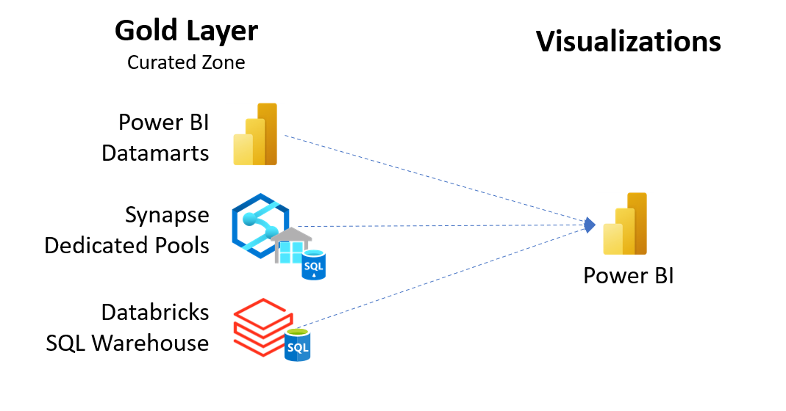

# Challenge 04 - Visualize the Results

[< Previous Challenge](./Challenge-03.md) - **[Home](../README.md)**

## Introduction
Data, in general, is not as useful if it's just sitting in storage on our Data Lake. One of the most common ways to drive insights from data is through visualizations.   

In this challenge we will visualize some of the data we've loaded into the Gold Layer using Power BI.

## Description
Some of the things we can try in this challenge are:
- __Generate Insights__  
  Go through the Gold Layer and brainstorm about which columns make good candidates to be used for reporting. Look for fields that can be used to dissect the Sales/Customer data into a more meaningful breakdown.  
  Some of the types of visualizations that can be used to showcase this data are
  - Maps
  - Area or line charts
  - Bar and column charts
  - Pie charts
  - Cards
  - Scatter plots
  - Treemaps

- __Role Based Row Level Security__  
  In tools such as Power BI, there are ways in which the same report can be read by two different people of varying security approval levels and they could get access to subsets of the whole data, and all the visualizations and metrics in that report would automatically conform to the amount of data readable by each user. This way instead of different security levels using different manual reports, the same report can be used across a team/organization.
  
A visual representation (no pun intended) of the ask is shown below.  
  
 
  

## Success Criteria
To complete this challenge successfully, you should be able to:
- Showcase a few examples of visualizations that can help drive more insights from the Gold Layer data.
- Showcase how role-based / row-level access can be used to limit data within the same reports/visualizations.
  

## Learning Resources
The following links may be useful to achieving the success criteria listed above.
- [Visualizations in Power BI reports](https://learn.microsoft.com/en-us/power-bi/visuals/power-bi-report-visualizations)
- [How to connect Azure Synapse to Power BI for data visualization](https://techcommunity.microsoft.com/t5/educator-developer-blog/how-to-connect-azure-synapse-to-power-bi-for-data-visualization/ba-p/3614555) 
- [Azure Databricks - Connect to Power BI](https://learn.microsoft.com/en-us/azure/databricks/partners/bi/power-bi#connect-to-power-bi-desktop-manually)
- [Row-level security (RLS) with Power BI](https://learn.microsoft.com/en-us/power-bi/enterprise/service-admin-rls)

## Bonus Challenge  
- Brainstorm and find ways in which we can use built-in visualizations in other services apart from Power BI
