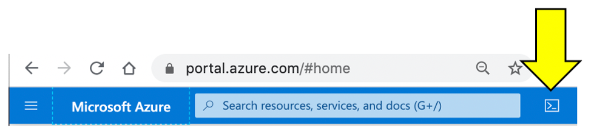
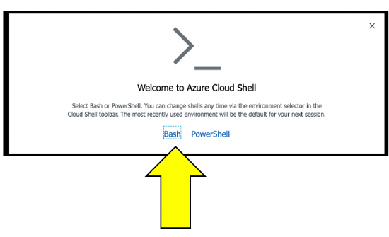
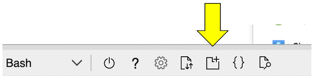
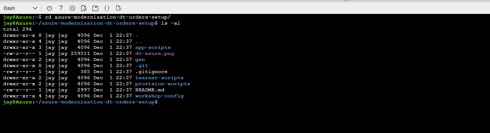
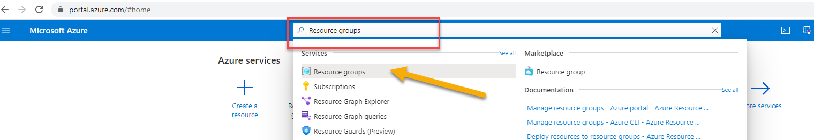
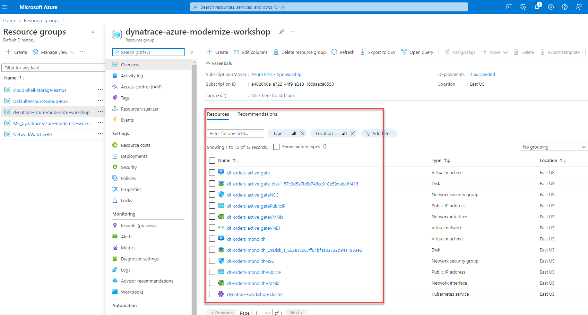

# Challenge 00 - Prerequisites - & Setup - Coach's Guide 

**[Home](./README.md)** - [Next Solution >](./Solution-01.md)

## Notes & Guidance

### Learning Objectives

We will now setup Dynatrace, Azure, and the workshop environment. You need all of these in place before you are presented with the wth challenge.

### What you'll need in this section


- Ensure your have an email for accessing your Dynatrace trial environment

- Coach must validate if the [Dynatrace Azure Workshop Github repo](https://github.com/dt-alliances-workshops/azure-modernization-dt-orders-setup/) is accessible.

### Login to Dynatrace trial environment

For this challenge, we have set-up a free Dynatrace environment with an evaluation license of the complete feature set of our all-in-one performance monitoring platform to monitor Azure resources and complete the workshop exercises.

### What you will need


### Tasks to complete this step

1) Login to your Dynatrace Environment
    - Click on the link within the email you've received to login to your Dynatrace trial environment.
    

2) Azure Portal Prep

    a. Navigate to <a href="https://portal.azure.com/" target="_blank">https://portal.azure.com/ </a>

    b. Click on the Cloud Shell button
      

      If you get this prompt, choose bash.  </aside>

         

    c. Make a dedicated Azure shell Browser tab by clicking this new tab icon.

      

    d. Within your Azure Cloud Shell window, run this command to download the workshop scripts:
      ```bash
        git clone https://github.com/dt-alliances-workshops/azure-modernization-dt-orders-setup.git
      ```
    e. To validate all the workshops scripts have download, please run these commands within the Azure Cloud Shell window to display the directories
      ```bash
        cd azure-modernization-dt-orders-setup/
        ls -al
      ```
    - You should see an output similar to the one below 
    


  3. Provision the workshop

  * This step will automatically provision several Azure resources and Dynatrace configuration needed for the workshop via a shell script.  

* The process to provision everything will take ~15-20 minutes.
    
    1. Run the input credentials script
        ```bash
        cd ~/azure-modernization-dt-orders-setup/provision-scripts
        ./input-credentials.sh
        ```
    2. Run the provisioning script
    - Run the script to provision the workshop Azure resources
        ```bash
        cd ~/azure-modernization-dt-orders-setup/provision-scripts
        ./provision.sh  wth
        ```
    3. Return back to the window where you have the Azure Cloud shell open
    8. Paste the full command and hit enter.  You should see a prompt similar to as one below.

        ```
          ===================================================================
          About to setup a Dynatrace What the Hack
          Dynatrace Server: https://xxxx.live.dynatrace.com
          SETUP_TYPE   = wth
          ===================================================================
          Proceed? (y/n) : 
        ```
    4. Enter **y** at the prompt to begin the provisioning of the workshop.  Once the script is complete you should see output as shown below
        ```
          =============================================
          Provisioning workshop resources COMPLETE
          End: Thu 25 Nov 2021 12:45:29 PM UTC
          =============================================
        ```

## Validate workshop provisioning completed
In this step we will verify if all of the Azure resources were provisioned for the workshop

>**Note**: Only proceed if the provisioning script completed with this status:

```
...
...
=============================================
Provisioning workshop resources COMPLETE
=============================================
```

### Tasks to complete this step
1. Go back to the window where you have the Azure Portal screen open
2. Search for `Resource Groups` from the search bar at the top

3. Click on `Resource Groups`.  From the list of resource group select `<lastname>-dynatrace-azure-modernize-wth`.
4. Once you within the resource group, you will see all of the different types of resources we've automatically provisioned for this workshop


### Verify AKS Cluster is provisioned
- In this step we will verify if the Azure Kubernetes Service (AKS) Cluster was provisioned correctly. Also we will download the credentials to manage our AKS cluster via `kubectl` commands.

- The <a href="https://kubernetes.io/docs/reference/kubectl/overview/" target="_blank">kubectl</a> command line tool that lets you control Kubernetes clusters.  For details about each command, including all the supported flags and subcommands, see the <a href="https://kubernetes.io/docs/reference/kubectl/overview/" target="_blank">kubectl</a> reference documentation.

1. Run this command in Azure Cloud shell to get familiar with the command line options for kubectl.

    ```
    kubectl --help
    ```

1. Configure kubectl to connect to the new cluster by downloading the cluster credentials. 

    ```
    az aks get-credentials --resource-group dynatrace-azure-modernize-workshop --name dynatrace-workshop-cluster
    ```

1. Verify you are connected.  You should see `dynatrace-workshop-cluster` as the output.

    ```
    kubectl config current-context
    ```

1. List the nodes in the cluster

    ```
    kubectl get nodes
    ```

    The output should look like this:

    ```
    NAME                                STATUS   ROLES   AGE   VERSION
    aks-nodepool1-74092643-vmss000000   Ready    agent   21h   v1.19.11
    aks-nodepool1-74092643-vmss000001   Ready    agent   21h   v1.19.11
    ```

    You can see even more detail with this command.

    ```
    kubectl describe nodes
    ```


## Summary

In this section, you should have completed the following:

- Provisioned a Dynatrace tenant and Azure subscription

- Setup the Azure Cloud Shell to run various UNIX commands

- Captured environment and token info needed for workshop provisioning automation scripts

- Provisioned workshop resources
