 Challenge 01 - OneAgent Observability on VM - Coach's Guide 

[< Previous Solution](./Solution-00.md) - **[Home](./README.md)** - [Next Solution >](./Solution-02.md)

## Notes & Guidance
### Review Sample app

The sample application is called Dynatrace Orders.  A more detailed overview can be found here - [https://github.com/dt-orders/overview](https://github.com/dt-orders/overview).  

All the source code can be found here - [https://github.com/dt-orders](https://github.com/dt-orders)

#### Tasks to complete this step
1. Get the Public IP to the frontend of the Sample Application
    - Open up the Azure Portal and navigate to the Virtual Machine page.  You can use the search feature as shown below.
    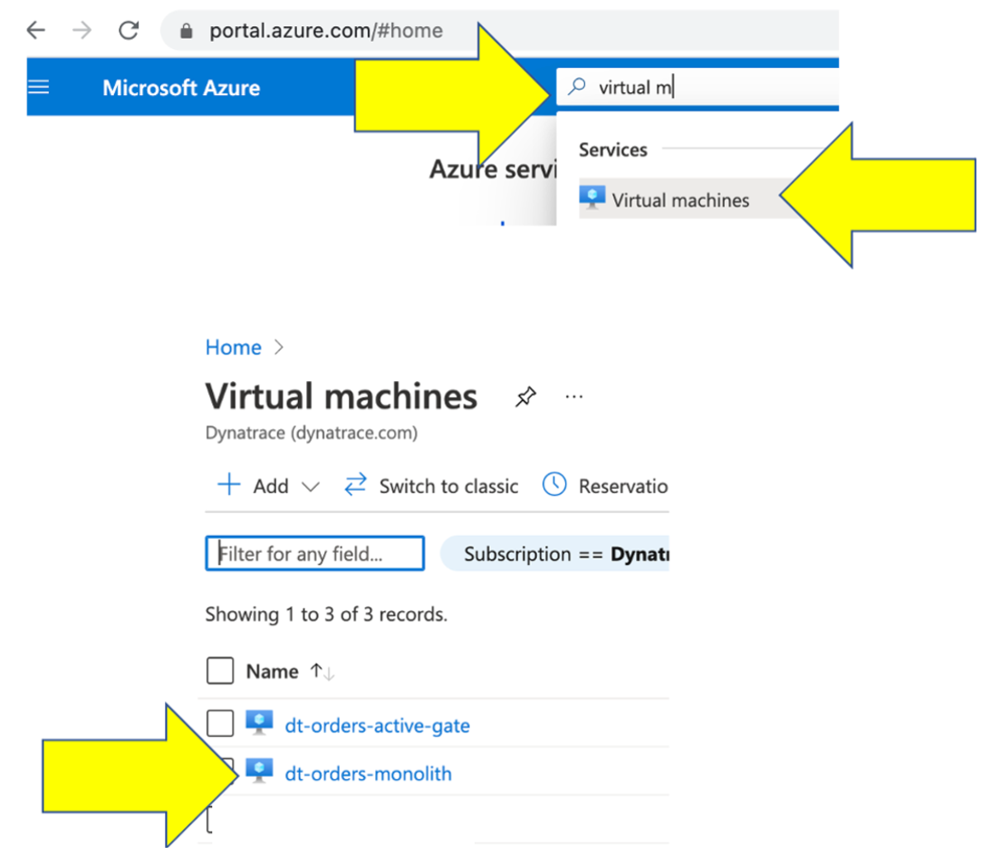
    - Once on the Virtual Machine page, click on the VM named `dt-orders-monolith`.  You can explore details about this VM, but you will want to copy the public IP as shown below.
    
2. Navigate the Sample app in a Browser
    - To view the application, copy the public IP into a browser. It will look like this:
    
    - Use the menu on the home page to navigate around the application and notice the URL for key functionality.  You will see these URLs later as we analyze the application.
        - Customer List = `customer/list.html`
        - Customer Detail - Each customer has a unique page = `customer/5.html`
        - Catalog List = `catalog/list.html`
        - Catalog Search Form = `catalog/searchForm.html`
        - Order List = `order/list.html`
        - Order Form = `order/form.html`

### OneAgent Deployment Status
1. Login into Dynatrace UI

2. Choose the `Manage --> Deployment Status` option from the left side menu to open the OneAgent deployment page.

3. Check to ensure the `dt-orders-monolith` VM is reporting in under OneAgents

### Host monitoring screen

In the next few sections, you will review what the OneAgent automatically discovered for the host, services, processes, and the complete dependency mapping for the sample application.  

👍 `How this helps`

    As you plan your migration, each of these views will give insights into accessing the profile, consumption and dependencies to other systems and services.

#### Tasks to complete this step

- From the left-side menu in Dynatrace choose `Infrastructure -> Hosts` then click on the host with the name `dt-orders-monolith`.
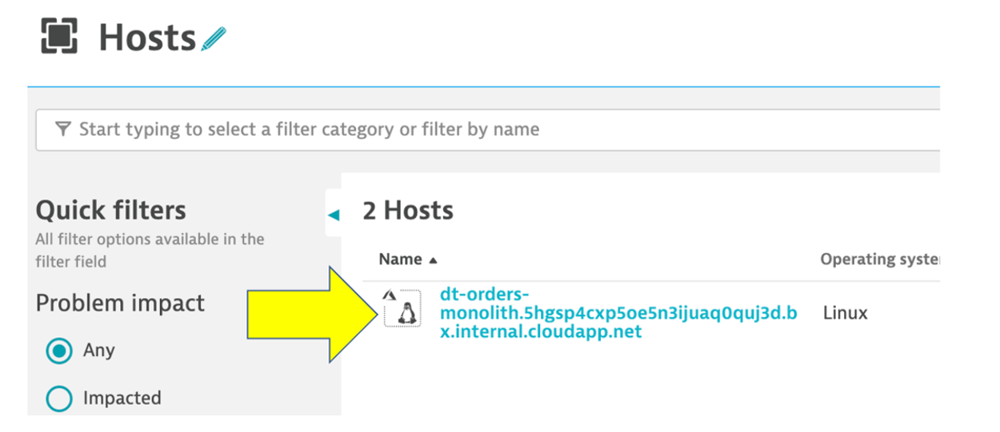
- On host page, you will see basic infrastructure information for the host.
    1. Now expand the `Properties` section to see data about the host:
    1. Host resource metrics (CPU, memory)
    1. Host availability
    1. Discovered processes. In this case the front end is running Node.js and the backend is running Java in Apache Tomcat.  JMeter is running in Java providing the automated user interactions
    

### Review Smartscape

Enterprises have many hosts, services, and application that are ever changing. The ability to automatically discover and change as the environment changes is a key feature that Smartscape delivers.  

Dynatrace's near real-time environment-topology visualization tool, Smartscape, is where Dynatrace's auto-discovery is delivered into a quick and efficient visualization of all the topological dependencies in your infrastructure, processes, and services.

👍 `How this helps`

    Smartscape shows all the dependencies of a given service. Those include connections to queues, web servers, app servers, and a native process. The host view shows historical and live time-series data for usage as well as the consuming processes. This information allows us to better plan the migration, as all depending services must be considered during the migration.

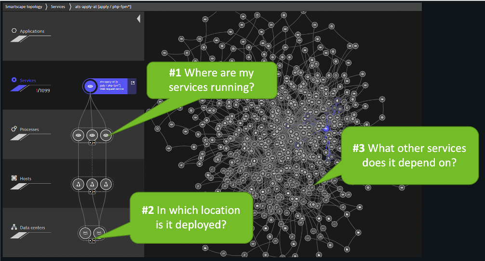

    Referring to the picture above: 
    - On the horizontal axis, it visualizes all ingoing and outgoing call relationships within each tier
    - On the vertical axis, it displays full-stack dependencies across all tiers
        * Data center
        * Hosts
        * Process
        * Service
        * Application

#### Tasks to complete this step

- Let’s see how Dynatrace can visualize these processes using Smartscape.
    1. Be sure you are on the `dt-orders-monolith` host page
    1. Just click on the `...` box on the to the right of the host name
    1. pick `Smartscape view` menu option
    1. this will open Smartscape filtered to this Host Instance
    
- Feel free to explore the Smartscape.

### Process

In the Smartscape view, we saw the visualizations of the relationships in vertical stack and as well as the relationships spatially. Now let’s view the processes and services running on the host.

As you plan your migration, you need more than just host level metrics.  Knowing the details for each service, **BEFORE** you change it, will lower the risk of impacting the business.

👍 `How this helps`

    Very quickly you have seen what processes and services are running on a host AND more importantly, what processes and services call (outbound) and are being called (inbound).  Having a real-time picture is certainly more accurate than an out of date documentation.

#### Tasks to complete this step

1. Review the data on the Process screen 
    - Return back to the host view for the host with the prefix of `dt-orders-monolith` and locate the `Processes and Containers` section.
    - Click on the 2nd `monolith-frontend` process to open the process detail view.
    
    - You should be on the process page where you will see information for this process.  Follow the picture below to locate the following:
        1. Click on the `Properties and tags` line to toggle on/off to see additional data 
        1. Notice the properties such as open ports
        1. On the info graphic:
            * Click to view the processes that call this process (Inbound)
            * Click to view the services that are served by this process. In this case there are multiple
            * Click to view the processes that this process calls (Outbound)
            * Click to view the Process specific metrics
        1. Did you notice Docker??
        
            📓  Dynatrace automatically recognizes many common processes like Tomcat and will capture process specific metrics such as JVM garbage collection. See a list of supported technologies, languages and containers in the [Dynatrace documentation](https://www.dynatrace.com/support/help/technology-support/supported-technologies-and-versions) 

            📓`Dynatrace and containers`

            In the picture above, the arrow shows the properties for Docker.

            Our sample app was built as a Docker container and Dynatrace hooks into containers and provides code for injecting OneAgent into containerized process.  

            `How Dynatrace monitors containers`

            

            There’s no need to modify your Docker images, modify run commands, or create additional containers to enable Docker monitoring. Simply install OneAgent on your hosts that serve containerized applications and services. Dynatrace automatically detects the creation and termination of containers and monitors the applications and services contained within those containers. </aside>

            <aside class="positive"> 📓
            You can read more about Dynatrace Docker Monitoring [here](https://www.dynatrace.com/support/help/technology-support/cloud-platforms/other-platforms/docker/basic-concepts/how-dynatrace-monitors-containers/) and technical details [here](https://www.dynatrace.com/support/help/technology-support/cloud-platforms/other-platforms/docker/monitoring/monitor-docker-containers) </aside>

2. Review the data on the Services screen
    - Now Let’s review a specific service.
        1. Click the `services` square above the host infographic to open the list of services
        1. From the list of services, choose the `frontend`
        
    - You should be on the service page where you will see information for this specific service.  Follow the picture below to locate the following:
        1. Click on the `Properties` line to toggle on/off to see additional data
        1. Click to view the services that call this service (Inbound)
        1. Click to view the services that this service calls (Outbound)
        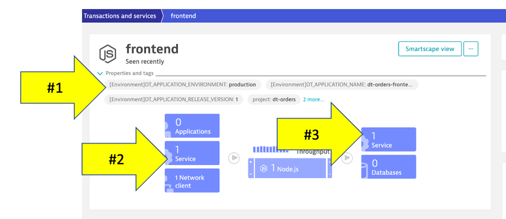

### Services

Web applications consist of web pages that are served by web servers and web application processes, for example Tomcat. Web and mobile applications are built upon services that process requests like web requests, web service calls, and messaging. 

Such "server-side services" can take the form of web services, web containers, database requests, custom services, and more. Services may in turn call other services such as web services, remote services, and databases services.

👍 `How this helps`

    As you plan your migration, it is important to gain a complete picture of interdependency to the rest of the environment architecture at host, processes, services, application perspectives. Since time is always scarce, being able to do this in a single place can shorten assessment timelines. 

#### Tasks to complete this step
1. Review the Services being monitored. Let’s now take a look at all the services being monitored by clicking on the `Services` left side Dynatrace menu.
    - In the management zone drop down, choose `dt-orders-monolith`. 
    
    - The filtered list should now look like this:
    
    - Choose the `frontend` service.
    - On the `frontend` service page, find the `Dynamic Web Requests` section on the right and click the `view Dynamic Requests` button to see what it calls. 
    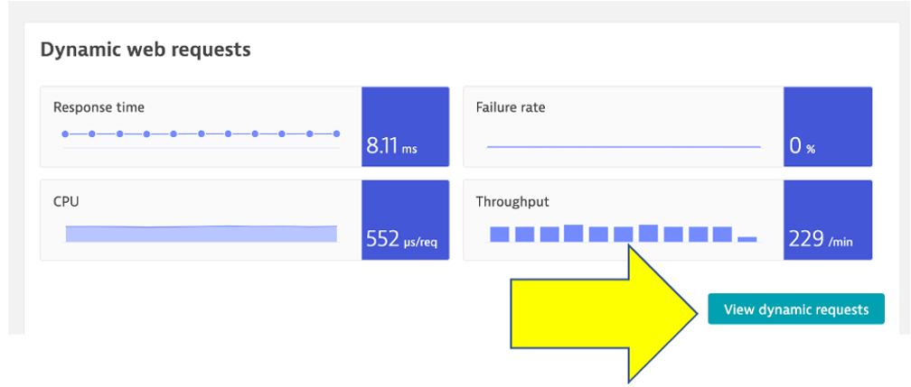
        - On this page you can view the transactions as time-series charts.
            
        - On this page you can view the top 15 requests and their response time consumption.  You should recognize the URLs from the sample app!
            
        - By clicking on one of the requests, the time-series charts are filtered to just that one request.
            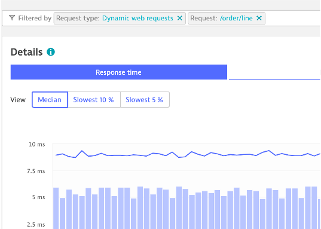

2. Review the Analysis View screen
    - On the top of the page on the right is a button labeled `Create Analysis view`, click that.
        
    - Try the various options available to view, filter and analyze data.
        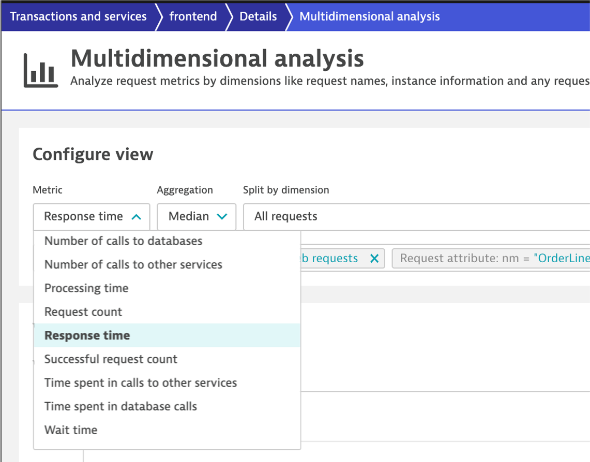

### Analyze serviceflow

We just saw one way to review process and service communication, but let’s look at how Dynatrace understands your applications’ transactions from end to end and visualizes through `Service Backtraces` and `Service flows`.

* With `Service flow`, you see the flow of service calls **FROM** a service, request, or their filtered subset. Along with the specific services that are triggered, you can also see how each component of a request contributes to the overall response time.

* With `Service backtrace`, you see the calls **TO** a service.

👍 `How this helps`

    As you plan your migration, it is important to gain a complete picture of interdependency to the rest of the environment architecture at host, processes, services, and application perspectives. Since time is always scarce, being able to do this in a single place can shorten assessment timelines.

    Knowing the type of access, executed statements, and amount of data transferred during regular hours of operation allows for better planning and prioritization. 

#### Tasks to complete this step
- Review the Service Flow 
    1. Return to the `frontend` service.  You can use the `breakcrumb` menu as shown below.
        
    1. On the `frontend` service page, locate the `Understand dependencies` section on the right, and then click the `view service flow` button. 
        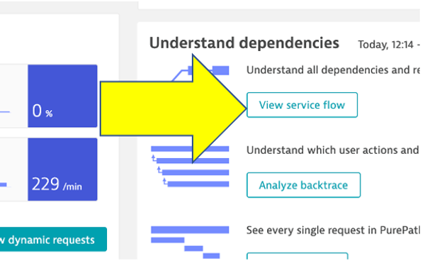
- Response time perspective
    - You should now be on the **Service flow** page.
    - Right away, we can see how this application is structured:  
        * Frontend calls backend
        * Backend calls database
            

    - Refer to the numbers in the picture above:
        1. The timeframe defaults to 10 minutes but can be adjusted. 
        1. We are viewing the data from a **Response time perspective**. Shortly, we will review the **Throughput perspective**.
        1. Click on the boxes to expand the response time metrics. We can see that most of the time is spent in the backend service.
        1. Even though there are a few calls to the database for every backend service request, only a very small amount of the response time is spent in the database. 

- Throughput perspective
    
    - Refer to the numbers in the picture above:
        1. The timeframe defaults to 10 minutes but can be adjusted
        1. Change to the **Throughput** perspective by clicking on the box
        1. Click on the boxes to expand the metrics to see the number of requests and average response times going to the backend service
        1.  We can see the number of requests to `backend` database

###  Analyze service backtrace

Dynatrace understands your applications transactions from end to end. This transactional insight is visualized several ways like the backtrace. 

The backtrace tree view represents the sequence of services that led to this service call, beginning with the page load or user action in the browser.

👍 How this helps

    Using the service flow and service backtrace, these two tools give you a complete picture of interdependency to the rest of the environment architecture at host, processes, services, application perspectives.  

#### Tasks to complete this step
- Click on the `Services` left side Dynatrace menu.
- Pick the `backend` service.
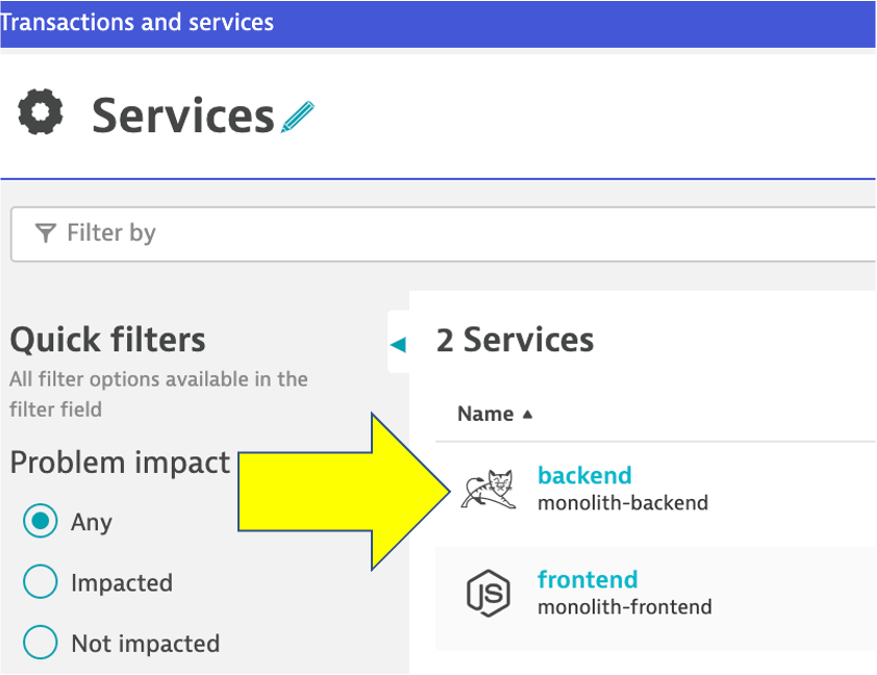
- On the `backend` service, click on the `Analyze Backtrace` button.

📓 You should be on the service backtrace page where you will see information for this specific service. 

📓 If you click on any of the rows in the backtrace, the bottom portion of the page will expand.

 

📓 This will get more interesting in the next lab, but for the monolith backend, we can see that the backtrace is as follows: 
1. The starting point is the `backend`   
2. `backend` is called by the `frontend` service   
3. `ApacheJMeter` traffic from the load generator script  
4. You may also see browser traffic to the **frontend** from the `My web application`.  If you don't that is OK. 

### Databases

As you plan your migration, Database observability is critical to a successful plan. Knowing the type of access, executed statements, and amount of data transferred during regular hours of operation allows for better migration planning and prioritization of the move groups. In some cases, you may decide to not migrate this database in favor of other services or databases that are less complex to migrate due to fewer dependencies.

👍 ***How this helps***

    When monitoring database activity, Dynatrace shows you which database statements are executed most often and which statements take up the most time. You can also see which services execute the database statements, what will be direct input to migration planning, and prioritization of the move groups.

    Dynatrace monitors all the popular databases like SQL Server, Oracle, and MongoDB. See <a href="https://www.dynatrace.com/platform/database-monitoring/" target="_blank">Dynatrace documentation </a> for more details on platform support.

#### Tasks to complete this step
1.  Navigate to the Database screen
    - Lets get back to the `backend` service. One way is to go back to the `Services` left side Dynatrace menu and then pick the `backend` service for the `dt-orders-monolith` management zone.
    - On the `backend` service page, click on the `[embedded]` database to open the database service page. 
    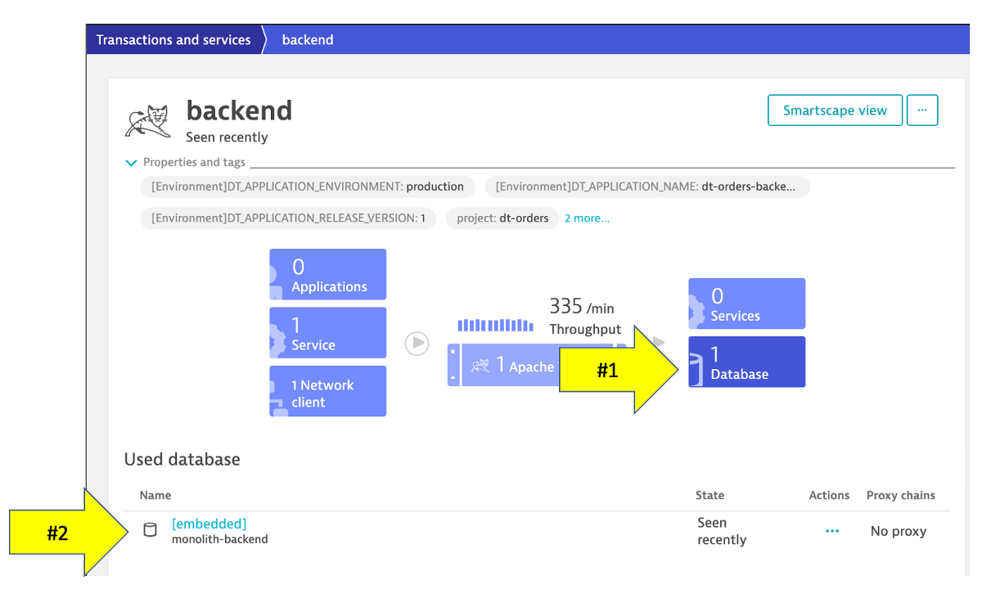

2. Review the Database screen
    - The sample application uses an <a href="http://hsqldb.org/" target="_blank">In memory Java relational database</a>.  On this page you can explore the database process like
        1. What services call this database
        1. Database availability
        1. View individual SQL statements
        1. Custom metric analysis 
        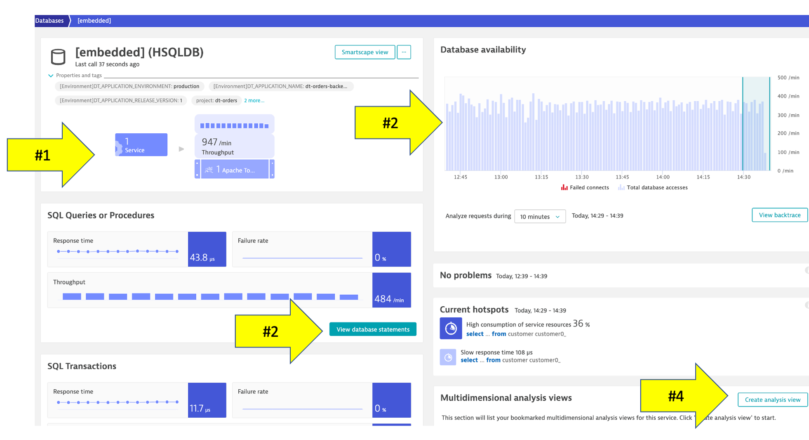

### Technologies View

By default, Dynatrace gives you FullStack horizontal (who talks to whom) and vertical (what runs on what) dependency visibility as part of Dynatrace Smartscape! All without a single line of code or configuration change – just by installing the OneAgent

Seeing which processes make up the monolith has been an eye-opener for many teams that have done this exercise. “Oh – we completely forgot about the dependency to this legacy process we introduced 5 years ago!” – that’s a common thing you hear!

As you plan your migration, knowing what technologies make up your eco-system is key so that you can decide whether to migrate, refactor or replace certain services.

The workshop is somewhat limited, so here is an example from another environment.

👍 How this helps

    This is another out the box feature that helps you understand what technologies are in your environment with a heat map presentation that shows to what degree they exist. 

#### Tasks to complete this step
1. Review the Technologies view 
- Click on the **Technology and processes** link on the left side menu within Dynatrace to view the technologies that OneAgent was able to automatically discover and instrument.
    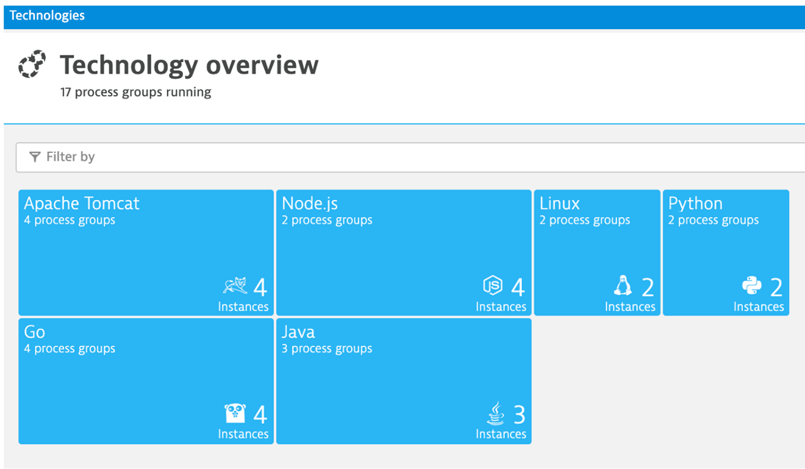
- Make sure your management zone filter is set to `All` so that you see everything
    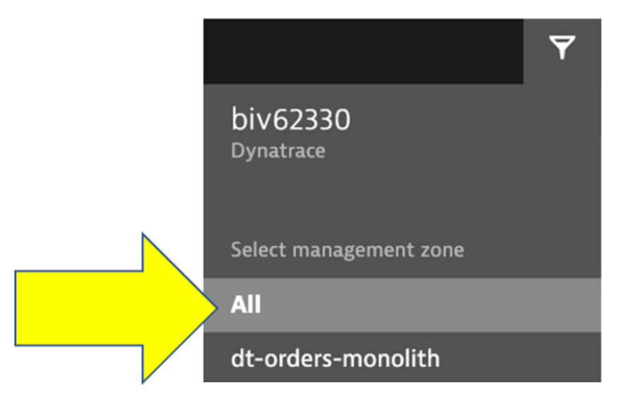
- In the filter box, type `tag`, choose `stage`, and the value of `production`. It should look like this:
    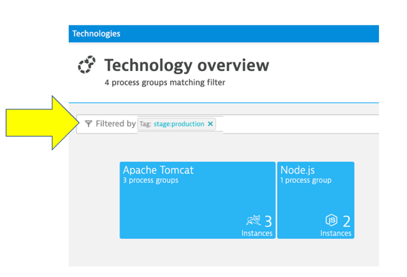

### Planning Ahead

You can always click into the `Hub` menu within Dynatrace to learn about the many technologies that Dynatrace supports.  This list is in sync and constantly updated in conjunction with the <a href="https://www.dynatrace.com/hub" target="_blank">Dynatrace website hub page</a>

## Summary

By just installing the OneAgent, we have now gained a detailed topological view of sample application from the both the infrastructure and application tiers and we are now ready to tackle our adoption to the cloud armed with the answers we need.

* **Right Priority** - We now understand the complexity and interdependency of services and components to the rest of the environment architecture
* **Right-Sizing the environment** - We now understanding which resources are required to move along with their required resource consumption patterns
* **Best Migration Strategy** - We now understand the current end-to-end transactions through architecture and can choose the best migration strategy (rehost, refactor, re-architect, rebuild)

### Checklist

In this section, you should have completed the following:

✅ Review Dynatrace OneAgent

✅ Review real-time data now available for the sample application

✅ Review how Dynatrace helps with modernization planning
