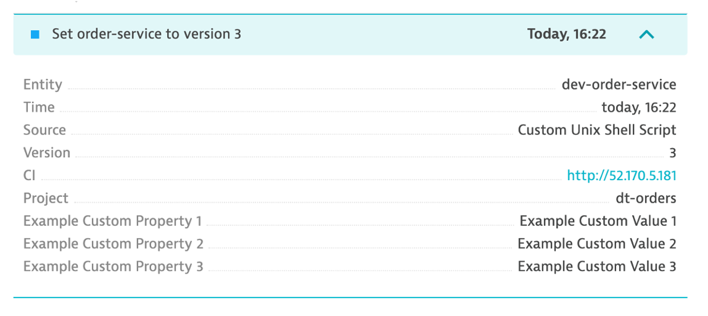
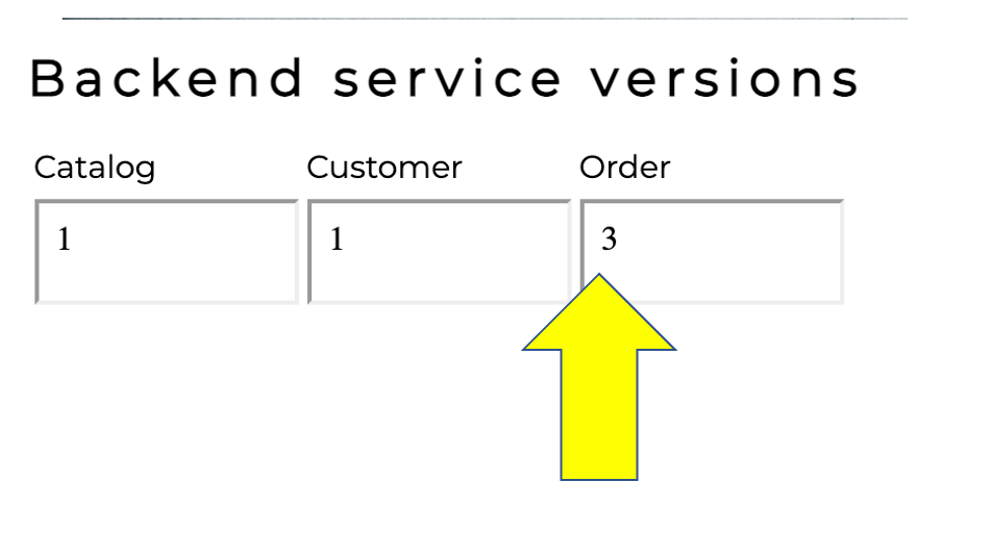

# Challenge 03 - Automated Root Cause Analysis with Davis - Coach's Guide 

[< Previous Solution](./Solution-02.md) - **[Home](./README.md)** - [Next Solution >](./Solution-04.md)

### Overview
Often the monitoring tools organizations use simply don’t work in the complex ecosystem of microservices and for technologies like Kubernetes.

Finding the root cause of problems is harder than ever before and the effort required goes beyond what is humanly possible when the application spans to the cloud providers and data centers and the explosion of interconnected services. There are more possibilities for failures and more hiding spots for problems to sneak into the environment when software driving more than just the application.

In this lab, we will trigger a few problem and see how troubleshooting time is Significantly reduced by letting AI automatically detect problems and pinpoints the root cause, explaining business impact with no manual configurations.

### Objectives of this Lab

-  Enable a problem in the application and walk through what [Dynatrace Davis](https://www.dynatrace.com/platform/artificial-intelligence/) found

-  Review how Dynatrace process events and Tags to provide additional context in root cause analysis


## Review Events & Tags in Dynatrace

Before we get to the problems, let's review <a href="https://www.dynatrace.com/support/help/dynatrace-api/environment-api/events/post-event/" target="_blank"> Dynatrace Information Events</a>.

Dynatrace information events enable continuous delivery tools, such as Azure DevOps, to provide additional details for Dynatrace. Here is an example of two informational events for deployment and performance testing being be sent to Dynatrace.


There are several Dynatrace information event types:
* CUSTOM_ANNOTATION
* CUSTOM_CONFIGURATION
* CUSTOM_DEPLOYMENT
* CUSTOM_INFO
* MARKED_FOR_TERMINATION

Below we can see both the CUSTOM_INFO (#1) and CUSTOM_DEPLOYMENT events (#2) for a service that was the root cause to a problem the Dynatrace AI engine, Davis®, determined.


Each event has a timestamp, event source, a few standardized fields (depending on the event type), and the option to add additional custom fields.  See <a href="https://www.dynatrace.com/support/help/shortlink/api-events-post-event#parameters-mapping" target="_blank"> this table </a> for details.  Here are two example events.  NOTE: the URL back to the pipeline making the change.


**👍 How this helps**


  Having information events speeds up triage by adding context to what’s happening with the application. Just imagine getting alerted about an issue and immediately seeing a load test or deployment took place, and in one click of the event, review the system, job, and team responsible!

### Dynatrace tags

When creating information events, you must target the entities to receive the event so that it’s only associated with the relevant component. That is where Dynatrace tags come in.

In a nutshell, tags in Dynatrace are labels or markers used for organizing entities in large monitoring environments. Below shows a few tags for my catalog service: `stage:staging` and `service:catalog-service`


### API call Example

Here is an example of a typical events API call. You do not need to executed this as you will see this in action as part of the scripts in the next step

```
curl -X POST \
  https://mySampleEnv.live.dynatrace.com/api/v1/events \
  -H 'Authorization: Api-token abcdefjhij1234567890' \
  -H 'Content-Type: application/json' \  
  -d '{
  "eventType": "CUSTOM_ANNOTATION",
  "timeoutMinutes": 0,
  "attachRules": {

    "tagRule": [
      {
        "meTypes": [
          "CUSTOM_DEVICE"
        ],
        "tags": [
          {
            "context": "CONTEXTLESS",
            "key": "IG-test"
          }
        ]
      }
    ]
  },
  "source": "OpsControl",
  "annotationType": "defect",
  "annotationDescription": "coffee machine is defective"
}'
```
## Enable Backend service problem on Monolith

In this step we are going to "simulate" a deployment of new version of the `backend` service.  After the "deployment" the service will exhibit a high response time for all backend requests.

### Tasks to complete this step
1. To enable the problem pattern, use the unix that is provided that will do the following  
    * Call the `backend/set-version` URL set the backend version
    * Send a Dynatrace `CUSTOM_DEPLOYMENT` event indicating the change
    * From the Azure shell, run these commands to set the version:

      ```
      cd ~/azure-modernization-dt-orders-setup/learner-scripts
      ./set-version.sh backend 2
      ```

    * Review the output to ensure the change was made successfully.  I should look like this with numerical values at the end for `Response Data: storedEventIds`:

      ```
      @Azure:~/azure-modernization-dt-orders-setup/learner-scripts$ ./set-version.sh backend 2

      Retrieving dt-orders-monolith Public IP
      =================================================================
      Setting Service Version
      SERVICE         = backend
      NEW_VERSION     = 2
      SET_VERSION_URL = http://1.1.1.1/backend/setversion/2
      =================================================================
      Set backend to 2 was successful
      =================================================================
      Sending Dynatrace Deployment event
      DT_API_URL                 = https://xxx.live.dynatrace.com/api/v1/events
      DEPLOYMENT_NAME            = Set backend to version 2
      DEPLOYMENT_VERSION         = 2
      DEPLOYMENT_PROJECT         = dt-orders
      CI_BACK_LINK               = http://1.1.1.1
      =================================================================
      Push Event POST_DATA
      { "eventType" : "CUSTOM_DEPLOYMENT", "source" : "Custom Unix Shell Script" , "deploymentName" : "Set backend to version 2", "deploymentVersion" : "2" , "deploymentProject" :"dt-orders" , "ciBackLink" : "http://1.1.1.1", "customProperties": { "Example Custom Property 1" : "Example Custom Value 1", "Example Custom Property 2" : "Example Custom Value 2", "Example Custom Property 3" : "Example Custom Value 3" }, "attachRules" : { "tagRule" : [ { "meTypes":["PROCESS_GROUP_INSTANCE"], "tags": [ { "context": "CONTEXTLESS", "key": "service", "value": "backend" }, { "context": "CONTEXTLESS", "key": "project", "value": "dt-orders" }, { "context": "CONTEXTLESS", "key": "stage", "value": "production" } ]} ]} } }

      Response Data
      {"storedEventIds":[8663164135574257870,-5988376401319068441],"storedIds":["8663164135574257870_1628095127627","-5988376401319068441_1628095127627"],"storedCorrelationIds":[]}

      ```

2. Validate Sample App in Browser
      - The output from previous task has link to the sample under `CI_BACK_LINK`.  Click on the URL to get to the sample application if you don't have the sample app up already.  You should see `version 2` for the customer app now too.

      

3. Review the Problem card in Dynatrace
    * Go to Dynatrace menu -> Problems, and you will probably see two problems that eventually get merged…
        1. Impact summary - multiple service impact
        1. Root cause
        1. Click on the `Analyze Response Time Degradation` button to view the real issue with the request.
          

4. Analyze problem - top findings        
    1. Here you can see how Dynatrace automatically analyzes the problem and lets you know whether the problem is related to code, waiting, or other services and queues.
    1. Click in the `active wait time` line with the top findings to open the execution time breakdown detail.
      

5. Analyze problem - execution time breakdown
    - Dynatrace automatically shows the breakdown of the execution time.  To see more, click the `View method hotspots` button.
      

6. Analyze problem - hot spots
    - Here the code call breakdown is shown and by expanding this tree, you can locate the method where the slow down is occurring.

    **📓 You will need to expand several stack frames to get to method causing the slow down.** 


    

7. Analyze problem impact
    - From the breadcrumb menu, click on the `backend` to open the service page.
      

    - Then click on the response time box in the Dynamic web requests section to open the service details page.  You can see exactly when the problem started.
      

8. Disable the problem pattern
  * From the Azure shell run these commands to set the version back to version 1

    ```
    cd ~/azure-modernization-dt-orders-setup/learner-scripts
    ./set-version.sh backend 1
    ```

  * Ensure there are numerical values at the end for `Response Data: storedEventIds` like:

    ```
    Response Data
    {"storedEventIds":[8663164135574257870,-5988376401319068441],"storedIds":["8663164135574257870_1628095127627","-5988376401319068441_1628095127627"],"storedCorrelationIds":[]}
    ```

  * By ensuring there are numberical values t the end, it validates the command ran sucessfully.


**📓 Why does the problem card say 'Custom Threshold'?**
<br>The Dynatrace AI engine is evaluating metrics and dependencies for daily and weekly traffic patterns.  Since we just setup our sample application, there is not a lot of history to review. We setup a fixed threshold as a global service setting.

  * To review this setting, on the left side menu, click `settings`, click `Anomaly Detection` and the the `Services` setting.

      

  * To learn more about how Davis AI problems are detected and analyze, click the <a href="https://www.dynatrace.com/support/help/how-to-use-dynatrace/problem-detection-and-analysis/problem-detection/automated-multi-dimensional-baselining/" target="_blank"> Dynatrace docs </a> to learn more


## Enable Order Service problem on AKS


In this step we are going to "simulate" another deployment of new version of the `order` service running on Kubernetes.  After the "deployment" the service will exhibit a failures for all requests.

### Tasks to complete this step
1. Enable the problem pattern use the automated unix script that is provided which will do the following:
    * Call the `order/set-version` URL to set the order-service version
    * Send a Dynatrace `CUSTOM_DEPLOYMENT` event indicating the change
    * From the Azure shell run these commands to set the version:

      ```
      cd ~/azure-modernization-dt-orders-setup/learner-scripts
      ./set-version.sh k8-order 3
      ```

      Ensure there are numerical values at the end for `Response Data: storedEventIds` like:

      ```
      Response Data
      {"storedEventIds":[8663164135574257870,-5988376401319068441],"storedIds":["8663164135574257870_1628095127627","-5988376401319068441_1628095127627"],"storedCorrelationIds":[]}
      ```

2. Validate the Change in Dynatrace
    * From the left side menu, navigate to the `Releases` page.  Here you will see how Dynatrace detected the versions of monitored processes.  It may take a minute, but you will see the version change in the `Real-time inventory` section and a new event in the `Release events` section.
      <aside class="positive"> 📓 Be sure to adjust the management zone to `dt-orders-k8` </aside>

      

    * If you expand the event, you should see something like this

      

3. Validate Sample App in Browser
    * The event above has the URL back to the sample application, so just click that if you don't have the sample app up already.  You should see `version 3` for the order app now too.

      

4. Review the Problem in Dynatrace  
    * The problem may take a minute to show up, but this is what the problem will look like once it does. Also, you may see two problems that eventually get merged into one as Dynatrace is performing the problem analysis.
      1. Problem card windows and impact summary
      1. Root cause
      1. Deployment event as additional context

        

5. Analyze problem
      - Referring to #4 in the picture above, click on the `Analyze failure rate degradation` button.
      - Right away we can see that there were exceptions in the code and the `details` button can be clicked to see the code stack trace.

          

6. Analyze problem impact
      - From the breadcrumb menu, click on the `order` to open the service page.

          

      - On this page, notice the failure rate.  

          

      - Then click on the failure rate box to open the service details page.  You can see exactly when the problem started.

          

7. Disable the Problem Pattern
    * From the Azure shell run these commands to set the version back to version 1

      ```
      cd ~/azure-modernization-dt-orders-setup/learner-scripts
      ./set-version.sh k8-order 1
      ```

    * Ensure there are numerical values at the end for `Response Data: storedEventIds` are like:

        ```
        Response Data
        {"storedEventIds":[8663164135574257870,-5988376401319068441],"storedIds":["8663164135574257870_1628095127627","-5988376401319068441_1628095127627"],"storedCorrelationIds":[]}
        ```

    * Dynatrace will automatically close the problem once it detects things are back to normal.


## Summary

In this section, you should have completed the following:

  ✅ Enabled a problem in the application and walk through what <a href="https://www.dynatrace.com/platform/artificial-intelligence/" target="_blank"> Dynatrace Davis </a> found

  ✅ Reviewed the details of the Dynatrace Problem card.
    
  ✅ Learn how Dynatrace use Events and Tags to provide additional context.

