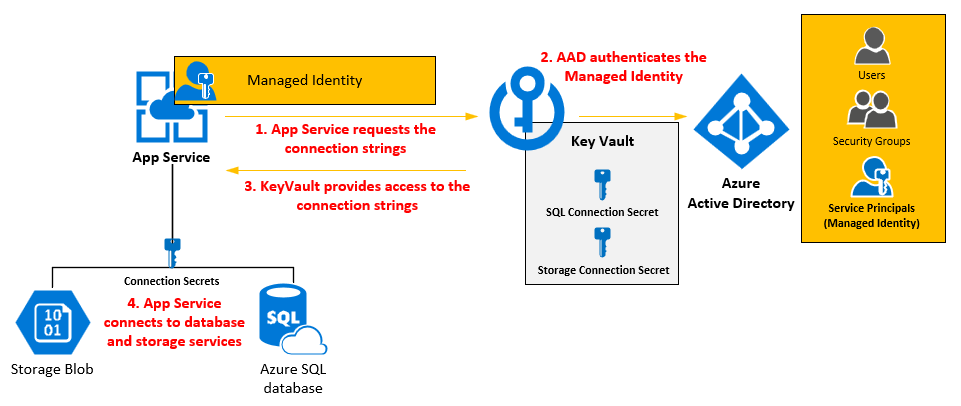

# Challenge 06 - Deploy your app to Azure!!

[< Previous Challenge](./Challenge-05.md) - **[Home](../README.md)**

## Introduction

Modern authentication protocols allow you to decouple from Windows and Active Directory, instead allowing any person in the organization to sign in to a web application from any device - as long as it has internet connectivity.

During this scenario, you will modernize an existing intranet web application from being hosted on Windows with IIS and connecting to SQL Server all using Windows Integrated Authentication, into a cloud based web application using OpenID Connect to sign users in and a Managed Identity to securely connect to an Azure SQL Database.

## Description

You will be deploying the application you built in challenge 5. You can deploy your ASP.Net, ASP.Net Core and Single Page Application to Azure App Service. Your application in Azure will be secured with Entra ID using OpenID.

Additionally, you can create a SQL Database and connect with your web app with/without Managed Service Identity.Managed Service Identity removes the need to maintain and store any credentials to access the database, instead using the identity of the App Service Web App itself to authenticate to Azure SQL Database.

## Success Criteria

1. Your app is deployed to an Azure App Service.
2. The redirect URL of Entra ID app registration should be configured with the Azure App service URL.
3. User can sign in to your Azure app with Entra ID credentials.

## Learning Resources

- [Deployment to Azure App Service](https://learn.microsoft.com/en-us/azure/app-service/deploy-local-git?tabs=cli)
- [Quickstart: Deploy an ASP.NET web app](https://learn.microsoft.com/en-us/azure/app-service/quickstart-dotnetcore?tabs=net60&pivots=development-environment-vs#publish-to-azure)

## Advanced Challenges (Optional)

_Too comfortable? Eager to do more? Try these additional challenges!_

1. Configure a Managed Service Identity for the Web App.
2. Create a SQL Database.
3. Configure your SQL Database to use the web app's manage service identity.
