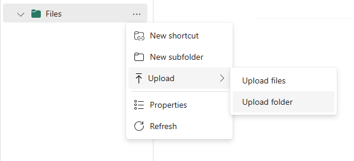

# What The Hack - Fabric Lakehouse - Coach Guide

## Introduction

Welcome to the coach's guide for the Fabric Lakehouse What The Hack. Here you will find links to specific guidance for coaches for each of the challenges.

This hack includes an awesome [lecture presentation](Lectures.pptx) that features short presentations to introduce key topics associated with each challenge. It is recommended that the host present each short presentation before attendees kick off that challenge.

You may also want to customise the deck to include logistics, timings, you and other coaches details, and other information specific to your event. Additional sea-themed puns are also encouraged. Yarr...

**NOTE:** If you are a Hackathon participant, this is the answer guide. Don't cheat yourself by looking at these during the hack! Go learn something. :)

## Coach's Guides

- Challenge 00: **[Prerequisites - Grab your fins and a full tank!](Solution-00.md)**
  - Provision your Fabric Lakehouse
- Challenge 01: **[Finding Data](Solution-01.md)**
  - Head out into open waters to find your data
- Challenge 02: **[Land ho!](Solution-02.md)**
  - Land your data in your Fabric Lakehouse
- Challenge 03: **[Swab the Decks!](Solution-03.md)**
  - Clean and combine your datasets ready for analysis
- Challenge 04: **[Make a Splash](Solution-04.md)**
  - Build a data story to bring your findings to life
- Challenge 05: **[Giant Stride](Solution-05.md)**
  - Take a giant stride and share your data story with the world

## Coach Prerequisites

This hack has pre-reqs that a coach is responsible for understanding and/or setting up BEFORE hosting an event. Please review the [What The Hack Hosting Guide](https://aka.ms/wthhost) for information on how to host a hack event.

The guide covers the common preparation steps a coach needs to do before any What The Hack event.

### About the Audience

Students will most likely have a wide range of backgrounds and experience ranging from Data Engineers comfortable with Pyspark, T-SQL and datalake technology, to business analysts with little or no coding experience. The hack is intended to be accessible to all, but coaches should be aware of the following:

- The hack is designed to be completed by teams of 2-4 students working together. Coaches should consider how to arrange students into teams to ensure a mix of skills and experience. However, for an event with more experienced (or daring) students the hack can be completed individually.
- The hack is designed to be completed in a linear fashion. Encourage students to work outside of their areas of expertise, but be aware that some challenges may be more difficult for some students than others. Use your discretion - students may commence challenges in parallel. For example, a Power BI reporting expert may wish to start Challenge 4 while the other team members are data wrangling in Challenge 2/3.

### Duration & Agenda

Ideally this hack can be completed in a day, but it is highly dependant on student profiles. For a more relaxed pace for a less experienced group, consider running the hack over 2 days - one day for challenges 1-3 and the second day for challenges 3-5.

Times are very fluid and almost certainly will vary, but a *very* indicative agenda for a 1 day hack is as follows:

|Time|Duration|Activity|
|----|--------|--------|
|9:30 AM|15 mins|Welcome!|
|9:45 AM|30 mins|An Overview of Microsoft Fabric|
|10:15 AM|15 mins|About The Hack & Challenge 0 - Get Your Gear Ready|
|10:30 AM|15 mins|Break|
|10:45 AM|45 mins|Challenge 1 - Finding Data|
|11:30 AM|60 mins|Challenge 2  - Land Ho!|
|12:00 PM|60 mins|Lunch|
|1:00 PM|30 min|Challenge 2 cont.|
|1:30 PM|60 mins|Challenge 3  - Swab the Decks!|
|2:30 PM|15 mins|Break|
|2:45 PM|60 mins|Challenge 4  - Make A Splash!|
|3:45 PM|30 mins|Challenge 5  - Giant Stride|
|4:15 PM|15 mins|Wrap Up|

### Additional Coach Prerequisites

This hack as been left very open ended - [TMTOWTDI](https://perl.fandom.com/wiki/TIMTOWTDI). Coaches should be familiar with the following technologies and concepts:

- Microsoft Fabric (duh!)
- Python / PySpark
- Dataflow Gen 2 / M / Power Query
- Power BI / DAX

Coaches should deploy the solution files before the event to ensure they are familiar with the approach and the technologies used. Coaches should also be familiar with the datasets and source government agency websites used in the example solutions. Links are provided in the various [Solutions](./Solutions).

### Coach Resources

- [What is Microsoft Fabric?](https://aka.ms/learnfabric)
- [Microsoft Fabric Blog](https://aka.ms/FabricBlog)
- [Import Existing Notebooks](https://learn.microsoft.com/en-us/fabric/data-engineering/how-to-use-notebook#import-existing-notebooks)
- [Importing a datafow gen2 template](https://learn.microsoft.com/en-us/fabric/data-factory/move-dataflow-gen1-to-dataflow-gen2)

- [Fabric (trial) Known Issues](https://learn.microsoft.com/en-gb/fabric/get-started/fabric-known-issues)

### Student Resources

Always refer students to the [What The Hack website](https://aka.ms/wth) for the student guide: [https://aka.ms/wth](https://aka.ms/wth)

Coaches are should generate a complete dataset ahead of time and use this to become familiar with each,  giving consideration on how they can be used to with the cohort. Coaches are strongly recommended to **regenerate on the day of the event**  to refresh weather forecast data.

Depending on the composition of the student group, coaches may wish to provide all **(or none)** of the datasets to students. For example, a group of data engineers may be comfortable working with Python to build an complete end to end pipeline, including automating ingesting from source, but a group of business analysts may require data in a slightly cleaner format to enable them complete the challenges. Use your discretion to provide the most appropriate support, this is supposed to be a fun learning experience after all!

### A Note on the Provided Data

Students may ask about data provided by the coach (``resources.zip``). First, it is important to note that the data provided is not intended to be used as a solution to the hack. Discourage students from 'peeking' at the data with your best pirate captain voice.

*"Avast ye sea dogs, don't be peeking at me data files or ye'll be walking the plank! But if ye have fallen overboard and be lost adrift, then these be here to saves you. Yarr..."*

> Yes, I know I'm mixing my diving and pirate metaphors but hey, it's a hack about shipwrecks and have you read the stories of some of those boats??!!

Whilst it is entirely possible for an experienced data engineer to automate the retrieval of the datasets and process through to Silver in the hack, the provided data is to allow students to 'jump in' at a point where they can continue to build their solution.

[Challenge 0](../Student/Challenge-00.md) includes a pre-requisite to create a new workspace and lakehouse - this is required to be able to use any of the provided data (or undertake the hack in general, really).

[Challenge 1](../Student/Challenge-01.md) is about finding data sources on the web, and Coaches are strong advised to gently nudge students with hints towards the two sources used in the reference solution (but of course, students are free to use any data source they wish).

In [Challenge 2](../Student/Challenge-02.md), students will be required to land their data in OneLake and transform to Bronze. Instead of retrieving these data files via script or manually, students can use the provided ``Raw`` zone copies, from the 'suggested' sources.

*"Yarr, ye done a good job finding treasure on the high seas, your Captain be proud of ye. Now, land ho that data ye-selves or, perchance take a looksee in the RAW chest. Now, swab the decks, I mean data, your Captain wants me bronze!"*

Using these provided ``Raw`` files will allow students to focus on data wrangling and transformation as opposed to the data retrieval, removing the requirement for SLIP registration and FTP access to BOM. Of course, if they want to do it the ~~hard~~ challenging way, they can!

In [Challenge 3](../Student/Challene-03.md), students enrich data to form a silver dataset ready for reporting. Again, if students are struggling with the data wrangling, they can use the provided ``Bronze`` zone data to focus on the enrichment, and if they are struggling with the enrichment they can use the provided ``Silver`` zone file and just write code (or a dataflow) to load to a delta table.

All students should be able to author a dataflow to load the BOM forecast XML to a delta table. (Yes, XML, I know, but this is a hack about archaeology so...).

*"Yarr, coaches be needing to get in character. Me sure ye can make up some more piratey puns on using bronze and silver. Me sure, ye find this preferable to walking the plan!"*

At the end of [Challenge 3](../Student/Challene-03.md) students should have a Silver zone dataset of forecast and shipwrecks loaded to delta tables ready for reporting. A notebook ``Solution - Data Engineering.ipynb`` with complete ``Raw`` to ``Silver`` transformation code can be found in [Solutions](./Solutions) (this should virtually be the same code found in ``createStudentResources.py``) An example dataflow M code can be found in ``Dataflow Load IDW11160 M Code.txt`` and a Power Query Template (``Load BOM Forecasts.pqt``) in the [Solutions](./Solutions) folder. See [Solution 2](./Solution-02.md) for more details on these solutions.


#### Creating Student Resources

Coaches should run the script ``createStudentResources.py`` in the [Solutions folder](./Solutions) to create a ``resources.zip`` file and share with students at the start of the event. The script will create a ``resources.zip`` containing the following files/folders:

```
resources.zip
├───Raw                           Raw data files as sourced from BOM / WAM
│   ├───BOM                       Bureau of Meteorology data
│   │   │   IDW11160.xml          Local waters forecast at the time of running the script
│   │   └───IDM00003              BOM marine zones shapefiles
│   │           IDM00003.dbf
│   │           IDM00003.prj
│   │           IDM00003.sbn
│   │           IDM00003.sbx
│   │           IDM00003.shp
│   │           IDM00003.shp.xml
│   │           IDM00003.shx
│   │
│   └───WAM                       Western Australian Museum data
│           Shipwrecks_WAM_002_WA_GDA94_Public.geojson
│
├───Bronze                        Bronze zone with minimal transformation
│           marinezones.geojson   BOM marine zones
│           shipwrecks.geojson    WAM Shipwrecks
|
└───Silver                    Silver zone enriched data (ready for Power BI)
            shipwrecks.json   WAM Shipwrecks with relevant BOM Marine Zone (foreign key to Forecast is: AAC)
```

The following table provides some guidance on which files to may be of use to students based on their role:

|Audience|Suggested Starting Data|
|--------|-----------------------|
|Data Engineers|Raw data or directly from source|
|Data Analysts|Raw data, or Bronze minimally cleaned data|
|Data Visualisation / BI Analysts|Bronze or Silver enriched data|

These files can also be used to 'catch up' any students who may be struggling with a particular a challenge. However. all students should be encouraged to create a dataflow to ingest the raw forecasts data.

#### Running ``createStudentResources.py``
The script requires Python >3.4.

1. Install Python from [https://www.python.org/downloads/](https://www.python.org/downloads/) (3.12 at time of writing)
2. In a new terminal, create a virtual environment and activate it:
```
 C:\MyWTHFolder> python -m venv venv
 ```

 ```
 C:\MyWTHFolder> .\venv\Scripts\activate.bat
 (or in a Powershell shell venv/Scripts/activate)
 ```
3. Install the required package:
 ```
(venv) C:\> pip install geopandas
Collecting geopandas
  ... more messages appear here ...
Successfully installed attrs-23.1.0 certifi-2023.7.22 click-8.1.7 click-plugins-1.1.1 cligj-0.7.2 colorama-0.4.6 fiona-1.9.5 geopandas-0.14.0 numpy-1.26.1 packaging-23.2 pandas-2.1.1 pyproj-3.6.1 python-dateutil-2.8.2 pytz-2023.3.post1 shapely-2.0.2 six-1.16.0 tzdata-2023.3
```
4. Run the script:
```
(venv) C:\MyWTHFolder> python "<path-to-Solutions-folder>/createStudentResources.py"
Downloading data....
Downloading file from URL: https://raw.githubusercontent.com/Microsoft/WhatTheHack/067-FabricLakehouse/Student/Resources/Shipwrecks_WAM_002_WA_GDA94_Public.geojson to data/Raw/WAM\Shipwrecks_WAM_002_WA_GDA94_Public.geojson
Downloading file from URL: ftp://anonymous@ftp.bom.gov.au/anon/gen/fwo/IDW11160.xml to data/Raw/BOM\IDW11160.xml
Downloading file from URL: ftp://anonymous@ftp.bom.gov.au/anon/home/adfd/spatial/IDM00003.zip to data/Raw/BOM/IDM00003\IDM00003.zip
Extracting data/Raw/BOM/IDM00003\IDM00003.zip to data/Raw/BOM/IDM00003
Processing raw files...
Shipwrecks...
Marine Zones...
Joining datasets...
Zipping data/resources.zip
```
5. Deactivate the virtual environment:
```
(venv) C:\MyWTHFolder> deactivate
C:\MyWTHFolder>
```

You should now have a ``resources.zip`` file in the ``data`` folder, and unarchived files in the ``data/Raw``,``data/Bronze`` and ``data/Silver`` folders.


### Uploading the Data

Unzip the ``resources.zip`` file. Open the the hack Lakehouse (created as part of [Challenge 0](./Challenge-00.md)), click on the ``...`` menu next to the ``Files`` item and select ``Upload -> Upload Folder``

Repeat for each of the ``Raw``, ``Bronze`` and ``Silver`` folders as required.



----

## Azure / Fabric Requirements

### Fabric Tenant
This hack requires students to have access to a **Microsoft Fabric tenant account with an active subscription**. These tenant requirements should be shared with stakeholders in the organization that will be providing the Fabric environment that will be used by the students (most likely the student employer).

Students may be able to register for a [trial tenant](https://signup.microsoft.com/get-started/signup?OfferId=f6f20264-e785-4749-bd8e-884bab076de4&ali=1&products=f6f20264-e785-4749-bd8e-884bab076de4) and activate a Fabric trial, if they haven't previously done so.

There are no specific Azure resources required for this hack, beyond a Fabric capacity (see below).

### Enabling Microsoft Fabric

Fabric needs to be enabled in the tenant (see [Enable Microsoft Fabric for your organization](https://learn.microsoft.com/en-us/fabric/admin/fabric-switch)) and students need to be granted permission to create Fabric resources. Depending on the host org config and policy, students could be added to an security group that has permission to create Fabric resources:


### Microsoft Fabric Licenses

At the time of writing, Fabric is in preview and a trial license is available. See [Start a Fabric (Preview) trial](https://learn.microsoft.com/en-us/fabric/get-started/fabric-trial). Post-trial, a paid Fabric capacity may be required, although a small F2-F4 capacity should be sufficient for this hack.

Overall, students must have a capacity backed workspace, through one of the following methods.
1. FT - [Fabric trial](https://learn.microsoft.com/fabric/get-started/fabric-trial)    
2. F - [Fabric capacity](https://learn.microsoft.com/fabric/enterprise/buy-subscription#buy-an-azure-sku)
3. P - [Power BI Premium](https://learn.microsoft.com/power-bi/enterprise/service-admin-premium-purchase)

See [Microsoft Fabric Licenses](https://learn.microsoft.com/en-us/fabric/enterprise/licenses) for details.

### Microsoft Fabric Workspace

Students will require a Microsoft Fabric enabled Workspace where they can create Fabric artefacts (Lakehouse, Dataflow, Pipeline, Notebook, Report etc). If the group is arranged into pods, it is recommended to provision one workspace per pod. If the group is working individually, it is recommended to provision one workspace per student. It is recommended that students are granted Admin role on this workspace to allow them to create and manage all artefacts.

*Note:* for pods collaborating in a per-pod Workspace, students will also require a Power BI Pro license if they intend to publish reports to this workspace.

See [Microsoft Fabric Workspaces](https://learn.microsoft.com/en-us/fabric/get-started/workspaces) and [Create a workspace](https://learn.microsoft.com/en-us/fabric/get-started/create-workspace) for details.


### Power BI Desktop

Students will require Power BI desktop to be installed on their PC. Either the store or download version is fine.
1. [Microsoft Store](https://aka.ms/pbidesktop) See also [Learn more about the benefits of installing from the Microsoft Store including automatic updates](https://docs.microsoft.com/power-bi/fundamentals/desktop-get-the-desktop#install-as-an-app-from-the-microsoft-store).
  or
2. [Download Center](https://www.microsoft.com/en-us/download/details.aspx?id=58494) Ensure you have the latest version of downloaded.

## Repository Contents

- `./Coach`
  - Coach's Guide and related files
- `./Coach/Solutions`
  - Solution files with completed example answers to a challenge
- `./Student`
  - Student's Challenge Guide
- `./Student/Resources`
  - Resources (datafiles) required by the students are generated and not contained in this folder. See **Student Resources** above for details.
  
## Other Fabric What The Hacks

These WTHs are currently in development and will be released soon:
- Fabric Datamesh - A more architecturally focused hack covering Data Mesh, Medalion Architecture, and Fabric
- Fabric Realtime - A hack focused on realtime data processing with Fabric
