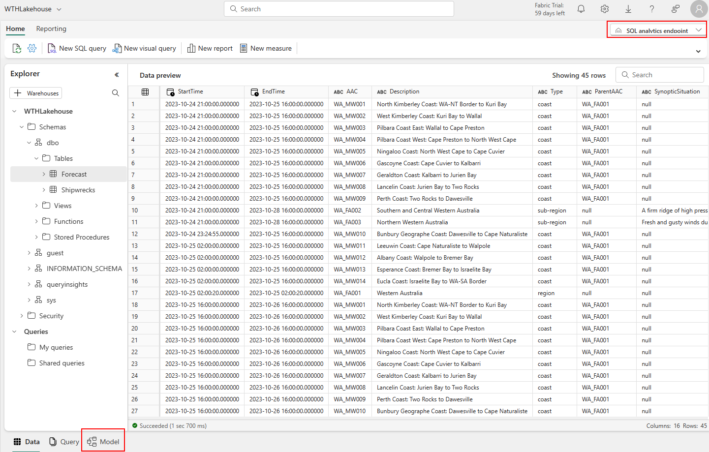

# Challenge 03 - Swab the Decks! - Coach's Guide

[< Previous Solution](./Solution-02.md) - **[Home](./README.md)** - [Next Solution >](./Solution-04.md)

## Notes & Guidance

Challenge Three is about cleaning and loading data from ``Bronze`` files to ``Silver`` delta tables in preparation for reporting.

The students should be encouraged to explore both notebooks and dataflows (for example, processing BOM forecast XML is easy in a dataflow, but the WAM-002 data is better suited to a notebook).

Overall, the method used by the students are very much a design choice by each.

## Solutions

Solutions are contained in the [Solutions](./Solutions) folder:

__Dataflow2__

- ``Load BOM Forecasts.pqt`` - dataflow template - M code for the dataflow is below.

__Notebooks__

- ``Solution - Data Engineering.ipynb`` - this notebook contains a solution for both [Challenge 2](Solution-02.md) and Challenge 3 and should be read in conjunction with ``Data Exploration.ipynb``.

- ``Data Exploration.ipynb`` - shows one way to explore the data and the contains the steps required to clean the data to bronze, and to enrich to silver. Coaches should step through each code cell to become familiar with the overall code, and be able to use snippets of code from this notebook to help students.
  
- ``Loading Planetary Computer Climate Prediction Models.ipynb`` - super bonus boss level - loads ECMWF climate models from the Microsoft Planetary Computer for students who want to go further. **Warning** this is hard...

__Misc__

- ``Cleanup.ipynb`` - cleans up OneLake tables and files
- ``troubleshooting/Cancel-Dataflow.ps1`` - a PowerShell script to cancel a dataflow (or at least mark the metadata as cancelled). Rarely a dataflow may not complete correctly. This script can be used to help cancel the dataflow so it can be re-run.

---

## Dataflow

Coaches should import the dataflow template ``Load BOM Forecasts.pqt`` from the solutions folder for an example of loading the ``IDW11160.xml`` file into a Lakehouse table. 

**Note: this dataflow assumes the source file is ``Files/Raw/BOM/IDW11160.xml`` the Lakehouse.**

### Importing the Dataflow

Coaches should review [Move queries from Dataflow Gen1 to Dataflow Gen2](https://learn.microsoft.com/en-us/fabric/data-factory/move-dataflow-gen1-to-dataflow-gen2) for an overview of the process.

1. Navigate to your Lakehouse. From the URL, copy the ``workspaceId`` (the part after ``/group/`` and before ``/lakehouses`` in yellow below) and the ``lakehouseId`` (the part after ``/lakehouses/`` in red below).

1. Navigate back to your workspace, and then create a new **Dataflow Gen 2**

**Important! Make sure you select Dataflow Gen 2 from the Data Factory section.**
1. Import the ``Load BOM Forecasts.pqt`` template

1. You should now see a new dataflow. 

1. Set the credentials by clicking on the ``Configure connection`` button and click ``Connect``

1. Update the parameters with the ``workspaceId`` and ``lakehouseId`` from step 1.
1. Set the data destination for the Forecast query. Click on the query and set the destination to ``Lakehouse``

1. Navigate to the correct workspace and lakehouse. 
1. Verify the column mappings (you may have to change type ``any`` to the correct type (or ``text``)
1. Finally Publish the dataflow. The dataflow should automatically run and load the data into ``Forecast`` table in the Lakehouse.


### Manually creating the dataflow

The dataflow can also be manually created.

1. First, create a new dataflow step 1-2 above). 
1. Next, add two parameters for ``workspaceId`` and ``lakehouseId`` (see [Parameters - Power Query](https://learn.microsoft.com/en-us/power-query/power-query-query-parameters#creating-a-parameter). 
1. Finally, add the following code as to a blank query (see [Share a Query](https://learn.microsoft.com/en-us/power-query/share-query#copy-the-m-code).

Set the credentials and publish the dataflow as above.

```M
let
  Source = Lakehouse.Contents([]),
  Navigation = Source{[workspaceId = workspaceId]}[Data],
  #"Navigation 1" = Navigation{[lakehouseId = lakehouseId]}[Data],
  #"Navigation 2" = #"Navigation 1"{[Id = "Files", ItemKind = "Folder"]}[Data],
  #"Navigation 3" = #"Navigation 2"{[Name = "Raw"]}[Content],
  #"Navigation 4" = #"Navigation 3"{[Name = "BOM"]}[Content],
  #"Navigation 5" = #"Navigation 4"{[Name = "IDW11160.xml"]}[Content],
  #"Imported XML" = Xml.Tables(#"Navigation 5"),
  #"Navigation 6" = #"Imported XML"{0}[forecast],
  #"Navigation 7" = #"Navigation 6"{0}[area],
  #"Changed column type 1" = Table.TransformColumnTypes(#"Navigation 7", { {"Attribute:aac", type text}, {"Attribute:description", type text}, {"Attribute:type", type text}, {"Attribute:parent-aac", type text} }),
  #"Expanded forecast-period" = Table.ExpandTableColumn(#"Changed column type 1", "forecast-period", {"text", "Attribute:start-time-local", "Attribute:end-time-local", "Attribute:start-time-utc", "Attribute:end-time-utc"}, {"text", "Attribute:start-time-local", "Attribute:end-time-local", "Attribute:start-time-utc", "Attribute:end-time-utc"}),
  #"Expanded text" = Table.ExpandTableColumn(#"Expanded forecast-period", "text", {"Element:Text", "Attribute:type"}, {"Element:Text", "Attribute:type.1"}),
  #"Pivoted column" = Table.Pivot(Table.TransformColumnTypes(#"Expanded text", {{"Attribute:type.1", type text}}), List.Distinct(Table.TransformColumnTypes(#"Expanded text", {{"Attribute:type.1", type text}})[#"Attribute:type.1"]), "Attribute:type.1", "Element:Text"),
  #"Removed columns" = Table.RemoveColumns(#"Pivoted column", {"Attribute:start-time-local", "Attribute:end-time-local"}),
  #"Renamed columns" = Table.RenameColumns(#"Removed columns", { {"Attribute:start-time-utc", "StartTime"}, {"Attribute:end-time-utc", "EndTime"}, {"Attribute:aac", "AAC"}, {"Attribute:description", "Description"}, {"Attribute:type", "Type"}, {"Attribute:parent-aac", "ParentAAC"}, {"synoptic_situation", "SynopticSituation"}, {"preamble", "Preamble"}, {"warning_summary_footer", "WarningSummaryFooter"}, {"product_footer", "ProductFooter"}, {"postamble", "Postamble"}, {"forecast_winds", "ForecastWinds"}, {"forecast_seas", "ForecastSeas"}, {"forecast_swell1", "ForecastSwell"}, {"forecast_weather", "ForecastWeather"} })
in
  #"Renamed columns",
  #"Changed column type" = Table.TransformColumnTypes(Source, { {"StartTime", type datetime}, {"EndTime", type datetime}, {"SynopticSituation", type text}, {"Preamble", type text}, {"WarningSummaryFooter", type text}, {"ProductFooter", type text}, {"Postamble", type text}, {"ForecastWinds", type text}, {"ForecastSeas", type text}, {"ForecastSwell", type text}, {"ForecastWeather", type text}, {"forecast_swell2", type text} })
in
  #"Changed column type"
```

### Troubleshooting

Between the time of writing and the hack, there may have been changes made to the BOM xml file. Coaches are strongly advised to **download the latest forecast file and validate the dataflow** before the hack. Commonly, we have seen columns not included in some forecast files, or forecasts within a file which will cause the code above to fail.

We welcome contributions to help make this M code a little more robust.

## Building the Semantic Data Model

Fabric will create a default semantic model once the Delta tables have been written to OneLake that can be used for reporting, but coaches may wish to encourage students to expand this model (or create a custom model). 


Students familiar with Power BI will most likely want to use Power BI Desktop to build their semantic model. This is not the way. Direct Lake semantic models are created and edited in the service, and coaches should familiarise themselves with the model editor

To launch the model editor, navigate to your workspace, and then select the Lakehouse. In the Lakehouse view, switch the the ``SQL Analytics Endpoint.`` then select the ``Model`` tab.



The model window will open.


From here, relationships can be defined, measures created etc as per standard Power BI modelling.

Refer to [Default Power BI semantic models in Microsoft Fabric](https://learn.microsoft.com/en-us/fabric/data-warehouse/semantic-models)

### Optional - Gold Semantic Model

More advanced students (or those with a data modelling background) may wish to create a dimensional model using Spark, dataflows or other tooling, instead of using the base tables. 

Some suggestions:

- Create a ``Date`` dimension. 
- Model ``Shipwrecks`` as dimensions for ``Country``, ``Port``,``ShipClass``, ``District`` etc
- Model ``Forecasts`` as a dimension for ``ForecastType`` and ``ForecastPeriod``
- Model ``Wrecks`` as a fact table - wreck date, location etc

> **Note:** Creating a dimensional model is not required for this challenge, but is a good way to introduce students to dimensional modelling in Fabric. Coaches with a Power BI background will be familiar with real-world reporting from data which has not been dimensionally modelled, and may wish to discuss the benefits of dimensional modelling with students. The focus of the hack is on the end-to-end Fabric experience, so coaches should not over emphasise building a 'correct' model for this small dataset.

At the time of writing, a second Fabric hack is being developed which will focus on datawarehousing and dimensional modelling in Fabric. We welcome contributions to this hack via the GitHub repo.

[< Previous Solution](./Solution-02.md) - **[Home](./README.md)** - [Next Solution >](./Solution-04.md)
