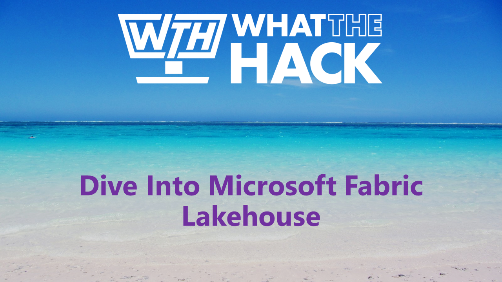

# What The Hack - Dive in Microsoft Fabric Lakehouse

## Introduction

 Washed by the warm [Leeuwin Current](https://en.wikipedia.org/wiki/Leeuwin_Current), the coastal waters of Western Australia are a divers paradise, home to a diverse range of marine life including the world's largest fish, the [Whale Shark](https://en.wikipedia.org/wiki/Whale_shark). 
 
 On a more sombre note, these waters have also claimed more than [1400 shipwrecks](https://en.wikipedia.org/wiki/Shipwrecks_of_Western_Australia). Some of these wrecks are well known, such as the [Batavia](https://en.wikipedia.org/wiki/Batavia_(ship)) and the [HMS Sydney](https://en.wikipedia.org/wiki/HMAS_Sydney_(D48)), and are protected archaeological sites. But many are regularly explored by intrepid divers and snorkellers, having become popular tourist attractions.

Margie's Travel is a travel agency specialising in diving holidays. They have heard about Microsoft Fabric, and have asked you to help them build a solution to allow their customers to explore the possibilities of diving some of the shipwrecks of Western Australia. 

 Your task is to use Microsoft Fabric to bring together the data and stories behind these shipwrecks to help boost customer engagement. Margie's would also like to be able to use this data to help customers assess dive conditions a few days before, and as a basis for on-board dive briefings.

## Learning Objectives

In this hack you will 

1. Provision a Fabric Lakehouse and "dive" on in. 
2. "Descend" in to the depths of open data sources including spatial, weather and archaeological to help build a data story behind the shipwrecks of Western Australia.
3. "Land" your data in your Fabric Lakehouse and "surface" with a clean, combined dataset ready for analysis.
4. Make a "splash" and bring your findings to life.

## Challenges

- Challenge 00: **[Prerequisites - Grab your fins and a full tank!](Student/Challenge-00.md)**
  - Provision your Fabric Lakehouse
- Challenge 01: **[Finding Data](Student/Challenge-01.md)**
  - Head out into open waters to find your data
- Challenge 02: **[Land ho!](Student/Challenge-02.md)**
  - Land your data in your Fabric Lakehouse
- Challenge 03: **[Swab the Decks!](Student/Challenge-03.md)**
  - Clean and combine your datasets ready for analysis
- Challenge 04: **[Make a Splash](Student/Challenge-04.md)**
  - Build a data story to bring your findings to life
- Challenge 05: **[Giant Stride](Student/Challenge-05.md)**
  - Take a giant stride and share your data story with the world

## Prerequisites

- A Microsoft Fabric subscription & potentially, a Power BI Pro license
- Some familiarity with Fabric and Power BI (or a willingness to learn!)

## Contributors

- Liesel Hughes, Cloud Solution Architect, Microsoft, Boorloo - Whadjuk country (Perth, Western Australia)
