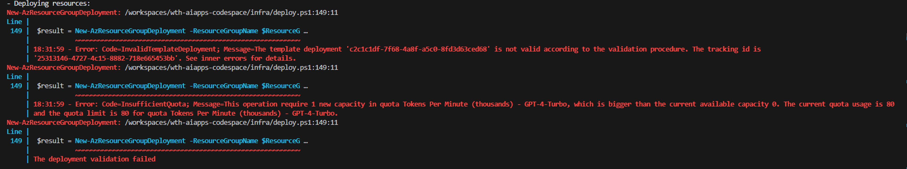
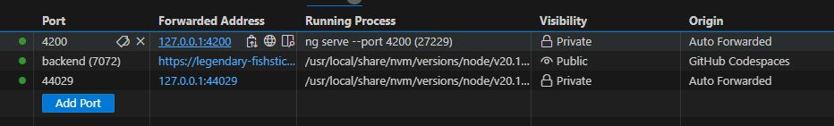
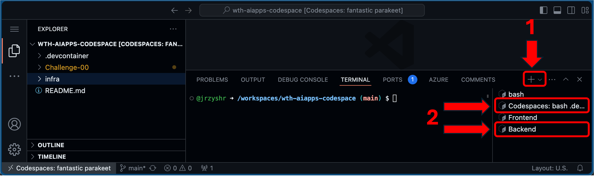
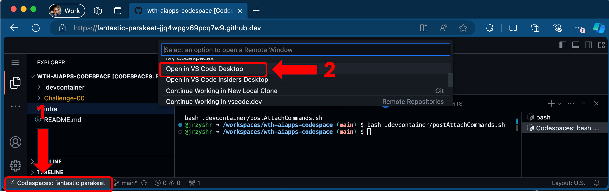

# Challenge 00 - Pre-Requisites - Coach's Guide 

**[Home](./README.md)** - [Next Solution >](./Solution-01.md)

## Notes & Guidance

Table of contents for this Coach Guide:
- [Deploying Azure Resources](#deploying-azure-resources)
  - [Microsoft FTEs and the FDPO Tenant](#microsoft-ftes-and-the-fdpo-tenant)
  - [Azure AI Capacity Issues](#azure-ai-capacity-issues)
  - [CORS Error When Running the Front End App](#cors-error-when-running-the-front-end-app) [Codespaces vs Local Workstation](#codespaces-vs-local-workstation)
  - [Debugging Python on Local Workstation](#debugging-python-on-local-workstation)
- [GitHub Codespaces Tips](#github-codespaces-tips)
  - [Working with Multiple Terminal Sessions in VS Code](#working-with-multiple-terminal-sessions-in-vs-code)
  - [Run Codespace in VS Code on Local Workstation](#run-codespace-in-vs-code-on-local-workstation)
  - [Python Debugging Not Available in Codespaces](#python-debugging-not-available-in-codespaces)
- [Azure Resources Overview](#azure-resources-overview)

### Deploying Azure Resources

#### Microsoft FTEs and the FDPO Tenant

Logging into Azure from GitHub Codespaces requires a Device Code login.

Microsoft employees running the hack in a subscription in the FDPO (for demo purposes only) Entra ID tenant will need to create & use a Service Principal to run the deployment script in Challenge 0.  This is due to Device Code Logins not being allowed in the FDPO tenant.  

>[!IMPORTANT]
>The creation of a new Service Principal must be done from the Azure Cloud Shell in a browser.  It can NOT be done from within the GitHub Codespace! The generated SP credentials should then be used when running the deployment script in the Codespace.

These details are called out in the student guide, but Coaches should be prepared to explain this to any Microsoft FTE students participating in this hack.

#### Azure AI Capacity Issues

At the time this hack was authored (June 2024), the Azure AI resources required for the solution are not all available in the same region. By default, the deployment script above will attempt to deploy most Azure resources in `East US 2` and the Azure Document Intelligence resource in `East US`.

Here is a screenshot of a sample capacity error that students might get when attempting to run the deployment script:

If students have any errors with capacity or quota issues, please guide them through re-running the deployment script with the additional optional parameters to specify different regions for any resources that failed to deploy.  The hidden section below for troubleshooting instructions has also been included in the student guide, but please read through and understand it before delivering this hack.

Click to expand/collapse Troubleshoot Capacity Issues

If you have any errors with capacity or quota issues, you may need to re-deploy the solution using one or more of the optional location parameters below. Note the resource type and region that failed to deploy in any error messages, and choose a different region based on the information below.

- `Location`: The Azure region where you want to deploy the resources. (Default value is `eastus2`)
- `OpenAILocation`: The Azure region where the Azure OpenAI resource will be deployed. (Default value is `eastus2`)
- `DocumentIntelligenceLocation`: The Azure region where the Azure Document Intelligence resource will be deployed. (Default value is `eastus`)

**NOTE:** The hack requires the Azure OpenAI Assistant API feature which is currently in preview and NOT available in ALL regions *where Azure OpenAI is available*!

The students may also need to check on capacity for the models and delete/purge models to get capacity.
 
 
As of June 2024, Azure OpenAI with the Assistant API preview feature is available in the following regions: `eastus2`, `australiaeast`, 
`francecentral`, `norwayeast`, `swedencentral`, `uksouth`, `westus`, `westus3`

This information is subject to change over time, for the most up to date list of available locations see [Azure OpenAI Service Models - Assistants (Preview) Availability](https://learn.microsoft.com/en-us/azure/ai-services/openai/concepts/models#assistants-preview)

**NOTE:** This hack uses Python to interact with the Azure Document Intelligence API. Python is supported with the `2024-02-29-preview` version of the Document Intelligence API.  The `2024-02-29-preview` version of the API is currently NOT available in ALL regions *where Azure Document Intelligence is available*!

As of June 2024, Azure Document Intelligence with support for API version `2024-02-29-preview` (with Python support) is available in the following regions: `eastus`, `westus2`, `westeurope`

This information is subject to change over time, for the most up to date list of available locations see [What is Azure AI Document Intelligence? - API `2024-02-29-preview` Availability](https://learn.microsoft.com/en-us/azure/ai-services/document-intelligence/overview?view=doc-intel-4.0.0)

### Deployment
Make sure the student uses the terminal window in GitHub Codespaces or the local workstation and **NOT** Azure Cloud Shell to do the deployment. If the student does the deployment from the Azure Cloud Shell by cloning the repo to the Cloud Shell and then running deployment script there, the `local.settings.json` file generated by the deployment script will be in the wrong place!  The student will either have to redeploy FROM their Codespace/Local Workstation or copy the `local.settings.json` for the `ContosoAIBackend` to their Codespace or local workstation manually FROM the Azure Cloud Shell if it ended up there. 

### Codespaces vs Local Workstation

We **strongly** recommend students use GitHub Codespaces as their development environment over a local workstation.

>[!NOTE]
>As of July 2024, the Challenge 0 instructions for how to set up a local workstation have NOT been tested!

Students should avoid doing the local workstation setup because there is the potential to adversely affect their local workstation (especially if they accidentally change the default Python version on Linux/Mac/WSL). There can be a lot of variations in terms of the student's OS version, already installed software packages like Python, Node, etc. that may cause them to lose time trying to get their environment working. 

#### CORS Error When Running the Front End App

If a CORS error occurs when a student is running the front end, change the visibility of the backend port to public.

#### Debugging Python on Local Workstation

One way to do Python debugging on a local workstation is to attach to another Python process which requires a special kernel flag to be set in Linux environment and this can done with this command:
`echo 0 | sudo tee /proc/sys/kernel/yama/ptrace_scope`

>[!WARNING]
>Changing the above setting makes the local workstation less secure and should not be changed permanently. 

Debugging is not required to complete the challenges, but students may attempt to configure and run a debugger while troubleshooting. 

Coaches should be aware of this issue and point students to the following guide on setting up local debugging for Python: [Python Debugging in VS Code](https://code.visualstudio.com/docs/python/debugging)

To debug on a local workstation, students will also need `gdb` (`sudo apt install gdb`) which is not mentioned in the above article. 

### GitHub Codespaces Tips

#### Working with Multiple Terminal Sessions in VS Code

During this hack, students will need to have multiple Terminal sessions open to keep the sample application's Frontend and Backend running while they hack.  If students are not familiar with how to manage multiple Terminal sessions in the VS Code interface within Codespace, you may want to demonstrate this to them.

Students can create additional Terminal sessions by clicking the `+` icon in the lower right side of the VS Code window. They can then switch between Terminal sessions by clicking the session name in the session list below the `+` icon as per the screenshot below.

Terminal sessions can be renamed by right-clicking on the session. Students may wish to rename the Frontend and Backend sessions so they can keep track of where they started the application components.

#### Run Codespace in VS Code on Local Workstation

Students may wish to use Visual Studio Code on their local workstation with Codespaces since it is a bit nicer than working in the browser. This makes it easier to keep track of the Codespace in a VS Code window versus having it get lost amongst many browser tabs. 

To do this, students can click the Codespaces area in the lower left corner of the Codespace browser tab and select `Open in VS Code Desktop` as shown in screenshot below:

Alternatively, they can install the Codespaces App in the browser which will give them a focused window as well as other features.

#### Python Debugging in Codespaces

Debugging is not required to complete the challenges, but students may attempt to run a debugger while troubleshooting. When the CodeSpace first appears, VS Code will show a message that it has detected an Azure Functions Project in folder "`/wth-aiapps-codespace`" that may have been created outside of VS Code and ask to Initialize for optimal use with VS Code. If the student clicks `Yes`, then it will configure `extensions.json`, `launch.json`, `settings.json` and `tasks.json` in the `/.vscode` folder and create a Python Virtual Environment automatically. If they miss this message, then they can go to the Command Palette and select "Azure Functions: Initialize project for use with VS Code". 

### Azure Resources Overview

AI Design Wins are an important concept for us and this is an example of a solution that spans the layers.

Specific resources in this What The Hack:

## Assistant Name Changes

Names of assistants in the source code have been changed but in the case that a reference to an older name is encountered, use the following map:

- Elizabeth was changed to Donald
- Esther was changed to Callum
- Miriam was changed to Veta
- Sarah was changed to Murphy

## Additional notes

The assistants that should be functional at the end of this challenge are Priscilla and Murphy.  All other assistants should be available after Challenge 02.
