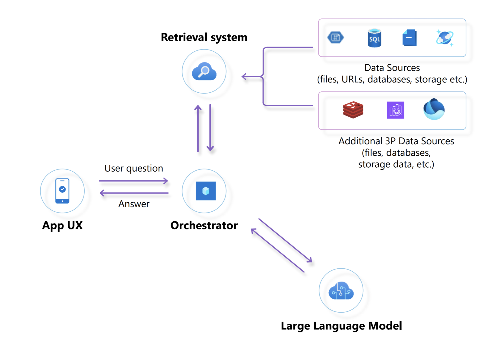

# What The Hack - Building AI Apps with Azure OpenAI and the Azure Ecosystem

## Introduction

This hands-on set of challenges will provide participants with experience on how to integrate the Azure OpenAI service with Microsoft Azure platform services.

This hack assumes you a have basic understanding of generative AI fundamentals such as:
- Prompt Engineering
- Large & Small Language Model (LLM/SLM) Comparisons
- Chunking & Embedding
- Retrieval Augmented Generation (RAG)
- Responsible AI Concepts

If you are just starting out with Azure OpenAI, we recommend you try the [OpenAI Fundamentals What The Hack](../066-OpenAIFundamentals/).

The architecture used by many generative AI applications is the Retrieval Augmented Generation (RAG) pattern. LLMs are trained with public data from the Internet. They do not have access to, or knowledge of your organization's data.

In an app using the RAG architecture pattern, the application ***retrieves*** information from a retrieval system that queries the organization's data. The application then provides that data to ***augment*** and ground a LLM with knowledge so that the LLM can ***generate*** content that returns an answer to the end user (often through a chatbot or virtual assistant interface).

Building AI applications on Microsoft Azure involves the following concerns:

- Which LLM or SLM SKUs and versions do you need to use and why?
- Automating data pipelines to ensure the organization's changing source data is available to application's retrieval system over time.
- Data hygiene and ensuring that the organization's data is in the right format and optimized so that the LLM can respond properly to user queries.
- Understanding how to configure and use a vector database, such as Azure AI Search, to power the retrieval system. 
- Optimizing costs by minimizing the amount of retrieved data sent to the LLM to answer user queries properly.
- Maintaining state, controlling usage throughput, and storing relevant metadata to simplify user interaction with virtual agents. This requires use of queueing mechanisms, key-value, and document stores such as Azure Service Bus, Azure Redis Cache and Azure Cosmos DB. 

### Contoso Yachts and the Citrus Bus Application

Contoso Yachts is a 40-person organization that specializes in booking tours of the Contoso Islands. The customer service agents at Contoso Yachts use virtual assistants from their in-house developed "Citrus Bus" application to help their customers book tours and learn more about the islands. 

As a major employer on the islands, Contoso Yachts has also expanded into the education vertical, extending their Citrus Bus application with advanced AI services to help educators on the island grade test scores.

In this hack, you will explore the architecture and configuration of the Citrus Bus application by getting hands-on and:
- Loading the company's source data into a retrieval system through automation.
- Configuring prompt engineering to enable virtual assistants to invoke functions and process user requests.
- Configuring the underlying Azure AI platform services, like Document Intelligence, to parse and prepare the company's data for the LLM
- Optimizing use of Azure OpenAI LLMs through caching.
- Understanding the overall solution for how to address the various design concerns in a generative AI application.

## Learning Objectives

The objective of the hack is to make participants aware and comfortable with the different strategies and scenarios for integrating the Azure Open AI service with Azure Platform products necessary to build, deploy and maintain highly performant AI applications in production.

The participants will learn how to:
- Select different architectures to implement Open AI solutions on Azure based on the scenarios.
- Understand when to use Open AI products and when to leverage Azure AI Services or other solutions
- Provision and configure Azure Open AI resources.
- Understand the different libraries, frameworks, capabilities and tools available to implement intelligent AI apps.
- Implement Q&A virtual assistants using RAG architectures powered by vector stores, full text search and hybrid search.
- Understand techniques and options available on Azure for processing and storing data used for implementing RAG architectures.
- Perform capacity planning and quota enforcement for Open AI resources.
- Easily observe what is taking place inside the deployed applications
- Implement solutions for batch and near real-time use cases.

## Challenges

- Challenge 00: **[Pre-requisites - Ready, Set, GO!](Student/Challenge-00.md)**
	 - Prepare your workstation and environment to work with Azure. Deploy Azure resources for the Citrus Bus application
- Challenge 01: **[Auto-Vectorization: Automatic Processing of Document Embeddings from Data Sources](Student/Challenge-01.md)**
	- Load source data into an automation process that prepares it for Azure AI Search
- Challenge 02: **[Contoso Travel Assistant](Student/Challenge-02.md)**
	- Use prompt engineering to configure a virtual assistants that responds to frequently asked questions about the Contoso Islands, and provides near real-time answers to Contoso Islands tourists that are looking to make reservations for yacht tours.
- Challenge 03: **[The Teacher's Assistant — Batch & Near Realtime Essay Grading](Student/Challenge-03.md)**
	 - Design and implement a pipeline that reads, analyzes and grades essays submitted in various file and image formats (PDF, JPEG/JPG, PNG, BMP, and TIFF) loaded from Azure Blob Storage.
- Challenge 04: **[Quota Monitoring and Enforcement](Student/Challenge-04.md)**
	 - Design and implement a solution to monitor the usage of OpenAI resources as well as the enforcement of quotas allocated to multiple users within an organization.
- Challenge 05: **[Performance and Cost and Optimizations](Student/Challenge-05.md)**
     - Design and implement a solution that optimizes the application performance and minimizes the operational costs of the OpenAI solutions.

## Prerequisites

- Access to an Azure subscription with Owner access
	- If you don’t have one, Sign Up for Azure [HERE](https://azure.microsoft.com/en-us/free/)
	- Familiarity with [Azure Cloud Shell](https://learn.microsoft.com/en-us/azure/cloud-shell/overview#multiple-access-points)
- A GitHub account to use [GitHub Codespaces](https://github.com/features/codespaces) as a developer workspace in the cloud
OR
- A local workstation with [Visual Studio Code](https://code.visualstudio.com/) and other tools to run Python.

## Contributors

We seize this opportunity to express our sincere gratitude to all our contributors that helped with the design and development of the content used for this hack.

We thank them for sharing their experience and creativity to design the scenarios and for taking the time to review the content that has been developed.

- [Alexis Joseph](https://github.com/alexistj)
- [Amanda Wong](https://github.com/wongamanda)
- [Charlotte Oickle](https://github.com/charlietfcgirl)
- [Devanshi Thakar](https://github.com/devanshithakar12)
- [George Luiz Bittencourt](https://github.com/glzbcrt)
- [Israel Ekpo](https://github.com/izzymsft)
- [Kevin M. Gates](https://github.com/kevinmgates)
- [Melody Yin](https://github.com/melody-N07)
- [Mike Richter](https://github.com/michaelsrichter)
- [Nikki Conley](https://github.com/nikkiconley)
- [Pete Rodriguez](https://github.com/perktime)
- [Peter Laudati](https://github.com/jrzyshr)
- [Sowmyan Soman Chullikkattil](https://github.com/sowsan)
- [Thomas Mathew](https://github.com/tmathew1000)
- [Wayne Smith](https://github.com/waynehsmith)
