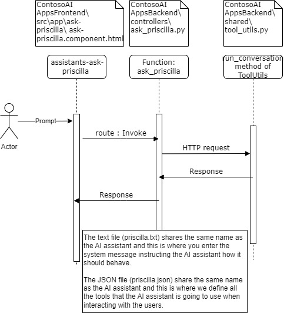

# Challenge 02 - Model Context Protocol (MCP)

[< Previous Challenge](./Challenge-01.md) - **[Home](../README.md)** - [Next Challenge >](./Challenge-03.md)

## Introduction

Virtual assistants augment customer service and can be leveraged to interact with customers during off-hours or when the customer service team is extremely busy.

Virtual assistants use information available in vector databases and other APIs to read and write to these data stores while providing assistance to the customers. 

The virtual assistants will also allow guest to create accounts, manage bank account balances and make or cancel yacht reservations with Contoso Yachts.

There are two existing customers in the database, and there are 5 yachts that customers can make future reservations for a specific date and yacht.

#### What is Model Context Protocol (MCP)?
 MCP is an open protocol that allows us to standardize how tools and data is provided to LLMs. Before MCP one would have to do custom integrations for tools based on the specific APIs and models that are being used. However, with MCP you can make one server which has the tools, and the agents can directly talk to the server and access those tools in a standardized way. Below is a diagram of how MCP works (credit to anthropic for the diagram).


#### Components of MCP
Host - The user facing application that manages different clients, enforces security policies, and coordinates AI intergration. The main job of a host is to facilitate user interactions and initate connections to servers via clients.

Client - Maintains a 1:1 connection with the specific server using the MCP protocol as shown in the diagram above. The main job of a client is to manage bidirectional communication and maintain session state and security boundaries. 

Server - Provides specialized capabilites and access to resources such as data and APIs. This can be local or remote. The main job of the server is to give tools, data or prompts to the client.

## Description

In this challenge, you will configure and build an MCP server that connects the Veta agent to the National Weather Service API.

#### Assistant Descriptions
Please read the `.txt` files in `/ContosoAIAppsBackend/assistant_configurations` folder for Donald, Veta, and Callum to understand what each of the assiants do. Also look through the `.json` files to understand what functions the agents have pre-built into them.

Note for Veta:
- Reservations can only be made up to 3 days from the current date.
- Reservations must be within the passenger capacity of the yacht.
- Reservations should contain the full name, email address and customer identifier in the database.

#### System Messages & Tools for AI Assistants
- System Messages are used in the application configuration to direct the LLM on how it should behave. This is where you exert control over the behavior of the language models used in the application.
- Tools are application method invocations (or functions) that are invoked optionally with input data and the actions are used to query databases or remote APIs to create, update or fetch data that can be used by the LLM to perform tasks or respond to queries from the user.

#### TODO: Configuring Your MCP Server

 In your `/ContosoAIAppsBackend` folder there is an `llm-full.txt` file that contains detailed instructions to give LLMs on how to build an MCP server. Your job in this hack is to feed that file and the given prompt to Github Copilot and build an MCP server that connects the Veta agent to the national weather service API. This functionality will help you check the weather before booking the yacht reservation to tour Contoso Islands. 
 
 We have already configured the the client files and all the necessary architecture, all you have to do is fill in the missing code in `mcp_weather_server.py` located in `/ContosoAIAppsBackend` folder to build the server with the help of Github Copilot. Use the `llm-full.txt` file and the prompt below to ensure that the MCP server is built properly.
 
```
Complete the functions with TODO in the mcp_weather_server.py file to have the proper functionality and look the llms-full.txt file to do so. Carefully look at the mcp_weather_client file to ensure the names of functions are the same to ensure they can call each other. Also look at veta.txt and veta.json to know what the agent functionality is supposed to be. Make the code as simple as possible to have proper functionality. Only change the server file since everything else is properly configured to work with a properly configured server.
```

Note: Ensure Github Copilot is in Agent mode and you have used the Add Context button to give it all the files it needs to execute the job properly. The following files may be helpful to add as context but you can add more based on what you think is necessary: veta.json, veta.txt, mcp_weather_server.py, ask_veta.py, and the ContosoAIAppsBackend folder. After implemented toggle from Agent mode to Ask mode to ask it whether the implementation is proper. Also play around with the cooridinates in veta.txt and change them to your current location to see how accurate the weather is (you will have the kill the terminal and restart the front and backend after making any changes to the app). This challenge will take a few tries and debugging to work, but please try to persevere through it.

#### How All the Assitants (Except Veta) Currently Work



#### How Veta Will Work After Implementing MCP Server


#### Initalization Sequence
```
Veta Assistant Request
    ↓
Weather Tools Called
    ↓
SyncMCPWeatherClient._ensure_client()
    ↓
Start subprocess: python mcp_weather_server.py
    ↓
JSON-RPC handshake:
    - initialize request
    - capabilities exchange
    - initialized notification
```
#### Weather Request Flow
```
User: "Book yacht for tomorrow"
    ↓
Veta: Check weather conditions
    ↓
Weather Tools: v_get_weather_summary_for_client()
    ↓
MCP Client: get_weather_summary()
    ↓
JSON-RPC: tools/call request
    ↓
MCP Server: handle_call_tool()
    ↓
HTTP Request: NWS API
    ↓
Format & Return: Client-friendly summary
    ↓
Veta: Present weather to customer
```
#### Security for MCP
At Microsoft our pirority is always security. If implementing such an app at a production we would need to take neumerous security measures to avoid any adverserial attacks. Below are security measures you could apply at each level of the application to ensure its properly secured.

Securing the Host: 
- Use virtual networks and private endpoints to isolate the environment
- Add a web application firewall and application gateway to protect entry points
- Utilize monitoring services and application inights for proper monitoring
Securing the Client:
-  Use TLS 1.2+ for JSON-RPC communication and mTLS to authenticate server and client
-  Use Entra ID and RBAC for authentication
-  Add rate limiting or input validation using Azure API management
Securing the Server:
- Run the server in containers with network isolation using ACA or AKs
- Use HTTPS to encrypt API calls

These layers of security in your MCP application will ensure safety against adverserial attacks.

#### Testing and Debugging the Assistants

You can use the `rest-api-ask-assistants.http` REST Client in the `/ContosoAIAppsBackend` folder to test and debug directly against the backend how the assistants will respond. We recommend you use the REST Client so that you will be able to view and troubleshoot any error messages you receive.

The question you have for the AI assistant needs to be in the `message` field for the JSON object for the body of the HTTP request.

Once you have proved the backend is responding properly using the REST Client, you can navigate to the Frontend webpage for the assistants to send your questions to each one.

## Success Criteria for the Challenge

To complete the challenge successfully, the solution should demonstrate the following:
- Understand how the agents work and play with their functionalities
- The MCP server is built and functioning
- Veta is providing weather information when you ask for a yacht reservation.
- You are able to book a reservation using the Veta agent

## Learning Resources

Here are a list of resources that should assist you with completing this challenge: 

- [Basic MCP Information](https://modelcontextprotocol.io/introduction) - This is basic documentation for MCP provided by Anthropic
- [How to Build MCP Servers With LLMS](https://modelcontextprotocol.io/tutorials/building-mcp-with-llms) - Clearly lays out instructions for how to build MCP servers faster using LLMs

## Tips

- If you run into bugs try adding more context to Github Copilot and maybe even change the provided prompt to deal with those bugs
