# 🚀 Challenge 00 - Prerequisites - Ready, Set, GO! (Lab Provided)

**[🏠 Home](../README.md)** - [Next Challenge > 📋](./Challenge-01.md)

<div class="progress">
  <div class="progress-bar" style="width: 0%">Challenge 00 - Setup Phase</div>
</div>


---

## 👋 Introduction

<div class="alert alert-info">
<strong>🎉 Welcome to the Azure OpenAI Apps What The Hack!</strong><br>
An Azure lab environment will be provided to you with the sample application resources pre-deployed into Azure. Before you can hack, you will still need to set up some prerequisites.
</div>

---

## 📋 Description

<div class="card">

### 🎯 Challenge Overview

This challenge will guide you through setting up your development environment and the Citrus Bus application. Follow the steps below to get everything ready for the upcoming challenges.

```mermaid
graph TD
    A[🚀 Start Challenge] --> B[🔐 Access Azure Subscription]
    B --> C[⚙️ Setup Development Environment]
    C --> D{Choose Environment}
    D -->|Recommended| E[☁️ GitHub Codespaces]
    D -->|Alternative| F[💻 Local Workstation]
    E --> G[🏗️ Setup Citrus Bus App]
    F --> G
    G --> H[🧪 Test Application]
    H --> I[✅ Success!]
    
    style A fill:#e1f5fe
    style I fill:#e8f5e8
    style E fill:#fff3e0
```



</div>

### 🎯 Quick Navigation
- [🔐 Access Azure Subscription](#access-azure-subscription)
- [⚙️ Setup Development Environment](#setup-development-environment)
  - [☁️ Use GitHub Codespaces](#use-github-codespaces)
  - [💻 Use Local Workstation](#use-local-workstation)
- [🏗️ Setup Citrus Bus Application](#setup-citrus-bus-application)
  - [⚙️ Get Azure Resource Settings](#get-azure-resource-settings)
  - [🔧 Setup App Backend and Frontend](#setup-app-backend-and-frontend)
    - [🔙 Setup App Backend](#setup-app-backend)
    - [🎨 Setup App Frontend](#setup-app-frontend)

---

### 🔐 Access Azure Subscription 

<div class="alert alert-warning">
<strong>📝 Important:</strong> You will be provided login credentials to an Azure subscription to complete this hack by your coach.
</div>

When you receive your credentials, make note of them and login to the Azure Portal:

<div align="center">
<a href="https://portal.azure.com" class="btn btn-primary">🌐 Open Azure Portal</a>
</div>

<div class="alert alert-info">
<strong>💡 Pro Tip:</strong> Keep your credentials handy as you will also need them to login to the Azure CLI (command line interface).
</div>

---

### ⚙️ Setup Development Environment 

You will need a set of developer tools to work with the sample application for this hack. 

> **🚀 Quick Start Options**
> 
> Choose your preferred development environment:

<div align="center">

| ☁️ **GitHub Codespaces** | 🖥️ **Dev Containers** | 💻 **Local Workstation** |
|:---:|:---:|:---:|
| [](https://codespaces.new/perktime/WhatTheHack?devcontainer_path=.devcontainer%2F068-AzureOpenAIApps%2Fdevcontainer.json) | [](vscode://ms-vscode-remote.remote-containers/cloneInVolume?url=https://github.com/perktime/WhatTheHack) | [📖 Setup Guide](#use-local-workstation) |
| **Recommended** ⭐ | **VS Code Required** | **Manual Setup** |

</div>

> **💡 Recommendation:** We highly recommend using GitHub Codespaces to make it easier to complete this hack.

---

#### Use Github Codespaces

You must have a GitHub account to use GitHub Codespaces. If you do not have a GitHub account, you can [Sign Up Here](https://github.com/signup).

GitHub Codespaces is available for developers in every organization. All personal GitHub.com accounts include a monthly quota of free usage each month. GitHub will provide users in the Free plan 120 core hours, or 60 hours of run time on a 2 core codespace, plus 15 GB of storage each month.

You can see your balance of available codespace hours on the [GitHub billing page](https://github.com/settings/billing/summary).

The GitHub Codespace for this hack will host the developer tools, sample application code, configuration files, and other data files needed for this hack. Here are the steps you will need to follow:

- A GitHub repo containing the student resources and Codespace for this hack is hosted here:
  - [WTH Azure OpenAI Apps Codespace Repo](https://aka.ms/wth/openaiapps/codespace/)
  - Please open this link and sign in with your personal Github account. 

**NOTE:** Make sure you do not sign in with your enterprise managed Github account.

Once you are signed in:
- ✅ Verify that the `Dev container configuration` drop down is set to `068-AzureOpenAIApps`
- ✅ Click on the green "Create Codespace" button

<div class="progress">
  <div class="progress-bar" style="width: 30%">⏳ Creating Codespace (3-5 minutes)</div>
</div>

Your Codespace environment should load in a new browser tab. It will take approximately 3-5 minutes the first time you create the codespace for it to load.

<div class="alert alert-success">
<strong>🎉 Success!</strong> When the codespace completes loading, you should find an instance of Visual Studio Code running in your browser with the files needed for this hackathon.
</div>

Your developer environment is ready, hooray! Skip to section: [🏗️ Setup Citrus Bus Application](#setup-citrus-bus-application)

<details>
<summary>📋 Important Codespace Notes</summary>
<div>

**Returning to Your Codespace:**
- If you close your Codespace window, or need to return to it later, you can go to [GitHub Codespaces](https://github.com/codespaces) and you should find your existing Codespaces listed with a link to re-launch it.

**Timeout Management:**
- GitHub Codespaces time out after 20 minutes if you are not actively interacting with it in the browser
- If your codespace times out, you can restart it and the developer environment and its files will return with its state intact within seconds
- For a better experience, you can update the default timeout value in your personal setting page on GitHub: [Default-Timeout-Period](https://docs.github.com/en/codespaces/setting-your-user-preferences/setting-your-timeout-period-for-github-codespaces#setting-your-default-timeout-period)

**Expiration:**
- Codespaces expire after 30 days unless you extend the expiration date
- When a Codespace expires, the state of all files in it will be lost

</div>
</details>

#### Use Local Workstation

**NOTE:** You can skip this section and continue on to "Setup Sample Application" if are using GitHub Codespaces!

If you want to setup your environment on your local workstation, expand the section below and follow the requirements listed. 

<details markdown=1>
<summary markdown="span">Click to expand/collapse Local Workstation Requirements</summary>

#### Student Resources

The sample application code, Azure deployment scripts, and sample data sources for this hack are available in a Student Resources package.

- [Download and unpack the Resources.zip](https://aka.ms/wth/openaiapps/resources) package to your local workstation.

The rest of the challenges will refer to the relative paths inside the `Resources.zip` file where you can find the various resources to complete the challenges.

#### Set Up Local Dev Container

You will next be setting up your local workstation so that it can use dev containers. A Dev Container is a Docker-based environment designed to provide a consistent and reproducible development setup. The VS Code Dev Containers extension lets you easily open projects inside a containerized environment. 

**NOTE:** On Windows, Dev Containers run in the Windows Subsystem for Linux (WSL). As of May 2025, WSL on Windows ARM64 does not currently support running the Azure Function Core Tools needed for this hackathon in x86_64 emulation using QEMU. IF you are using a Windows on ARM device, you will need to use a GitHub Codespace instead.

On Windows and macOS (**NOTE:** only tested on Apple Silicon):
- Download and install Docker Desktop
- (macOS only) In Docker Desktop settings, choose Apple Virtualization Framework for the Virtual Machine Manager. Also, click the checkbox to use Rosetta for x86_64/amd64 emulation on Apple Silicon
- (Windows only) Install the Windows Subsystem for Linux along with a Linux distribution such as Ubuntu. You will need to copy the `Resources.zip` to your Linux home directory and unzip it there. 
- Open the root folder of the Student resource package in Visual Studio Code
- You should get prompted to re-open the folder in a Dev Container. You can do that by clicking the Yes button, but if you miss it or hit no, you can also use the Command Palette in VS Code and select `Dev Containers: Reopen in Container`

##### Setup GitHub Copilot

For parts of this hack we will be relying heavily on GitHub Copilot for coding. Please setup [VS Code with GitHub Copilot](https://code.visualstudio.com/docs/copilot/setup-simplified?wt.md_id=AZ-MVP-5004796)

</details>

### Setup Citrus Bus Application

Contoso Yachts, Inc has developed the Citrus Bus application in-house. The Citrus Bus application supports the company's travel agents with virtual assistants that answer questions about the Contoso Islands and can book yacht reservations. The application also supports Contoso Island educators with advanced AI services that help them grade student tests.

The Citrus Bus application was developed using Python and Typescript/Javascript, and implements a RAG architecture with Azure OpenAI, Azure AI Search, and other Azure AI platform services. These services, as well as frameworks such as Langchain, have support for both Typescript and Python.

There are three major steps to setup the Sample Application:
- [Get Azure Resource Settings](#get-azure-resource-settings)
- [Setup App Backend](#setup-app-backend)
- [Setup App Frontend](#setup-app-frontend)

<<<<<<< Updated upstream
In your codespace, or student `Resources.zip` package, you fill find the following folders containing the frontend and backend API of the sample application to help you get started:
- `/ContosoAIAppsBackend` - Contains an Azure function app that provides capabilities of processing data and interacting with Azure AI  Services like Azure OpenAI and Azure Document Intelligence.
- `/ContosoAIAppsFrontend` - Contains an Angular App that provides a user interface to some example virtual assistants.
- `/data` - Contains various artifacts and data sources that will be used by the Citrus Bus application
=======
In your codespace, or student `Resources.zip` package, you will find the following folders containing the frontend and backend API of the sample application to help you get started:
- `/ContosoAIAppsBackend` - Contains an Azure Function app that provides capabilities of processing data and interacting with Azure AI  Services like Azure OpenAI and Azure Document Intelligence.
- `/ContosoAIAppsFrontend` - Contains an Angular app that provides a user interface to some example virtual assistants.
- `/artifacts` - Contains various artifacts and data sources that will be used by the Citrus Bus application
>>>>>>> Stashed changes
- `/infra` - Contains deployment script and Bicep templates to deploy Azure resources for hosting the Citrus Bus application in Azure.

The apps also contain helper utilities, functions and tools to help you speed up development as well as hints to the challenges you will be taking on.

#### Get Azure Resource Settings

The Azure lab environment has the Citrus Bus application resources pre-deployed into Azure. We have provided you with a script that will load the Azure resource settings into a local settings file that you will use during the hack.  

You can find this script in the `/infra` folder of your Codespace or Student resources package.

The deployment script uses the Azure CLI to log into your Azure subscription. When prompted for Azure credentials, use the ones provided by your coach for the Azure lab environment.

Execute the following commands in the terminal of your GitHub Codespace or local workstation terminal window:

```bash
cd infra
chmod +x genlocalsettings.sh
./genlocalsettings.sh --resource-group-name "openai-apps-wth"
```

To confirm that the script executed successfully, you should find a new file named **`local.settings.json`** in the **`/ContosoAIAppsBackend`** folder of your Codespace or your Student resources location on your local workstation.  The file will be populated with the Azure resource endpoints and access keys from your Azure lab environment.

#### Setup App Backend and Frontend

Now that the Azure resources to support the hack's sample application have been deployed, you will setup and run both the backend and frontend components in your development environment.  These components will run in your development environment (GitHub Codespace OR local workstation) throughout the duration of the hack as you work on the challenges.

Here are some things to know about the developer environment:
- Once you start each component, it will hold the Terminal session while the component is running.
- Therefore, each component will require its own Terminal session in VS Code.
- If you are using GitHub Codespaces and the Codespace times out while you are hacking, you will need to re-run the steps here to restart each component.

##### Setup App Backend

The sample application's Backend is implemented as an Azure Function. Azure Functions can be run in a local developer environment for testing before eventual deployment into Azure.  For this hack, you will run the application's Backend function code in your developer environment without publishing it to Azure.

In a Terminal session in VSCode, navigate to the `/ContosoAIAppsBackend` folder and Start up the Backend function app by running the following commands:

```
cd ContosoAIAppsBackend
pip install -r requirements.txt
func start 
```

##### Setup App Frontend

The sample application's Frontend is implemented as an Angular web application. For this hack, you will only run the application's Frontend in your development environment without publishing it to Azure.  

Open another Terminal session in VScode and then navigate into the `/ContosoAIAppsFrontend` folder. Install the application dependencies and start the Frontend by running the following commands:

```
# Navigates into the folder 
cd ContosoAIAppsFrontend

# Installs the node packages required for the frontend
npm install

# Starts up the web application on your local machine
npm start
```

**NOTE:** The Frontend application is configured to connect to the Backend function's URL via a setting in the `/ContosoAIAppsFrontend/src/environments/environment.ts` file. If your Backend function app is running on a different port or machine, please update the `environment.ts` config file accordingly

Open another terminal session in VSCode so that you can continue the rest of the challenges. The terminal sessions you opened to run the Frontend and Backend should remain running in the background. 

---

## ✅ Success Criteria

<div class="progress">
  <div class="progress-bar" style="width: 100%">🎯 Challenge 00 - Validation Phase</div>
</div>

<div class="alert alert-success">
<strong>🎯 Challenge Complete!</strong><br>
To complete this challenge successfully, you should be able to accomplish the following:
</div>

### 🔧 Development Environment Checklist

<div class="card">

| <span class="step">1</span> | **Requirement** | **Status** | **Description** |
|:---:|:---|:---:|:---|
| 🖥️ | **Bash Shell + Azure CLI** | <span class="status status-pending">⏳ Pending</span> | Verify command line access |
| ⚡ | **Azure Function Backend** | <span class="status status-pending">⏳ Pending</span> | Backend service running |
| 🌐 | **Frontend Application** | <span class="status status-pending">⏳ Pending</span> | Web app accessible via browser |

</div>

### ☁️ Azure Resources Validation

<div class="card">

Verify that you have the following resources deployed in Azure:

<details>
<summary>🔍 Click to expand Azure Resources Checklist</summary>
<div>

| Service | Status | Purpose | Validation |
|---------|:------:|---------|------------|
| 🤖 **Azure OpenAI Service** | <span class="badge badge-success">✅ Required</span> | AI language models | Check in Azure Portal |
| 🔍 **Azure Cognitive Search** | <span class="badge badge-success">✅ Required</span> | Search and indexing | Verify search service |
| 💾 **Azure Storage Accounts** (2x) | <span class="badge badge-success">✅ Required</span> | Blob storage | Check both accounts |
| 🗄️ **Azure Cosmos DB** | <span class="badge badge-success">✅ Required</span> | Database and containers | Verify DB access |
| 📨 **Azure Service Bus** | <span class="badge badge-success">✅ Required</span> | Message queuing | Check queue setup |
| ⚡ **Azure Redis Cache** | <span class="badge badge-success">✅ Required</span> | Caching layer | Verify cache instance |
| 📄 **Azure Document Intelligence** | <span class="badge badge-success">✅ Required</span> | Form processing | Check service availability |

</div>
</details>

</div>

### 🧪 Functional Testing

<div class="card">

<span class="step">🧪</span> **Final Validation Steps:**

1. **Assistant Response Test**: Ask all assistants for their name from the front-end
2. **Expected Result**: They should respond correctly with the configured names from system prompts

<div class="alert alert-info">
<strong>💡 Testing Tip:</strong> This validates that your entire application stack is working correctly from frontend to backend to AI services.
</div>

</div>

---

## 📚 Learning Resources

> **💡 Expand Your Knowledge**
> 
> Here are essential resources to deepen your understanding of the technologies used:

### 🤖 AI & OpenAI
- 🔗 [Azure OpenAI Service](https://learn.microsoft.com/en-us/azure/cognitive-services/openai/) - Complete guide to Azure OpenAI
- 🔗 [Document Intelligence Overview](https://learn.microsoft.com/en-us/azure/ai-services/document-intelligence/overview?view=doc-intel-4.0.0) - Region and API version details

### 🛠️ Development Tools
- 🔗 [VS Code with GitHub Copilot](https://code.visualstudio.com/docs/copilot/setup-simplified?wt.md_id=AZ-MVP-5004796) - AI-powered coding assistant

### 📖 Additional Resources
- 🔗 [Azure Functions Documentation](https://docs.microsoft.com/en-us/azure/azure-functions/)
- 🔗 [Angular Framework Guide](https://angular.io/docs)
- 🔗 [GitHub Codespaces Documentation](https://docs.github.com/en/codespaces)

---

🎉 **Ready for the next challenge?** [Continue to Challenge 01 →](./Challenge-01.md)
