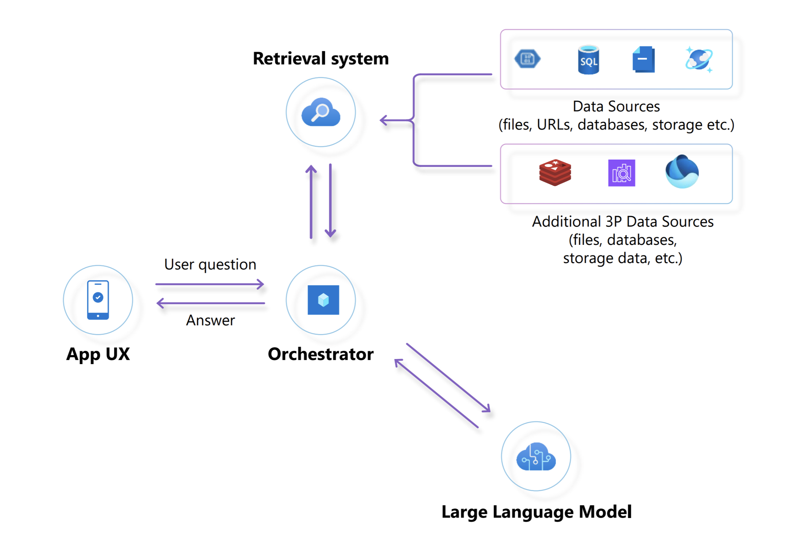

# Challenge 01 - Auto-Vectorization: Automatic Processing of Document Embeddings from Data Sources

[< Previous Challenge](./Challenge-00.md) - **[Home](../README.md)** - [Next Challenge >](./Challenge-02.md)

## Pre-requisites

This challenge assumes that all the dependencies in the Challenge 0 were deployed successfully.

## Introduction

Contoso Yachts is a 40-person organization that specializes in booking tours of the Contoso Islands. The customer service agents at Contoso Yachts use virtual assistants from their in-house developed "Citrus Bus" application to help their customers book tours and learn more about the islands.

### Retrieval Augmented Generation

The Citrus Bus application uses the RAG (Retrieval Augmented Generation) architecture pattern to power a set of virtual assistants (chat bots) that users can interact with.

In an app using the RAG architecture pattern, the application ***retrieves*** information from a retrieval system that queries the organization's data. The application then provides that data to ***augment*** and ground a LLM with knowledge so that the LLM can ***generate*** content that powers the virtual assistants.



The retrieval system is implemented by indexing structured and unstructured data, from the its source locations, into a vectorized data store which can be queried by the application. Thus, the vector data store used by the retrieval system is not the original source of truth.

### Document Embeddings

The process of indexing source data for a retrieval system is known as chunking and embedding. As the data is indexed, it is broken into chunks and converted into a numerical vector representation, called an embedding. The embeddings are then stored in the retrieval system's vector data store. 

The vector data store used for the retrieval system in the Citrus Bus application is Azure AI Search.

Why vectors and embedding? The short answer is: Math and science! The search algorithms used by retrieval systems such as Azure AI Search are able to provide much more relevant results when querying vector-based indexes than text-based indexes.

For the long answer, and more information on Chunking & Embedding, see the [Learning Resources](#learning-resources) links below.

### Automating Vectorization

In most organizations, data is not static. It is constantly changing. Since the vector data store used by the LLM is not the original source of truth, the structured and unstructured source data must be continuously synchronized with the vector data store over time.

Automating this process is a key component of any RAG application architecture implementation. By leveraging automated detection, organizations can ensure that their retrieval system remains synchronized with the most recent content, enabling better insights, search capabilities, and recommendation systems. 

This approach enhances the efficiency and effectiveness of various applications, from content recommendation engines to fraud detection, by providing accurate and timely representations of the documents in question, making it an indispensable component of modern data processing and analysis pipelines.

### The Citrus Bus Retrieval System

Contoso Yachts stores documents about the islands in Azure Blob storage and information about the yachts in Azure Cosmos DB. The retrieval system of the Citrus Bus App is designed to monitor these source data stores and synchronize them with Azure AI Search so they can be queried as part of RAG implementation for the virtual assistants.

Automatically detecting document changes in Azure Blob Store and Azure Cosmos DB is of paramount importance as it facilitates the continuous and real-time update of document embeddings through the Azure OpenAI embedding service. 


In the diagram above, the following sequence of activities are taking place:
- Step 1: Newly inserted or modified documents in Azure Blob Store and Cosmos DB trigger Azure Functions
- Steps 2 and 3: The Azure Function determines if it needs to compute the embeddings for the new/modified record from the data sources
- Steps 4 and 5: If necessary, the embeddings are computed by communicating with the embedding API for the correct embeddings for each document chunk
- Step 6: Document embeddings (vector representations) are sent to the vector database (Azure AI Search)


## Description

Your challenge is to run water through the pipes as described above. The Azure resources in the diagram above should have been deployed to your Azure environment in Challenge 0, but the source data is in your GitHub Codespace or local workstation (in the student Resources package).

- [Upload Contoso Islands data to Azure Blob Storage](#upload-documents-to-azure-blob-storage)
- [Upload Contoso Yachts' yacht data to Azure Cosmos DB](#upload-documents-to-azure-cosmos-db)
- [Observe indexed data appears in Azure AI Search](#observe-azure-ai-search)
- [Modify data and observe Azure AI Search picks up the changes](#modify-data-and-observe-azure-ai-search)

### Upload Documents to Azure Blob Storage

There are documents in the **`/artifacts/documents/contoso-islands`** folder in your Codespace or student Resources package that need to be uploaded to the **`government`** container in the Azure Blob Storage account.

You can use the **`az storage blob upload`** command examples below to upload the document to Azure Blob Storage.

To upload the documents to blob store, navigate to the **`/artifacts/documents/contoso-islands`** folder and use the Azure CLI to upload the files. You may upload the files individually or in bulk. 

Here is some sample code to help you:

````bash
# Use this command to login if you have a regular subscription
az login --use-device-code

# OR 

# Use this command to login if you are using a service principal (i.e. you are on an Microsoft employee FDPO subscription)
az login --service-principal -u <app-id> -p <password-or-cert> --tenant <tenant>

# navigate to document directory
cd artifacts/documents/contoso-islands

````

Use these commands to upload the file to Azure blob storage individually:

````bash
# Syntax to upload single documents one at a time
az storage blob upload --account-name {mystorageaccountname}  -f {filenameToUpload} -c {destinationContainer} --overwrite

# Sample usage of this command:
az storage blob upload --account-name contosoizzy1storage  -f climate.txt -c government --overwrite

````

Use these commands to upload multiple files simultaneously:

````bash

# Syntax to upload all files simultaneously from the current directory
az storage blob upload-batch --account-name {myStorageAccountName} -d {myStorageContainer} -s {sourceDirectory}

# Sample usage of this command:
az storage blob upload-batch --account-name contosopeterod1storage -d government -s .

````

### Upload Documents to Azure Cosmos DB

There are JSON documents in the **`/artifacts/cosmos-db/contoso-yachts`** folder that need to be uploaded to the corresponding Azure **`yachts`** Cosmos DB containers respectively. These JSON documents contain details about the yachts owned by Contoso Yachts.

For Cosmos DB, you can upload the JSON documents using the REST API client file **`rest-api-yachts-management.http`** located in the **`/ContosoAIAppsBackend`** folder of your Codespace or student Resource package. 

The REST API client file is an interactive file that allows you to perform various CRUD commands against the Cosmos DB REST API. These commands allow you to upload each yacht record individually to the database.

**NOTE:** This file uses the **[REST Client for VS Code by Huachao Mao](https://marketplace.visualstudio.com/items?itemName=humao.rest-client)**. This is a VSCode extension which should already be installed if you are using GitHub Codespaces for this hack. If you are running the hack with a local setup, you will need to add the extension to VSCode.

**TIP:** You will need to manually copy and paste the JSON contents of each JSON file into the REST client in the **`rest-api-yachts-management.http`** file to send each document via the REST API to Cosmos DB.

Click on "`Send Request`" for each command to execute and upload each yacht individually to the database.

Each request should return a 200 HTTP status code.

This shows how to create or update existing yacht records in the database via the REST API:


This shows how to retrieve existing yacht records from the database via the REST API:


This shows how to remove existing yacht records from the database via the REST API:


There are in-file variables that you may have to edit to control the destination and contents of the HTTP requests you are making to the back end service:


The `api_endpoint` controls the destination of the http request, the `conversation_id` variable is used to keep track of different requests to the back end and the `yacht_id` specifies the specific yacht record we are targeting

````bash
@api_endpoint = http://localhost:7072
@conversation_id = 22334567
@yacht_id = "100"
````
### Observe Azure AI Search

If everything works properly then the text files newly uploaded to, or modified in, the **`government`** container in Blob store should show up in the Contoso documents AI Search index configured and defined in the **`AZURE_AI_SEARCH_CONTOSO_DOCUMENTS_INDEX_NAME`** application setting.

Likewise, updates to the **`yachts`** JSON records in Cosmos DB should automatically show up in the AI Search index defined in the **`AZURE_AI_SEARCH_CONTOSO_YACHTS_INDEX_NAME`** application setting.

**NOTE:** You can view the application's settings in the `local.settings.json` file in the `/ContosoAIAppsBackend` folder of your Codespace or student Resources package.

The application has Azure Functions that watch the Cosmos DB database collections as well as the Azure Blob Store containers for changes. Each file upload to Azure Blob Store (new or modified) should trigger the Azure Function for you to see in the Terminal Console and the change triggering the Azure Functions. You should also see the document chunks uploaded to the AI Search Index.

Each JSON request submission to the Yacht management REST API should also trigger the Azure function that processes the embeddings for the Yacht contents. You should also see these changes reflected in the Azure Search Index.

You should be able to search for the documents in Azure AI Search, as shown in the screenshot below:


### Modify Data and Observe Azure AI Search

Make a small change to one of the JSON files by changing some text in the description and then upload the file again. You should then be able to see the change reflected in the Azure AI Search index. 

Change the file back to how it was originally and upload the file again because it will be used in later challenges. 

## Success Criteria

To complete the challenge successfully, the solution should demonstrate the following:
- The Triggers for the Blob Store and Cosmos DB Container changes are detecting changes to new or modified records in your VSCode.
- Any new document or change to an existing document in Cosmos DB must be reflected in the vector store index
- Any new document uploaded into the Azure Blob Store container must be reflected in the vector store index.

## Learning Resources

Here is a list of resources that should assist you with completing this challenge:

- [Understand Embeddings in the Azure OpenAI Service](https://learn.microsoft.com/en-us/azure/ai-services/openai/concepts/understand-embeddings)
- [Integrated data chunking and embedding in Azure AI Search](https://learn.microsoft.com/en-us/azure/search/vector-search-integrated-vectorization)
- [Vector Search with Azure AI Search](https://learn.microsoft.com/en-us/azure/search/vector-search-overview)
- [Vector Similarity Search with Redis](https://techcommunity.microsoft.com/t5/azure-developer-community-blog/vector-similarity-search-with-azure-cache-for-redis-enterprise/ba-p/3822059)
- [Azure Function Triggers for Cosmos DB](https://learn.microsoft.com/en-us/azure/azure-functions/functions-bindings-cosmosdb-v2-trigger)
- [Azure Function Triggers for Azure Blob Store](https://learn.microsoft.com/en-us/azure/azure-functions/functions-bindings-storage-blob-trigger)

## Tips

- Start up the Backend function app first before loading the documents.
- Log changes to the console so that you can see if your changes are working.
- There are some example codes in the app for you to use to get started.
