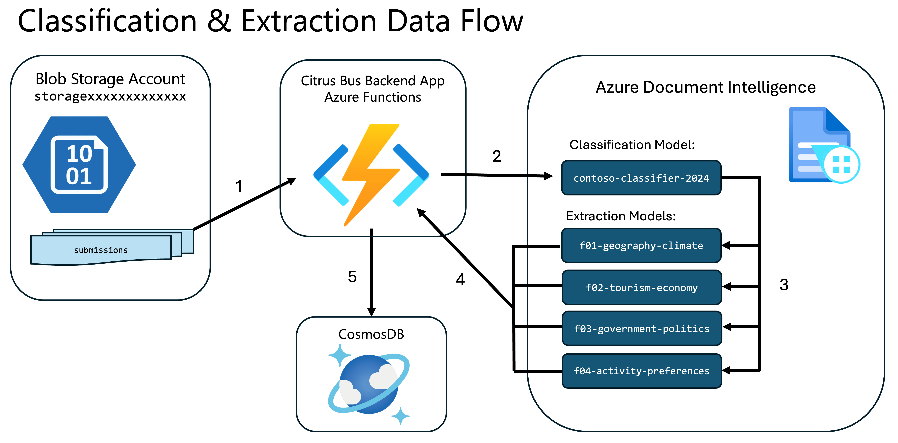
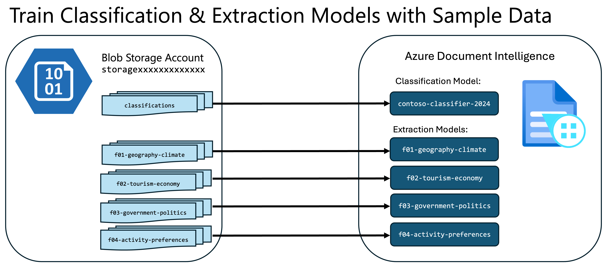

# Challenge 03 - The Teachers Assistant—Batch Essay Grading

[< Previous Challenge](./Challenge-02.md) - **[Home](../README.md)** - [Next Challenge >](./Challenge-04.md)

## Pre-requisites

This challenge assumes that all requirements for Challenges 01 & 02 were successfully completed.

## Introduction

As a major employer on the Contoso Islands, Contoso Yachts, Inc has also expanded into the education vertical, extending their Citrus Bus application with advanced AI services to help educators on the island grade student exams.

The Citrus Bus application has an Azure storage account with a Blob Store containing a large number of documents and images of handwritten essays from students in various file formats including but not limited to PDF, PNG, TIFF and JPEG.

Often an organization's data is not readily consumable by the app. It needs to be digested, parsed and simplified to extract the data in a format that can be readily leveraged by the language model.  The Azure AI platform has services that help with these tasks such as Azure Document Intelligence, Azure AI Vision, Azure Custom Vision, and Azure Video Indexer. 

In this challenge, you will focus on just one of these parsers, Azure Document Intelligence, to parse records uploaded to Azure Blob Storage and Azure Cosmos DB.

## Description

The goal of this challenge is to configure Azure Document Intelligence to classify documents and extract data from them.  You will then observe the extraction of the school district, school name, student ID, student name, and question answers from civics/social studies exams from students in the country. You will also see the parsing of the activity preferences and advance requests from the tourists visiting Contoso Islands.

### Understanding the Citrus Bus Classification and Extraction Data Flow

The Citrus Bus application has a pipeline that can process PDF and PNG files for exam submissions and activity preferences which are submitted to an Azure Blob Storage account.  When exam or activity preference documents are posted to the **`submissions`** container of the storage account, the app will send them to the Azure Document Intelligence service for processing.

First, the app will invoke a custom classifier model in Azure Document Intelligence to recognize which document type it has encountered. Next, the app will call a corresponding custom extractor model to parse the document and extract the relevant fields. Finally, the app will process the contents of the documents, including grading the exams, and storing the results in CosmosDB, where they can be accessed by the Citrus Bus AI Assistants. 

The data flow for this automation can be seen in the following diagram:



Azure Document Intelligence enables you to create and train custom models that can classify or extract data from documents. These models are trained on sample documents so that they can then do the classification or extraction on production documents.

You will find sample documents in the Azure Blob Storage account of your Azure environment that were pre-deployed in Challenge 0.

The storage account name with these files is prefixed with `storage` followed by set of unique characters. For example: `storagexxxxxxxxxxxxx`.

**NOTE:** You will see a storage account name prefixed with `webjobs`. This is NOT the storage account to use for this challenge!

In the Azure Blob Storage account, there are 21 sample documents in the following containers:

- **`f01-geography-climate`**
- **`f02-tourism-economy`**
- **`f03-government-politics`**
- **`f04-activity-preferences`**

Each container contains 5 samples for that category of document (except for `f01-geography-climate`, which has 6). 

There is also a container called **`classifications`**. This container contains a copy of the same 21 samples from the 4 category containers.

You will use the copies of these sample documents for training the custom classifier and extractors in Azure Document Intelligence as shown in the diagram below:



**NOTE:** You can find the source files which were used to populate the Azure storage account in your Codespace or Student Resources package in the sub-folders under the **`/data/contoso-education`** folder. These files were pre-loaded into Azure Storage by the deployment script you ran in Challenge 0 and are there only for reference.

In order to observe all of the things above in action, you will need to complete the following high-level tasks:
- [Create a Custom Classifier Model in Document Intelligence Studio](#create-a-custom-classifier-model-in-document-intelligence-studio)
- [Create a Custom Neural Extraction Model in the Document Intelligence Studio](#create-a-custom-neural-extraction-model-in-the-document-intelligence-studio)
- [Submit Student Exams to be Processed](#submit-student-exams-to-be-processed)
- [Upload Student Registration Records](#upload-student-registration-records)
- [Query the AI Assistants](#query-the-ai-assistants)

### Create a Custom Classifier Model in Document Intelligence Studio

You will need to create one Classifier Project which will give you one Classification Model to process the 4 different types of documents we have. When you create your model, make sure the name matches the value of the **`DOCUMENT_INTELLIGENCE_CLASSIFIER_MODEL_ID`** setting in your applications settings config file **`local.settings.json`**.

**NOTE:** You may need to use the `Settings` icon in the Azure Portal to switch directories if your Entra ID belongs to more than one Azure tenant.

The custom classifier helps you to automate the recognition of the different document types or classes in your knowledge store

Use these directions [Building a Custom Classifier Model](https://learn.microsoft.com/en-us/azure/ai-services/document-intelligence/how-to-guides/build-a-custom-classifier?view=doc-intel-4.0.0) for how to train the custom classifier in Azure Document Intelligence to recognize the following 4 categories of documents:
- `f01-geography-climate`
- `f02-tourism-economy`
- `f03-government-politics`
- `f04-activity-preferences`

Rename your `document-intelligence-dictionary.json.example` to `document-intelligence-dictionary.json`. 

When creating your extraction models in Document Intelligence Studio after labelling, please ensure that you use the names in the JSON as the model IDs. Changing the variables file for document intelligence (`document-intelligence-dictionary.json`) should not be necessary, but if you name your extraction models differently than what is specified in the JSON, you should update the corresponding variables accordingly. Ensure that the **`classifier_document_type`** in your dictionary configuration matches what you have in your Document Intelligence Studio. 

### Create a Custom Neural Extraction Model in the Document Intelligence Studio

Use these directions for [Building a Custom Extractor Model](https://learn.microsoft.com/en-us/azure/ai-services/document-intelligence/how-to-guides/compose-custom-models?view=doc-intel-4.0.0&tabs=studio) to build and train each of the extractor models for the 4 document types. You will need 4 projects (1 for each category of documents that references each Azure Blob storage container listed above). 

Make sure that the **`extractor_model_name`** field in your application config **`document-intelligence-dictionary.json`** matches what you have in Document Intelligence Studio
- `f01-extractor`
- `f02-extractor`
- `f03-extractor`
- `f04-extractor`

Also ensure that the field names such as **`q1`** and **`q5`** matches exactly what you have in Document Intelligence Studio.

In Document Intelligence Studio, when creating an extraction model, be sure to map the field names to the ***values*** in the sample documents.

The first 3 extractor models are straightforward. However, in the 4th document type, there are tables, signatures and checkboxes, which will require more attention.

#### **`document-intelligence-dictionary.json`** 
````json
[
{
    "classifier_document_type": "f03-geography-politics",
    "extractor_model_name": "f03-extractor",
    "model_description": "This is used to extract the contents of Form 03 using Azure Doc Intelligence",
    "fields": {
      "student_id": "student_id",
      "student_name": "student_name",
      "school_district": "school_district",
      "school_name": "school_name",
      "exam_date": "exam_date",
      "question_1": "q1",
      "question_2": "q2",
      "question_3": "q3",
      "question_4": "q4",
      "question_5": "q5"
    }
  },
  {
    "classifier_document_type": "f04-activity-preferences",
    "extractor_model_name": "f04-extractor2",
    "model_description": "This is used to extract the contents of Form 04 (Activity Preferences) using Azure Doc Intelligence",
    "fields": {
      "guest_full_name": "guest_full_name",
      "guest_email_address": "email_address",
      "checkbox_contoso_floating_museums": "contoso_floating_museums",
      "checkbox_contoso_solar_yachts": "contoso_solar_yachts",
      "checkbox_contoso_beachfront_spa": "contoso_beachfront_spa",
      "checkbox_contoso_dolphin_turtle_tour": "contoso_dolphin_turtle_tour",
      "table_name": "activity_requests",
      "table_column_header_experience_name": "experience_name",
      "table_column_header_preferred_time": "preferred_time",
      "table_column_header_party_size": "party_size",
      "signature_field_name": "guest_signature",
      "signature_date_field_name": "signature_date"
    }
  }
]
````

### Submit Student Exams to be Processed

In the **`/data/contoso-education/submissions`** folder of your Codespace or Student Resources package, you will find a set of student exams and traveler preference documents. After configuring the classification and extraction models in Document Intelligence Studio, you can test the classification and extraction processing pipeline by uploading these files to the **`submissions`** container in the Azure Blob Storage account. 

When files are uploaded to the **`submissions`** container, this will trigger the app's Azure Functions. The Azure Functions will invoke the Azure Document Intelligence service to classify the exams, extract the data, grade the exams, and then store the results in Cosmos DB. 

**HINT:** Refer back to [Challenge 01](Challenge-01.md) for examples of how to upload local files into an Azure Blob Storage account.

You can go to the Data Explorer in Cosmos DB to verify:
- That the exam submissions have loaded successfully into the **`examsubmissions`** container.
- The graded exams corresponding to each submission will reside in the **`grades`** container 
- The activity preferences for each customer uploaded are parsed and reside in the **`activitypreferences`** container.

### Upload Student Registration Records

There's just one more step to see the full solution in action!  The Cosmos DB needs to be loaded with the registration records for each student, as the AI assistant will only respond to queries from students registered in the Cosmos DB database.

In the `/ContosoAIAppsBackend/` folder of your Codespace or Student resources package, you will find an HTTP client file for the Student Management API: `rest-api-students-management.http`.  This file contains a list of all students registered in the Contoso Islands school system.

Just like how you uploaded yacht records and modified the yacht records via the http client in Challenge 1, use the **`rest-api-students-management.http`** http client to upload student registration records to Cosmos DB. 

### Query the AI Assistants

As seen in the previous challenges, the Citrus Bus AI Assistants can query Cosmos DB to return the results to end users. 

Once you have verified that these documents have been parsed and the data has been extracted into the corresponding containers, you can use the Murphy and Priscilla AI Assistants to query the database to get the answers from these data stores.

- Murphy: answers questions about exams, grades and exam submissions from students.
- Priscilla: answers questions about things to do on Contoso Islands as well as make recommendations to guests based on their activity preferences.

When working with the assistants, you may get a response that says something like "One moment, please. I’ll retrieve the details for you now". If that happens, you can try your prompt again. However, a better way would be to change the system prompt so that doesn't happen. Can you think of a way to modify the system prompt to prevent that? Alternatively, ask your coach for a system prompt that avoids you having to wait if you are running short on time. 

## Success Criteria

During this challenge you will:

- Observe the application properly classifying documents and using the appropriate model to extract the submissions contained in the file
- Observe the processing of all documents
- Extract all form fields from the documents
- Observe that the application grades the questions for correctness
- Observe that the application stores the student submission alongside the grade in JSON format in Cosmos DB
- Observe that the guest activity preferences are in the Cosmos DB database
- You should be able to configure the descriptions for each tool and tool parameter to enable to assistants to perform their tasks correctly
- Observe that the AI assistant should be able to parse the students responses on exam questions and grade them correctly based on the information in the knowledge (AI Search) extracted from the sample documents to Azure Blob Store

## Learning Resources

- [Project sharing using Document Intelligence Studio](https://learn.microsoft.com/en-us/azure/ai-services/document-intelligence/how-to-guides/project-share-custom-models?view=doc-intel-4.0.0)
- [How to use function calling with Azure OpenAI Service (Preview)](https://learn.microsoft.com/en-us/azure/ai-services/openai/how-to/function-calling?tabs=python)
- [Build and train a custom extraction model](https://learn.microsoft.com/en-us/azure/ai-services/document-intelligence/how-to-guides/build-a-custom-model?view=doc-intel-3.1.0)
- [Build and train a custom classification model](https://learn.microsoft.com/en-us/azure/ai-services/document-intelligence/how-to-guides/build-a-custom-classifier?view=doc-intel-3.1.0)
- [Studio experience for Document Intelligence](https://learn.microsoft.com/en-us/azure/ai-services/document-intelligence/concept-document-intelligence-studio?view=doc-intel-3.1.0)
- [Document Intelligence - SDK target: REST API 2023-07-31 (GA)](https://learn.microsoft.com/en-us/azure/ai-services/document-intelligence/sdk-overview-v3-1?view=doc-intel-3.1.0&tabs=csharp)
- [Project sharing using Document Intelligence Studio](https://learn.microsoft.com/en-us/azure/ai-services/document-intelligence/how-to-guides/project-share-custom-models?view=doc-intel-4.0.0)
