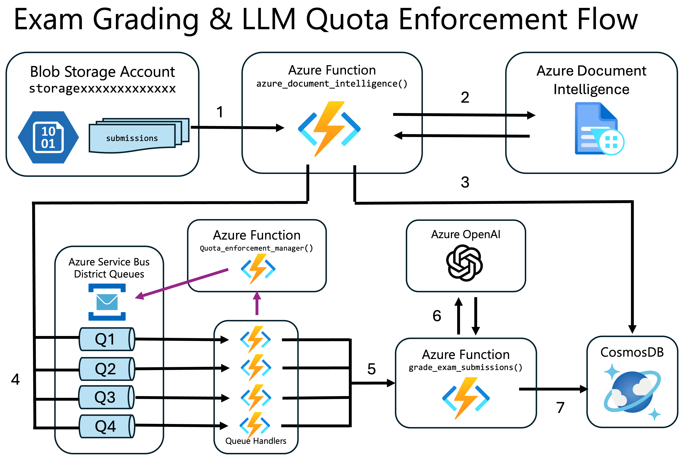

# Challenge 04 - Quota Monitoring and Enforcement

[< Previous Challenge](./Challenge-03.md) - **[Home](../README.md)** - [Next Challenge >](./Challenge-05.md)

## Pre-requisites

This challenge assumes that all requirements for Challenges 1, 2, and 3 were successfully completed.

## Introduction

In the previous challenge, you observed how the Citrus Bus app uses Azure Document Intelligence to classify and extract data from student exam documents. The extracted exam submission is stored in CosmosDB. The Citrus Bus app also uses an Azure OpenAI LLM to grade the exam submission and then saves the grade in CosmosDB too.

When building any application for production scenarios, there may be scenarios where the quota for the LLMs have to be distributed fairly to prevent or minimize opportunities for starvation amongst the consumers.

For this challenge, our goal is to ensure that for the automated exam grading for each school district, each school district is not exceeding the allocated quota.

The are 4 school districts and they do not have equal number of schools or students, so the goal is to ensure that the resource allocation is distributed fairly and equally to each school district.

The four school districts are:
- Grapefruit
- Lemon
- Orange
- Tangerine

To ensure fair access to the LLMs, the Citrus Bus app has implemented a set of Azure Service Bus queues to handle all calls to the LLM from the school districts. The application contains settings that an administrator can configure to manage LLM Quota Enforcement via the queues.  
 
You can see how this system is set up in the diagram below:

To summarize this flow:

1. Exam documents in the `submissions` blob storage container trigger the `azure_document_intelligence()` Azure Function.
1. The `azure_document_intelligence()` Azure Function calls Azure Document Intelligence to classify and extract the exam data from the document.
1. The `azure_document_intelligence()` Azure Function saves the extracted exam submission in CosmosDB.
1. The `azure_document_intelligence()` Azure Function also sends the extracted exam submission to an Azure Service Bus queue for the corresponding school district.
1. Azure Function Queue Handlers are configured to be triggered by each queue. The queue handler functions:
   1. Send the exam submission to the `grade_exam_submission()` Azure Function.
   2. Notify the `quota_enforcement_manager()` Azure Function to increment the quota count and stop the queue if required.
1. The `grade_exam_submission()` Azure Function sends exam submission and a prompt asking the LLM to grade the exam submission.
1. The `grade_exam_submission()` Azure Function saves the returned grade to CosmosDB.

The `quota_enforcement_manager()` Azure Function keeps track of the quota counts, and if conditions are met that exceed the quota, it will suspend the corresponding school district's queue for a set cool down period.  It runs on a timer to periodically check if the cool down period has expired and the queue can be reactivated.

## Description

In this challenge, you will modify the Citrus Bus application's configuration to manage LLM Quota enforcement, and then re-submit the same exam files to Azure Blob Storage for processing as you did earlier in Challenge 3.

### Configure LLM Quota Enforcement

In the **`/ContosoAIAppsBackend/`** folder of your Codespace or Student resources package, you will find the configuration file (`local.settings.json`) has the following settings as documented below:

| Configuration Name | Examples| Description|
|--------------|-----------|------------|
| `LLM_QUOTA_ENFORCEMENT` | 1     | Whether or not Quota enforcement is enabled for the app (1 for enabled, 0 for disabled)        |
| `LLM_QUOTA_ENFORCEMENT_WINDOW_SECONDS`      | 120  | The number of seconds that define the transaction aggregation window for quota enforcement       |
| `LLM_QUOTA_ENFORCEMENT_MAX_TRANSACTIONS`      | 5  | The number of transactions allowed per school district within the transaction window       |
| `LLM_QUOTA_ENFORCEMENT_COOL_DOWN_SECONDS`      | 300  | The number of seconds the district needs to wait before processing can resume. Should be greater than the transaction window       |

As an administrator, you job is to ensure that:
- Each school district does not process more than 5 submissions within a 2-minute period. 
- If this quota is reached, the Azure Service Bus queue for that district will need to be suspended. Processing for that school district can resume again after the cool down period of 5 minutes has elapsed.

Update these settings as per the requirements listed above.

**NOTE:** Any changes to the configuration settings file require that the Azure Function app be stopped and restarted to pick up the new changes.

### Re-Process Student Exams

To verify the LLM Quota Enforcement is working, re-upload the student exam files from the **`/data/contoso-education/submissions`** folder of your Codespace or Student Resources package, to **`submissions`** container in Azure Blob Storage.

These are the same files that you processed in Challenge 3.

The automation pipeline will re-process them, but this time check to see if the rules are being enforced.

**NOTE:** Each file's name contains the school district name for that exam. To better see that the proper quota enforcement rules are being enforced, you may wish to upload these files in batches by district.

**TIP:** You can see quota enforcement errors appear highlighted in red text in the terminal window for the Azure Function app.

**TIP:** You can monitor the status of the queues in the Azure Service Bus pane in the Azure Portal.

## Success Criteria

The service bus queue for each district should be suspended by disabling the receive queue when this threshold is reached

A successfully completed solution should accomplish the following goals:

- The quota enforcement is adhered to and that no school district exceeds the quota limit. You should not see any new grading activity by the LLM during the cool down period.

## Learning Resources

- [Timer trigger for Azure Functions](https://learn.microsoft.com/en-us/azure/azure-functions/functions-bindings-timer)
- [Suspend and reactivate messaging entities (disable)](https://learn.microsoft.com/en-us/azure/service-bus-messaging/entity-suspend#suspension-states)
- [Redis Strings](https://redis.io/docs/data-types/strings/)
- [Redis lists](https://redis.io/docs/data-types/lists/)
