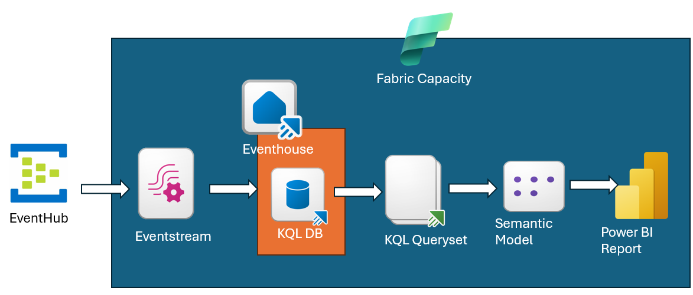
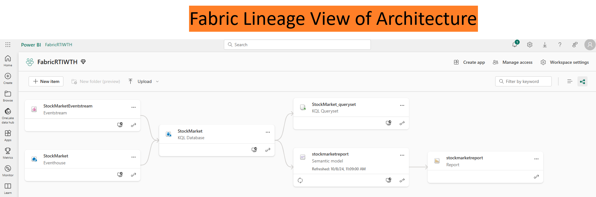

# What The Hack - Fabric Real-time Intelligence - Coach Guide

## Introduction

Welcome to the coach's guide for the Fabric Real-time Analytics What The Hack. Here you will find links to specific guidance for coaches for each of the challenges.

**NOTE:** If you are a Hackathon participant, this is the answer guide. Don't cheat yourself by looking at these during the hack! Go learn something. :)

## Coach's Guides

- Challenge 00: **[Prerequisites](Solution-00.md)**
   - Getting the environment setup for the rest of the challenges
- Challenge 01: **[Ingesting the Data and Creating the Database](Solution-01.md)**
   - Creating a database to store the real-time data
- Challenge 02: **[Transforming the Data](Solution-02.md)**
    - Transforming the data using KQL Querysets
- Challenge 03: **[Create the Realtime Reporting](Solution-03.md)**
    - Creating the Power BI reports, with real-time data

## Coach Prerequisites

This hack has pre-reqs that a coach is responsible for understanding and/or setting up BEFORE hosting an event. Please review the [What The Hack Hosting Guide](https://aka.ms/wthhost) for information on how to host a hack event.

The guide covers the common preparation steps a coach needs to do before any What The Hack event, including how to properly configure Microsoft Teams.

### Student Resources

Before the hack, it is the Coach's responsibility to download and package up the contents of the `/Student/Resources` folder of this hack into a "Resources.zip" file. The coach should then provide a copy of the Resources.zip file to all students at the start of the hack.

Always refer students to the [What The Hack website](https://aka.ms/wth) for the student guide: [https://aka.ms/wth](https://aka.ms/wth)

**NOTE:** Students should **not** be given a link to the What The Hack repo before or during a hack. The student guide does **NOT** have any links to the Coach's guide or the What The Hack repo on GitHub.

## Azure Requirements

This hack requires students to have access to an Azure subscription where they can create and consume Azure resources. These Azure requirements should be shared with a stakeholder in the organization that will be providing the Azure subscription(s) that will be used by the students.

## Suggested Hack Agenda (Optional)

- Sample Day 1
  - Challenge 0 (1 hour)
  - Challenge 1 (2 hours)
  - Challenge 2 (2 hours)
  - Challenge 3 (2 hours)

## Architecture Diagrams

## Repository Contents

- `./Coach`
  - Coach's Guide and related files
- `./Coach/Solutions`
  - Solution files with completed example answers to a challenge
- `./Coach/Images`
  - Images for coaches guide.
- `./Student`
  - Student's Challenge Guide
- `./Student/Resources`
  - Resource files, sample code, scripts, etc meant to be provided to students. (Must be packaged up by the coach and provided to students at start of event)
