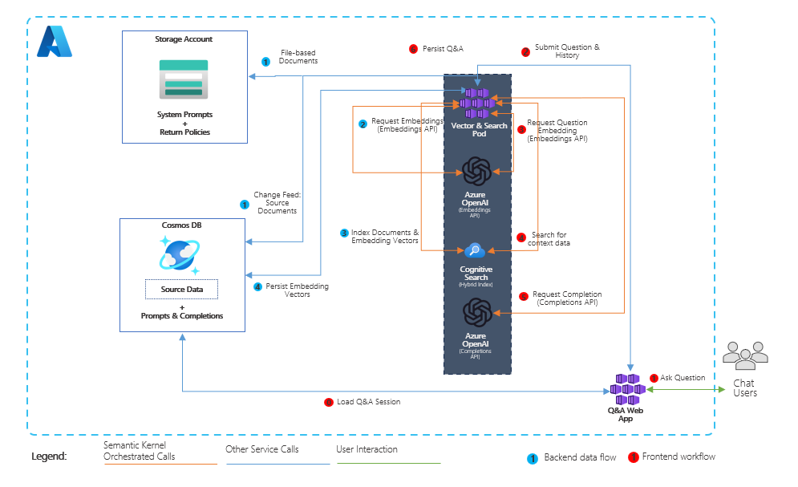
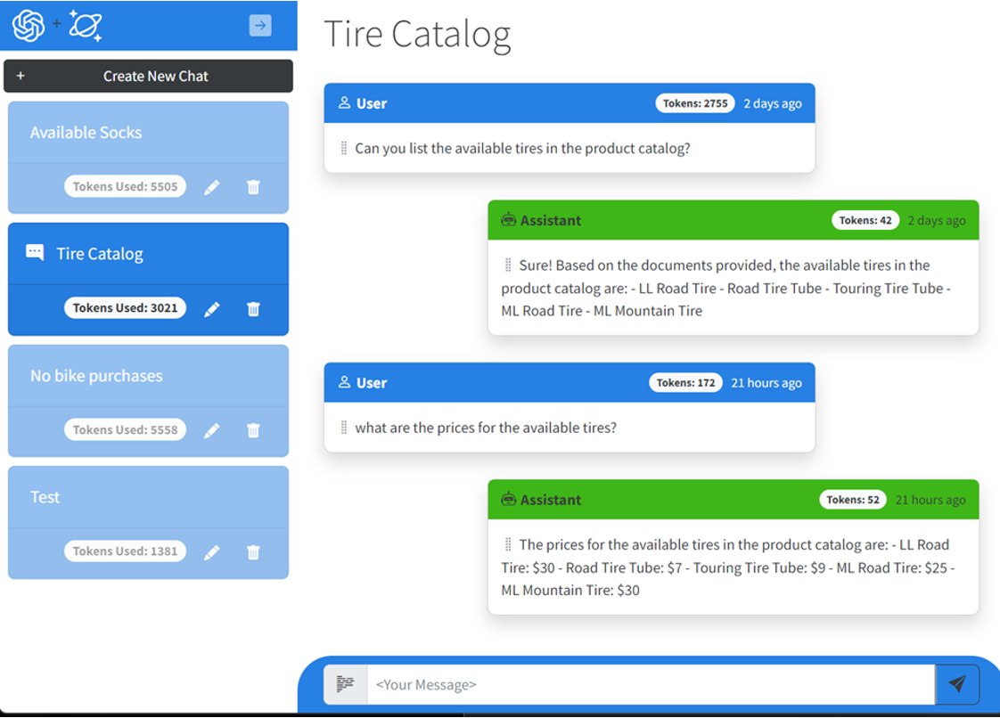
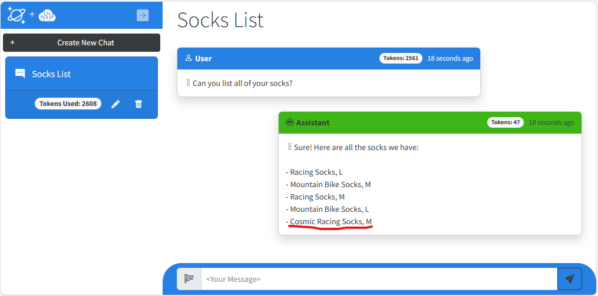

# Vector Search & AI Assistant for Azure Cosmos DB and Cognitive Search Services

This solution is a series of samples that demonstrate how to build solutions that incorporate Azure Cosmos DB with Azure OpenAI to build vector search solutions with an AI assistant user interface. The solution shows hows to generate vectors on data stored in Azure Cosmos DB using Azure OpenAI, then shows how to implment vector search capabilities using a variety of different vector capable databases available from Azure Cosmos DB and Azure.

The scenario for this sample centers around a consumer retail "Intelligent Agent" that allows users to ask questions on vectorized product, customer and sales order data stored in the database. The data in this solution is the [Cosmic Works](https://github.com/azurecosmosdb/cosmicworks) sample for Azure Cosmos DB. This data is an adapted subset of the Adventure Works 2017 dataset for a retail Bike Shop that sells bicycles, biking accessories, components and clothing.

## Solution Architecture

The solution architecture is represented by this diagram:

<p align="center">
    
</p>

The application frontend is a Blazor application with Intelligent Agent UI functionality:

<p align="center">
    
</p>

## Getting Started

### Prerequisites

- Azure Subscription
- Subscription access to Azure OpenAI service. Start here to [Request Access to Azure OpenAI Service](https://customervoice.microsoft.com/Pages/ResponsePage.aspx?id=v4j5cvGGr0GRqy180BHbR7en2Ais5pxKtso_Pz4b1_xUOFA5Qk1UWDRBMjg0WFhPMkIzTzhKQ1dWNyQlQCN0PWcu)
- Visual Studio 2022
- .NET 7 SDK
- Docker Desktop
- Azure CLI 2.49.0
- Helm v3.11.1 or greater - https://helm.sh/

### Deployment

Clone the VectorSearchAiAssistant repository and change to the `cognitive-search-vector` branch

```pwsh
git clone https://github.com/AzureCosmosDB/VectorSearchAiAssistant
git checkout cognitive-search-vector
```

#### Standard Deployments

Run the following script to provision the infrastructure and deploy the API and frontend. This will provision all of the required infrastructure, deploy the API and web app services into AKS, and import data into Cosmos.

```pwsh
./scripts/Unified-Deploy.ps1 -resourceGroup <resource-group-name> `
                             -location <location> `
                             -subscription <subscription-id>
```
#### Deployments using an existing OpenAI service

For deployments that need to use an existing OpenAI service, run the following from the `deploy/powershell`.  This will provision all of the necessary infrastruction except the Azure OpenAI service and will deploy the function apps, the frontend, and Synapse artifacts.

```pwsh
.\Unified-Deploy.ps1 -resourceGroup <resource-group-name> `
                     -location <location> `
                     -subscription <subscription-id> `
                     -openAiName <openAi-service-name> `
                     -openAiRg <openAi-resource-group-name> `
                     -openAiDeployment <openAi-completions-deployment-name>
```

### Quickstart

1. Navigate to resource group and obtain the name of the AKS service and execute the following command to obtain the OpenAI Chat endpoint

  ```pwsh
  az aks show -n <aks-name> -g <resource-group-name> -o tsv --query addonProfiles.httpApplicationRouting.config.HTTPApplicationRoutingZoneName
  ```

1. Browse to the web app with the returned hostname.
1. Click [+ Create New Chat] button to create a new chat session.
1. Type in your questions in the text box and press Enter.

Here are some sample questions you can ask:

- What kind of socks do you have available?
- Do you have any customers from Canada? Where in Canada are they from?
- What kinds of bikes are in your product inventory?

### Real-time add and remove data

One great reason about using an operational database like Azure Cosmos DB as your source for data to be vectorized and search is that you can leverage its
Change Feed capability to dynamically add and remove products to the vector data which is searched. The steps below can demonstrate this capability.

#### Steps to demo adding and removing data from vector search

1. Start a new Chat Session in the web application.
1. In the chat text box, type: "Can you list all of your socks?". The AI Assistant will list 4 different socks of 2 types, racing and mountain.
1. Using either CURL or Postman, send the following payload in a PUT request with a `Content-Type` header value of `application/json` to `https://<chat-service-hostname>/api/products` to add a product.
  
    ##### Curl Command
    ```pwsh
    curl -X PUT -H "Content-Type: application/json" -d $JsonPayload https://<chat-service-hostname>/api/products
    ```

    ##### Json Payload
    ```json
    {
        "id": "00001",
        "categoryId": "C48B4EF4-D352-4CD2-BCB8-CE89B7DFA642",
        "categoryName": "Clothing, Socks",
        "sku": "SO-R999-M",
        "name": "Cosmic Racing Socks, M",
        "description": "The product called Cosmic Racing Socks, M",
        "price": 6.00,
        "tags": [
            {
                "id": "51CD93BF-098C-4C25-9829-4AD42046D038",
                "name": "Tag-25"
            },
            {
                "id": "5D24B427-1402-49DE-B79B-5A7013579FBC",
                "name": "Tag-76"
            },
            {
                "id": "D4EC9C09-75F3-4ADD-A6EB-ACDD12C648FA",
                "name": "Tag-153"
            }
        ]
    }
    ```
    > Note the `id` of `00001` and `categoryId` of `C48B4EF4-D352-4CD2-BCB8-CE89B7DFA642`.  We will need these values in a later step.


1. Return to the AI Assistant and type, ""Can you list all of your socks again?". This time you should see a new product, "Cosmic Socks, M"
1. Using either CURL or Postman, send the following payload in a DELETE request to `https://<chat-service-hostname>/api/products/<product_id>?categoryId=<category_id>` to add a product, where `<product_id>` is the value of the `id` field and `<category_id>` is the value of the `categoryId` field of the JSON payload sent via a PUT request in a previous step (`00001` and `C48B4EF4-D352-4CD2-BCB8-CE89B7DFA642`, respectively, in this case).

    ##### Curl Command
    ```pwsh
    curl -X DELETE https://<chat-service-hostname>/api/products/<product_id>?categoryId=<category_id>
    ```

1. Open a **new** chat session and ask the same question again. This time it should show the original list of socks in the product catalog. 

**Note:** Using the same chat session after adding them will sometimes result in the Cosmic Socks not being returned. If that happens, start a new chat session and ask the same question. Also, sometimes after removing the socks they will continue to be returned by the AI Assistant. If that occurs, also start a new chat session. The reason this occurs is that previous prompts and completions are sent to OpenAI to allow it to maintain conversational context. Because of this, it will sometimes use previous completions as data to make future ones.

<p align="center">
    
</p>

## Run locally and debug

This solution can be run locally post deployment. Below are the prerequisites and steps.

### Prerequisites for running/debugging locally

- Visual Studio, VS Code, or some editor if you want to edit or view the source for this sample.
- .NET 7 SDK

### Local steps

#### Configure local settings

- In the `Search` project, make sure the content of the `appsettings.json` file is similar to this:

    ```json
    {
        "DetailedErrors": true,
        "Logging": {
            "LogLevel": {
            "Default": "Information",
            "Microsoft.AspNetCore": "Warning"
        }
        },
        "AllowedHosts": "*",
        "MSCosmosDBOpenAI": {
            "ChatManager": {
                "APIUrl": "https://localhost:63279",
                "APIRoutePrefix": ""
            }
        }
    }
    ```

- In the `ChatServiceWebApi` project, make sure the content of the `appsettings.json` file is similar to this:

    ```json
    {
        "Logging": {
            "LogLevel": {
                "Default": "Information",
                "Microsoft.AspNetCore": "Warning"
            }
        },
        "AllowedHosts": "*",
        "MSCosmosDBOpenAI": {
            "CognitiveSearch": {
                "IndexName": "vector-index",
                "MaxVectorSearchResults": 10
            },
            "OpenAI": {
                "CompletionsDeployment": "completions",
                "CompletionsDeploymentMaxTokens": 4096,
                "EmbeddingsDeployment": "embeddings",
                "EmbeddingsDeploymentMaxTokens": 8191,
                "ChatCompletionPromptName": "RetailAssistant.Default",
                "ShortSummaryPromptName": "Summarizer.TwoWords",
                "PromptOptimization": {
                    "CompletionsMinTokens": 50,
                    "CompletionsMaxTokens": 300,
                    "SystemMaxTokens": 1500,
                    "MemoryMinTokens": 500,
                    "MemoryMaxTokens": 2500,
                    "MessagesMinTokens": 1000,
                    "MessagesMaxTokens": 3000
                }
            },
            "CosmosDB": {
                "Containers": "completions, customer, product",
                "Database": "database",
                "ChangeFeedLeaseContainer": "leases"
            },
            "DurableSystemPrompt": {
                "BlobStorageContainer": "system-prompt"
            }
        }
    }
    ```

- In the `ChatServiceWebApi` project, create an `appsettings.Development.json` file with the following content (replace all `<...>` placeholders with the values from your deployment):

    ```json
    {
        "MSCosmosDBOpenAI": {
            "CognitiveSearch": {
                "Endpoint": "https://<...>.search.windows.net",
                "Key": "<...>"
            },
            "OpenAI": {
                "Endpoint": "https://<...>.openai.azure.com/",
                "Key": "<...>"
            },
            "CosmosDB": {
                "Endpoint": "https://<...>.documents.azure.com:443/",
                "Key": "<...>"
            },
            "DurableSystemPrompt": {
                "BlobStorageConnection": "<...>"
            }
        }
    }
    ```

    >**NOTE**: THe `BlobStorageConnection` value can be found in the Azure Portal by navigating to the Storage Account created by the deployment (the one that has a container named `system-prompt`) and selecting the `Access keys` blade. The value is the `Connection string` for the `key1` key.

#### Using Visual Studio

To run locally and debug using Visual Studio, open the solution file to load the projects and prepare for debugging.

Before you can start debugging, you need to set the startup projects. To do this, right-click on the solution in the Solution Explorer and select `Set Startup Projects...`. In the dialog that opens, select `Multiple startup projects` and set the `Action` for the `ChatServiceWebApi` and `Search` projects to `Start`.

Also, make sure the newly created `appsettings.Development.json` file is copied to the output directory. To do this, right-click on the file in the Solution Explorer and select `Properties`. In the properties window, set the `Copy to Output Directory` property to `Copy always`..

You are now ready to start debugging the solution locally. To do this, press `F5` or select `Debug > Start Debugging` from the menu.

**NOTE**: With Visual Studio, you can also use alternate ways to manage the secrets and configuration. For example, you can use the `Manage User Secrets` option from the context menu of the `ChatWebServiceApi` project to open the `secrets.json` file and add the configuration values there.

## Clean-up

Delete the resource group to delete all deployed resources.

## Resources

- [Upcoming blog post announcement](https://devblogs.microsoft.com/cosmosdb/)
- [Azure Cosmos DB Free Trial](https://aka.ms/TryCosmos)
- [OpenAI Platform documentation](https://platform.openai.com/docs/introduction/overview)
- [Azure OpenAI Service documentation](https://learn.microsoft.com/azure/cognitive-services/openai/)